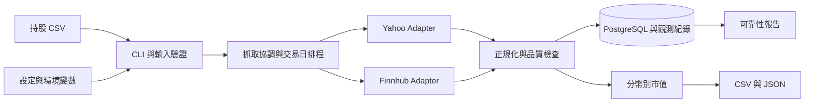

# 架構與 Docker 部署設計

版本：v0.5；日期：2026-09-08；狀態：步驟 0–8 完成；PostgreSQL、官方標的清單、quote、monitor、容器部署與 report 已通過，盤中連續觀測依步驟 9 執行。

## 1. 架構

單一 Python 應用程式連接使用者既有 PostgreSQL container，同一專案 database／schema 僅允許一個收集程序。使用同一映像提供一次性 CLI 與持續觀測模式，不需要 Web Server、Redis 或新增資料庫容器。



| 模組 | 責任 |
|---|---|
| cli / input | argparse 命令、CSV 解析、設定驗證、退出碼 |
| instruments | 依 ticker 首字元判斷台美市場；透過標的清單識別上市／上櫃並映射來源代碼、驗證商品類型與幣別 |
| providers | 將各來源回應轉為共用 Quote／FetchResult，不計算持股市值 |
| scheduler | 交易日曆、輪詢、限流、重試、停止訊號與缺輪紀錄 |
| quality | 價格、時間、時段、來源延遲與品質標記 |
| valuation | Decimal 運算、分幣別小計、完整性判斷 |
| storage | PostgreSQL 交易、migration、執行識別、設定快照與報價歷程 |
| reporting | 唯讀快照統計、終端摘要與可靠性報告 JSON／Markdown 輸出 |

2026-09-08 輸入契約更新：CSV 保持三欄，台股使用不含來源後綴的原始代碼。input 離線按首字元分類（數字為台股、英文字母為美股）；instruments 在抓價前查標的清單，台股依上市／上櫃映射為 Yahoo 的 `.TW`／`.TWO`。保留輸入 ticker 與 provider_symbol 的區別；清單不可用、查無或映射不唯一時回報明確錯誤，不以逐個嘗試後綴代替市場識別。

估值來源由設定指定；比較來源獨立抓取及計分，不做每輪隱藏的自動切換。POC 第一階段不以複雜備援掩蓋單一來源是否可靠。

步驟 4 實作：官方來源解析為不可變 CatalogInstrument，完整五來源成功後才在 PostgreSQL 原子發布一個 generation。來源證據含取得時間、payload hash、bytes、有效列數及 TLS relaxed 狀態；預設有效 24 小時。resolve 只讀最新未過期 generation，查無／不支援或 alias 歧義明確回報，不觸發試抓。台股上市／上櫃映射 `.TW`／`.TWO`；美股保存官方 aliases，Yahoo 股別分隔符另存 provider symbol。清單細節與保守篩選界線見 [步驟 4 紀錄](step-4-evidence.md)。

步驟 2 已提供 input.load_holdings／parse_holdings、models 的 Holding／Instrument／Quote／FetchResult 與品質列舉，以及 valuation.value_holdings／ValuationReport.to_dict。這些模組僅依賴標準庫；models 將時間正規化 UTC、保留 ticker／provider_symbol，失敗 FetchResult 不攜帶快取冒充本次報價。估值依運算元精度建立獨立 Decimal context，精確運算偵測非預期捨入，顯示才使用 ROUND_HALF_UP。來源映射、快取選擇及交易日曆品質判斷待後續整合。

## 2. 版本與套件策略

Python 沒有另列 LTS 系列。官方政策為自 3.13 起約兩年一般修正加三年安全維護。2026-09-07 查核的最新穩定 Python 為 3.14.7，作為實作起點；建立容器前再核對最新修補版。[維護政策](https://peps.python.org/pep-0602/)、[官方版本](https://www.python.org/doc/versions/)

| 項目 | 本版選擇 | 狀態 |
|---|---|---|
| Python | 3.14 系列最新穩定修補版 | 已驗證：`python:3.14-slim` 內為 3.14.7 |
| 基礎映像 | 官方 Python、Debian slim 變體，固定 patch tag 與 digest | 已驗證：Debian 13 trixie，digest `sha256:cad9a2c871761c413caa6fdd6441c783451e740a48aaeba60ae62a8b53525ef6`（linux/amd64，2026-09-07 取得）；建置前重新核對 |
| CLI／CSV／金額 | 標準庫 argparse、csv、decimal | 減少直接依賴 |
| PostgreSQL driver | psycopg[binary] 3.3.5 | 步驟 1：Python 3.14.7／Linux amd64 安裝與 binary 匯入通過；資料庫連線未測 |
| Yahoo 存取 | yfinance | 已驗證 1.7.0 於 3.14 容器安裝與匯入成功 |
| HTTP API | httpx | 已驗證 0.28.1；用於 Finnhub 與官方資料 HTTP 介接 |
| 交易日曆 | exchange_calendars 與官方交易行事曆核對 | 已驗證 4.13.2 可安裝匯入；台股／美股日曆內容待與官方行事曆核對 |
| 時區 | zoneinfo，容器安裝可用時區資料 | 已安裝 tzdata 2026.3；Asia/Taipei 與 America/New_York 已於探針使用 |
| 開發驗證 | pytest | 已驗證 9.1.1 |
| 套件鎖定 | pyproject.toml＋uv.lock；uv／uv_build 0.12.10 | required-version 固定 uv；uv_build 無傳遞依賴，backend 精確固定；frozen 安裝通過 |

2026-09-07 於 `python:3.14-slim` 實測：上述四個直接依賴及其相依（pandas 3.0.5、numpy 2.5.3、lxml 6.1.3、curl_cffi 0.16.3 等）全部以既有 wheel 安裝成功，映像內沒有 gcc 也不需要編譯，匯入無錯誤。原先列為風險的 Python 3.14 wheel 相容性與 pandas 3.x 相容性在本輪未出現，因此不需降版。細節與版本清單見 [資料來源評估](data-sources.md) 第 5 節。此結果為單次安裝驗證，鎖定檔仍須在實作時產生並固定確切版本。

對有官方 LTS 的元件優先選 LTS，沒有者採仍受維護的最新相容穩定版，不採 alpha／beta／RC。套件與映像不使用浮動 latest。若 Python 3.14 或最新套件不相容，先記錄原因與替代方案討論，不默默降版。

鎖定檔提供依賴解析的可重現性；映像 digest 固定來源映像。建置仍需記錄平台與必要系統套件版本，不宣稱不同平台產物完全相同。實際 Engine／Compose 版本記錄於驗收證據。

2026-09-08 步驟 1 已重新核對與鎖定：Python 3.14.7、uv／uv_build 0.12.10、yfinance 1.7.0、httpx 0.28.1、exchange-calendars 4.13.2、psycopg[binary] 3.3.5、tzdata 2026.3、pytest 9.1.1。固定映像為 `python:3.14.7-slim-trixie@sha256:cad9a2c871761c413caa6fdd6441c783451e740a48aaeba60ae62a8b53525ef6`（多平台 index，本輪指定 linux/amd64）。uv.lock 已產生，安裝、CLI 測試與打包通過；見 [步驟 1 證據](step-1-evidence.md)。前段 2026-09-07 內容保留為歷史探針紀錄。

## 3. Provider 契約

Adapter 接受一組 Instrument，回傳每個標的的 FetchResult，包含成功報價或明確錯誤；批次回應缺少某檔時必須建立缺漏結果。批次 HTTP 成功不代表每檔成功。

共同需求：逾時、限流、錯誤分類、UTC 時間、回應解析版本、供應商代碼。任何 SDK 內建重試或快取若無法觀測，於報告說明統計邊界，不宣稱是底層網路請求數。

預設策略：單次操作逾時 10 秒；可重試的暫時性錯誤最多追加兩次，指數退避加隨機偏移，尊重 Retry-After。無效金鑰、未知代碼與解析錯誤不盲目重試。每輪總預算 50 秒，到期未完成的標的記錄失敗／未執行原因，下一輪不補發請求風暴。

若 Retry-After 超過本輪預算，記錄來源冷卻狀態並延後該來源；每一預定機會仍計入覆蓋率，不因退避而消失。不同來源獨立限流。Finnhub 單次實測回應 limit 60，但窗口單位未由回應明示；步驟 6 不配置高於現有每 60 秒一輪的頻率，實際 429 與長時間額度行為於持續觀測記錄。

各市場依一般交易時段排程；收盤後延長「已知來源延遲＋兩輪輪詢」的觀測，讓延遲來源有機會回傳收盤資料，再停止該市場定期查詢。延遲未知時改用 post_close_observation_minutes（預設 30 分鐘）作為上限並記錄不確定性；台股啟用 TWSE／TPEx 或美股啟用 Finnhub 時即視為發布時間未確認。台股開盤後 20 分鐘的輪次另標 opening_delay，與 regular、post_close 分開保存。跨市場獨立排程，避免因台股休市而停止美股。單次 quote 可於任何時間執行，但保留真實市場狀態。

若來源資料只提供 K 線，必須明確映射時間為區間開始或結束；不使用不完整區間冒充成交快照。精度不足時標示品質未確定。

## 4. 持久化資料

| 表 | 主要內容 |
|---|---|
| campaigns | campaign-id、預定觀測起訖、實際結束、狀態、不可變輸入／設定快照與雜湊、来源／標的配對、日曆／排程／門檻版本、維護窗口 |
| scheduled_cycles | scheduled-cycle-id、campaign-id 外鍵、市場、預定時間、窗口類型；campaign／市場／預定時間唯一 |
| runs | run-id、開始／結束、套件版本、映像與設定識別、輸入雜湊、觀測是否中斷 |
| holdings | run-id、ticker、市場、幣別、buy_price、quantity |
| cycles | 預定時間、實際開始／完成、完成／中斷／跳過原因 |
| fetch_attempts | run-id、cycle-id、來源、標的、嘗試序號、耗時、錯誤與回應識別 |
| quotes | 來源、價格種類、價格、quote_time、received_at、品質與對應嘗試 |
| valuations | cycle-id、選用 quote-id、市值、各幣別完整性 |

目標 database `stock_quote_fetcher`、schema `app`、專用帳號 `stock_quote_app`；名稱來自建置約定，登入與權限尚待步驟 3 驗證。SQL 使用明確 schema 名稱與參數化查詢，應用不使用管理員帳號。

2026-09-08 步驟 3 已完成：上述專用帳號連線／權限與初始 migration 實際套用通過。新增 db-check／migrate CLI；完整 120 項測試通過。操作與隔離測試證據見 [步驟 3 紀錄](step-3-evidence.md)。前述「尚待驗證」保留為設計基線歷史狀態。

實作補充：storage.finish_cycle 每輪處理單一市場，從持久化 holding／選定 quote-id 重新估值；引用其他輪次 quote 時保留原始紀錄並在 valuation 加 cached，亦可接收上游品質旗標。非法價格改存 attempt 的 invalid_payload／精簡證據，不進入 positive NUMERIC domain。read_run／read_campaign／read_schedule 必須在 report_snapshot 中使用；read_schedule 只讀預定輪次，供 run 範圍報告在不讀其他 run 的情況下重建分母。response_evidence 暫存正規化摘要與雜湊，Provider 可重現解析的原始欄位與版本在步驟 5 補足。

### 4.1 型別與關聯

金額、股數、價格與小計使用不指定 precision／scale 的 `NUMERIC`，直接以 Decimal 綁定及讀回，不轉 float、money 或固定兩位小數。應用及 CHECK 約束拒絕 NaN／正負 Infinity；價格及股數大於零，小計可為零，缺值用 NULL。超出可表示範圍明確失敗，不能截斷。計算配置足夠 Decimal precision 並偵測非預期捨入，僅顯示時捨入；原始輸入保存在快照，JSON 精確值採字串。[NUMERIC 文件](https://www.postgresql.org/docs/current/datatype-numeric.html)

時間點使用 `TIMESTAMPTZ`，session 設 UTC、傳入帶時區時間；當地交易日用 DATE，IANA 市場時區與來源精度另存。未知 quote_time 為 NULL；原始時區名稱不由 TIMESTAMPTZ 保存。超過微秒精度時保留來源原文，不宣稱時間欄位可無損往返。[時間型別文件](https://www.postgresql.org/docs/current/datatype-datetime.html)

識別碼用應用產生的 UUID。runs 增加可空 campaign-id 外鍵（單次 quote 可獨立）及 heartbeat_at；cycles 增加可空且唯一的 scheduled-cycle-id 外鍵。holdings、cycles 連至 runs，fetch_attempts 連至 cycles，quotes 連至 fetch_attempts，valuations 連至 cycle／holding／可空 quote。估值須驗證持股與 cycle 屬於同 run，快取保留原 quote-id。另建 valuation_totals 保存同 cycle／currency 唯一的小計、total、筆數及 completeness。

同 run／ticker、同 cycle／來源／標的／嘗試序號、同 cycle／holding 均唯一。外鍵不連鎖刪除歷史；索引涵蓋 campaign 到 run、run 到 cycle、cycle 到 attempt、attempt 到 quote 與標的／來源／received_at 查詢路徑。

### 4.2 Migration 與權限

採版本控制中依序 SQL migration（例如 0001_initial.sql），獨立操作，不在收集程序啟動時自動修改 schema。schema_migrations 保存版本、SQL checksum、套件版本及套用時間；每份 DDL 與版本紀錄同交易提交，失敗全部回滾。checksum 不符或 schema 版本不受支援則拒絕啟動。POC 不使用交易外 DDL、不自動降版或清除資料。migration 與收集程序使用相同互斥鎖，操作前停止 monitor。

專用帳號需 database CONNECT、schema USAGE、表 SELECT／INSERT／UPDATE 與必要 sequence 權限；migration 另需專案 schema CREATE 與物件所有權。即使同帳號執行 migration，權限仍限專案，不要求 superuser、CREATEDB 或 CREATEROLE。帳密及 database／schema 初始建立由使用者操作。

### 4.3 交易、互斥與失敗

quote／monitor／migration 以 session advisory lock 互斥。lock key 由 `stock-quote-fetcher:collector:<schema>` 的 SHA-256 前 8 bytes 轉 big-endian signed int64，同 database／schema 使用同值，不用 Python 隨機 hash。`pg_try_advisory_lock` 失敗立即非零退出且不抓價；直連 session 持鎖至停止，不經 transaction pooling，report 不取鎖。[Advisory lock 文件](https://www.postgresql.org/docs/current/explicit-locking.html#ADVISORY-LOCKS)

收集程序以持鎖連線提交資料；外部抓价期間保持 session，但不持開啟交易。鎖連線失效即停止後續抓價與寫入、非零退出，不重連沿用舊 run；新程序重新取鎖後恢復。connect／statement／lock timeout 皆有限。

先提交 run／持股／快照；每輪先提交 running cycle；每次操作先提交 started attempt，再發送請求；結果及 quote 同一短交易提交；整輪 valuations／totals／完成狀態原子提交。SIGTERM 完成可提交結果或標記 interrupted。連線、權限或提交失敗須回滾、向 stderr 記錄去敏錯誤並非零退出，不能將未提交結果輸出為成功。commit 回應遺失視為結果未知，重啟以原 UUID 查核，不盲目重複插入。

report 使用 REPEATABLE READ READ ONLY 一致快照。資料庫不可用時以程序日誌保存錯誤證據；恢復取鎖後標記舊 run／cycle／attempt 未完成狀態為 interrupted，另記恢復時間，不虛構成功紀錄。

### 4.4 Campaign 與停機缺口

首次抓價前原子保存 campaign 不可變快照及整段 scheduled_cycles；來源／標的配對用於展開預定抓取機會。冷卻或停機不刪除預定輪次。重啟建立新 run 並明確連結原 campaign；輸入、來源、排程或門檻改變則另建 campaign。monitor 以 input_hash 與 config_hash 尋找仍在期間內的進行中 campaign 自動續接，找到多個相符者拒絕執行並要求 `--campaign-id`；明確指定時僅接受進行中且在預定起訖之內者。待辦機會以尚未被 cycle 認領且不早於本次啟動時間者為準，cycles.scheduled_cycle_id 的唯一約束確保同一機會不被重複認領。

報告依預定輪次左連接實際 cycle，計算截至報告時間已到期缺口，不將未來輪次算失敗。提前停止不縮短原預定分母；維護窗口同時提供包含／排除統計。不補抓錯過輪次、不覆寫舊 run。CSV／JSON／Markdown 保留作輸入及匯出，持久化資料以 PostgreSQL 為準。

保存足以重現解析的精簡回應與回應雜湊，不保存金鑰、Authorization header 或含 token 的 URL；原始來源資料僅在個人環境保留，移交文件只附必要且可分享的證據。

## 5. Docker Compose 契約

POC 實作交付下列檔案；步驟 7 已全部交付並實測，本節保留為契約定義：

- Dockerfile：固定基礎映像、鎖定安裝、非 root 執行、Python CLI entrypoint；在 TLS 受攔截的網路需注入公司根憑證，見第 6 節。
- compose.yaml：單一 app service，預設 monitor，無需開放 port。
- .dockerignore：排除本機環境、資料庫、報告、金鑰與真實持股。
- .env.example、config.example.toml、匿名範例 CSV。
- pyproject.toml、uv.lock 與完整 build／run／report 操作說明。

| 容器位置／設定 | 設計 |
|---|---|
| /input | 主機輸入目錄唯讀 bind mount |
| PostgreSQL | 既有服務保存持久化資料及心跳；app 不掛載資料庫 volume |
| DB_HOST／DB_PORT／DB_NAME／DB_SCHEMA／DB_USER | postgres／5432／stock_quote_fetcher／app／stock_quote_app，屬一般設定 |
| DB_PASSWORD | 從執行環境注入，不記錄完整 DSN、不寫入快照 |
| Docker network | external network infrastructure_default，以 postgres DNS 連接；不固定 IP、不用 app localhost |
| /output | 主機報告目錄可寫 bind mount |
| FINNHUB_API_KEY | 從執行環境注入，不寫入映像與 repository |
| 公司根憑證 | 建置參數或掛載提供，非映像內建；缺少時受攔截來源直接失敗並回報，不降級為停用驗證。見第 6 節 |
| 時區 | 儲存 UTC；應用明確使用市場時區，不能只依容器 TZ 判斷開盤 |
| restart | 持續模式使用 unless-stopped；一次性命令正常退出 |
| healthcheck | 檢查程序心跳與儲存可用性；市場休市／外部供應商斷線另行報告 |
| stop_grace_period | 允許完成本輪狀態與 flush；逾時中止仍可在下次啟動辨識未完成輪次 |

healthcheck 失敗本身不代表 Docker 會自動重啟；restart policy 針對程序退出。排程等待休市期間也更新心跳，避免把休市判成程序故障。

操作（步驟 7、8 已實測）：

```text
docker compose build
docker compose run --rm app validate --input /input/holdings.csv
docker compose run --rm app quote --input /input/holdings.csv --config /input/config.toml --output /output
docker compose up -d
docker compose logs -f app
docker compose run --rm app report --config /input/config.toml --run-id <run-id> --output /output
docker compose run --rm app report --config /input/config.toml --campaign-id <campaign-id> --output /output
docker compose down
```

一次性 quote／migration 前停止同 database／schema 的 monitor；重啟建立新 run-id 並連結原 campaign。App Compose 僅定義 app 與 external network，不定義 PostgreSQL service 或其 volume。一般停止使用 app 專案的 docker compose down，不操作基礎設施 Compose。migration 介面於步驟 3 補入操作說明。

2026-09-08 唯讀確認：postgres 容器執行檔 17.10，映像 postgres:17-alpine；網路 infrastructure_default；infrastructure_postgres_data 掛載 /var/lib/postgresql/data。配置已確認，app 實際連線／權限與重啟資料保留仍未測。見 [步驟 0 證據](step-0-evidence.md)。

Compose 使用現行 Compose Specification，不寫過時的頂層 version 欄位；實作時驗證 compose config、build、啟動、停止與資料保存。[Docker 文件](https://docs.docker.com/compose/intro/compose-application-model/)

2026-09-08 步驟 7 實測補充：Engine 29.6.1、Compose v5.2.0、buildx v0.35.0-desktop.2、既有 PostgreSQL 17.10。compose config、build、一次性指令、`up -d`、`stop`、`down` 與資料保留全部通過，詳見 [步驟 7 紀錄](step-7-evidence.md)。實作與本節設計的差異與補充如下：

- 映像分為 builder、test 與 runtime 三個 stage。runtime 只複製 builder 產生的 venv，不含 uv、不含 build context；執行帳號為 uid／gid 10001 的 app，venv 由 root 擁有且對該帳號唯讀。ENTRYPOINT 採 exec form，CLI 即 PID 1。
- .dockerignore 採允許清單：只放行 pyproject.toml、uv.lock、README.md 與 src。
- 公司根憑證以唯讀單檔掛載，未執行 `update-ca-certificates`。第 6.1 節的兩個途徑中，本實作只採 `SSL_CERT_FILE` 等效的每 provider `load_verify_locations`，由 config.toml 的 `tls.relaxed_providers`／`relaxed_sources` 決定載入範圍，未修改容器 OS 信任存放區。
- runs.image_id 由執行環境的 `APP_IMAGE_ID` 注入（建議填 `docker image inspect --format '{{.Id}}'`）；未注入時退回映像內建的 `APP_BASE_IMAGE` 基礎映像參照。本 POC 不推送 registry，因此記錄的是本機映像 Id，非 registry digest。
- restart policy 的實際邊界：`unless-stopped` 只在程序自行結束時生效；手動 `docker stop`／`docker kill` 依 Docker 設計不套用 restart policy，healthcheck 失敗本身同樣不觸發重啟。
- 根檔案系統未設 `read_only`：yfinance／curl_cffi 會寫入自己的家目錄快取。容器強化範圍為非 root、cap_drop ALL、no-new-privileges 與唯讀 venv。
- 一次性 quote／migration 前停止 monitor 的要求已實測：monitor 持鎖期間 quote、monitor、migrate 與 instruments-refresh 四種路徑都會被收集鎖拒絕並退出 1。

## 6. TLS 與 CA 設計

公司網路以 TLS 檢查代理重簽 `finnhub.io`、`openapi.twse.com.tw` 與 `www.tpex.org.tw` 的憑證，`query1.finance.yahoo.com` 則放行。實測證據、簽發者與指紋見 [資料來源評估](data-sources.md) 第 6 節。這是執行環境限制，不是來源本身的問題，但會影響 Dockerfile 與 providers 兩個模組，必須明確設計。

### 6.1 兩段式需求

在受攔截的網路中，連線成功需要同時滿足兩件事，只做其中一件仍然失敗：

1. 公司根憑證進入信任來源。容器內以 `update-ca-certificates` 寫入 OS 信任存放區，或以 `SSL_CERT_FILE` 指向含該憑證的 bundle。
2. 關閉 `VERIFY_X509_STRICT`。Python 3.13 起 `ssl.create_default_context()` 預設啟用此旗標，而公司根憑證缺少 Authority Key Identifier 擴充，因此嚴格模式下仍被拒絕，錯誤訊息為 `Missing Authority Key Identifier`。

### 6.2 設計原則

- 每個 provider 取得自己的 `ssl.SSLContext`，由設定決定，不使用單一全域設定。Yahoo 使用完全預設的 context；只有明確標記為受攔截的來源才使用附加公司 CA 且關閉嚴格旗標的 context。
- 放寬範圍限於憑證擴充欄位的格式檢查。憑證鏈驗證與主機名驗證必須保持啟用；任何情況下都不使用 `verify=False`，也不設定停用驗證的環境變數。
- 公司根憑證與寬鬆設定為本機環境的組態，預設關閉。設定檔需要明示啟用的來源清單，讓「目前正在放寬什麼」可稽核。
- 憑證設定錯誤時，該來源的抓取結果為 `network_error` 並記錄憑證驗證失敗，不得靜默改用未驗證連線。
- 執行紀錄需保存本次是否啟用了公司 CA 與寬鬆旗標，作為可靠性報告的環境條件之一；不同 TLS 設定下的觀測數據不可混為同一組統計。
- 公司根憑證不進入 repository、不烘進映像層，`.dockerignore` 需排除憑證檔案。

### 6.3 移交注意

正式專案不應把此設定當成產品預設。移交文件須註明該設定僅為公司網路的必要條件，並列出較乾淨的替代方案：請 IT 將這些主機加入 TLS 檢查放行名單，如同 Yahoo 目前的狀態，則程式端可完全使用預設憑證驗證，本節設計可整段移除。

## 步驟 5 實作補充（2026-09-08）

providers／provider_worker／quality／quoting 已交付單次 quote。每市場一個 cycle，Yahoo 先行，比較來源獨立保存；started attempt 提交後才呼叫 Adapter，白名單解析欄位／parser_version 存入 response_evidence，無新 migration。

SDK 由可終止的子程序執行，10 秒含啟動／內部等待；每市場網路預算 50 秒，DB timeout 另計。統計為 Adapter 操作數，不是 SDK 底層 HTTP 次數。來源冷卻於本次 quote 跨標的沿用；monitor 啟動時另以各來源最後一筆 rate_limited 嘗試的 completed_at 與 effective_cooldown_seconds 重算剩餘秒數載入，使冷卻跨輪次與重啟延續，且仍為來源獨立。

來源原始時間保留在 Adapter evidence，輸出另存當地時間。快取重新驗證並保留原 quote-id／時間，估值端加 cached／stale。freshness_unknown 區分未知延遲與未知時間。真實驗證與限制見 [步驟 5 證據](step-5-evidence.md)。Dockerfile／Compose 仍待步驟 7。

## 步驟 8 實作補充（2026-09-08）

reporting 為純讀模組：storage 只新增唯讀的 read_schedule，無新 migration，也不取收集鎖，因此可在 monitor 執行中產生報告。指標函式接收 read_run／read_campaign 的資料列，可用固定觀測紀錄離線測試；`build_run` 與 `build_campaign` 分別產生 run 與 campaign 範圍，campaign 另附各 run 摘要。

分母規則：一個抓取機會為（輪次、來源、標的），重試留在同一機會內；只有 response_evidence 記錄 executed 的操作進入首次與重試成功率分母。排程覆蓋率與時效分母來自 campaign 的 scheduled_cycles 左外接，缺紀錄的機會留在分母並重建為停機窗口；已被認領的機會不受時鐘影響一律視為到期。報告同時輸出含與排除預定維護窗口的統計。

輸出寫入 `<output>/reports/<scope>-<id>/<產生時間>/`，每次新目錄，不覆寫既有報告。報告含持股代碼與股數，移交前需依驗收第 7 節處理。實測與界線見 [步驟 8 證據](step-8-evidence.md)。
