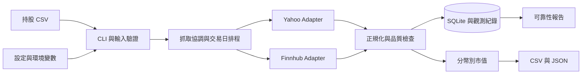

# 架構與 Docker 部署設計

版本：v0.1；日期：2026-09-07；狀態：待實作設計。

## 1. 架構

單一 Python 應用程式、單一寫入程序與 SQLite，使用同一映像提供一次性 CLI 與持續觀測模式。此 POC 不需要 Web Server、Redis 或額外資料庫容器。



| 模組 | 責任 |
|---|---|
| cli / input | argparse 命令、CSV 解析、設定驗證、退出碼 |
| instruments | 市場識別、代碼映射、商品類型與幣別驗證 |
| providers | 將各來源回應轉為共用 Quote／FetchResult，不計算持股市值 |
| scheduler | 交易日曆、輪詢、限流、重試、停止訊號與缺輪紀錄 |
| quality | 價格、時間、時段、來源延遲與品質標記 |
| valuation | Decimal 運算、分幣別小計、完整性判斷 |
| storage | SQLite 交易、執行識別、設定快照與報價歷程 |
| reporting | 終端表格、CSV／JSON 輸出與可靠性統計 |

估值來源由設定指定；比較來源獨立抓取及計分，不做每輪隱藏的自動切換。POC 第一階段不以複雜備援掩蓋單一來源是否可靠。

## 2. 版本與套件策略

Python 沒有另列 LTS 系列。官方政策為自 3.13 起約兩年一般修正加三年安全維護。2026-09-07 查核的最新穩定 Python 為 3.14.7，作為實作起點；建立容器前再核對最新修補版。[維護政策](https://peps.python.org/pep-0602/)、[官方版本](https://www.python.org/doc/versions/)

| 項目 | 本版選擇 | 狀態 |
|---|---|---|
| Python | 3.14 系列最新穩定修補版，目前查核為 3.14.7 | 待容器與依賴相容性驗證 |
| 基礎映像 | 官方 Python、Debian slim 變體，固定 patch tag 與 digest | 確切 tag／digest 在實作時查核，不臆造 |
| CLI／CSV／金額／儲存 | 標準庫 argparse、csv、decimal、sqlite3 | 減少直接依賴 |
| Yahoo 存取 | yfinance | 候選，版本及 Python 3.14 wheel 相容性待測 |
| HTTP API | httpx | 候選，用於 Finnhub 與官方資料 HTTP 介接 |
| 交易日曆 | exchange_calendars 與官方交易行事曆核對 | 候選，台股／美股覆蓋與版本待測 |
| 時區 | zoneinfo，容器安裝可用時區資料 | 驗證 Asia/Taipei 與 America/New_York |
| 開發驗證 | pytest | 實作測試時固定版本 |
| 套件鎖定 | pyproject.toml＋uv.lock | uv 本身亦固定版本，容器使用 frozen 安裝 |

對有官方 LTS 的元件優先選 LTS，沒有者採仍受維護的最新相容穩定版，不採 alpha／beta／RC。套件與映像不使用浮動 latest。若 Python 3.14 或最新套件不相容，先記錄原因與替代方案討論，不默默降版。

鎖定檔提供依賴解析的可重現性；映像 digest 固定來源映像。建置仍需記錄平台與必要系統套件版本，不宣稱不同平台產物完全相同。實際 Engine／Compose 版本記錄於驗收證據。

## 3. Provider 契約

Adapter 接受一組 Instrument，回傳每個標的的 FetchResult，包含成功報價或明確錯誤；批次回應缺少某檔時必須建立缺漏結果。批次 HTTP 成功不代表每檔成功。

共同需求：逾時、限流、錯誤分類、UTC 時間、回應解析版本、供應商代碼。任何 SDK 內建重試或快取若無法觀測，於報告說明統計邊界，不宣稱是底層網路請求數。

預設策略：單次操作逾時 10 秒；可重試的暫時性錯誤最多追加兩次，指數退避加隨機偏移，尊重 Retry-After。無效金鑰、未知代碼與解析錯誤不盲目重試。每輪總預算 50 秒，到期未完成的標的記錄失敗／未執行原因，下一輪不補發請求風暴。

若 Retry-After 超過本輪預算，記錄來源冷卻狀態並延後該來源；每一預定機會仍計入覆蓋率，不因退避而消失。不同來源獨立限流；未確認免費額度前不得配置高頻率。

各市場依一般交易時段排程；收盤後延長「已知來源延遲＋兩輪輪詢」的觀測，讓延遲來源有機會回傳收盤資料，再停止該市場定期查詢。延遲未知時先保留最多 30 分鐘的觀測窗口並記錄不確定性。跨市場獨立排程，避免因台股休市而停止美股。單次 quote 可於任何時間執行，但保留真實市場狀態。

若來源資料只提供 K 線，必須明確映射時間為區間開始或結束；不使用不完整區間冒充成交快照。精度不足時標示品質未確定。

## 4. 持久化資料

| 表 | 主要內容 |
|---|---|
| runs | run-id、開始／結束、套件版本、映像與設定識別、輸入雜湊、觀測是否中斷 |
| holdings | run-id、ticker、市場、幣別、buy_price、quantity |
| cycles | 預定時間、實際開始／完成、完成／中斷／跳過原因 |
| fetch_attempts | run-id、cycle-id、來源、標的、嘗試序號、耗時、錯誤與回應識別 |
| quotes | 來源、價格種類、價格、quote_time、received_at、品質與對應嘗試 |
| valuations | cycle-id、選用 quote-id、市值、各幣別完整性 |

Decimal 值以字串儲存，避免 SQLite REAL 精度損失；時間以帶時區的 UTC ISO 8601 儲存。所有報價可追溯至執行與來源。schema_version 記錄資料庫結構版本。

SQLite 檔置於持久化 volume；寫入交易保持短小。quote／monitor 使用應用層獨占鎖，禁止兩個收集程序同時寫同一資料目錄；report 可唯讀查詢。磁碟滿等儲存錯誤須可見並以非零退出，不繼續宣稱觀測正常。

保存足以重現解析的精簡回應與回應雜湊，不保存金鑰、Authorization header 或含 token 的 URL；原始來源資料僅在個人環境保留，移交文件只附必要且可分享的證據。

## 5. Docker Compose 契約

POC 實作交付下列檔案，這一版僅定義內容：

- Dockerfile：固定基礎映像、鎖定安裝、非 root 執行、Python CLI entrypoint。
- compose.yaml：單一 app service，預設 monitor，無需開放 port。
- .dockerignore：排除本機環境、資料庫、報告、金鑰與真實持股。
- .env.example、config.example.toml、匿名範例 CSV。
- pyproject.toml、uv.lock 與完整 build／run／report 操作說明。

| 容器位置／設定 | 設計 |
|---|---|
| /input | 主機輸入目錄唯讀 bind mount |
| /data | named volume，保存 SQLite、鎖與心跳 |
| /output | 主機報告目錄可寫 bind mount |
| FINNHUB_API_KEY | 從執行環境注入，不寫入映像與 repository |
| 時區 | 儲存 UTC；應用明確使用市場時區，不能只依容器 TZ 判斷開盤 |
| restart | 持續模式使用 unless-stopped；一次性命令正常退出 |
| healthcheck | 檢查程序心跳與儲存可用性；市場休市／外部供應商斷線另行報告 |
| stop_grace_period | 允許完成本輪狀態與 flush；逾時中止仍可在下次啟動辨識未完成輪次 |

healthcheck 失敗本身不代表 Docker 會自動重啟；restart policy 針對程序退出。排程等待休市期間也更新心跳，避免把休市判成程序故障。

預定操作（實作後才可執行）：

```text
docker compose build
docker compose run --rm app validate --input /input/holdings.csv
docker compose run --rm app quote --input /input/holdings.csv --config /input/config.toml --output /output
docker compose up -d
docker compose logs -f app
docker compose run --rm app report --run-id <run-id> --output /output
docker compose down
```

一次性 quote 前需停止正在使用同一資料卷的 monitor；重啟 monitor 建立新的 run-id 並連結同一觀測 campaign-id，以便彙總觀測停機缺口。操作說明需提醒 down -v 會刪除資料卷，不能作為一般停止方式。

Compose 使用現行 Compose Specification，不寫過時的頂層 version 欄位；實作時驗證 compose config、build、啟動、停止與資料保存。[Docker 文件](https://docs.docker.com/compose/intro/compose-application-model/)
