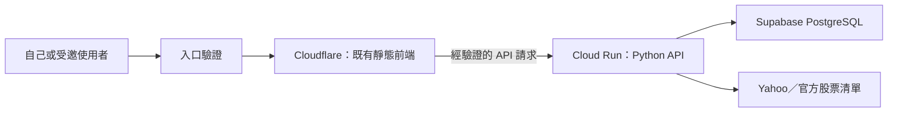
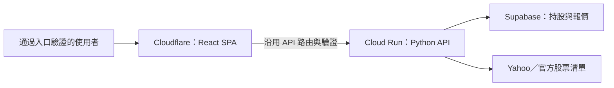
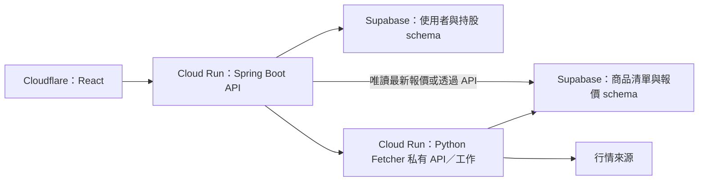

# Cloud Run／Supabase／Cloudflare 部署評估

評估日期：2026-09-15。依目前 repository 程式與官方文件評估；尚未建立雲端資源、變更應用程式或執行雲端連線測試。

## 1. 結論

**已確認第一版採 Cloudflare 靜態前端＋Cloud Run Python API＋Supabase PostgreSQL，保留既有 HTML／CSS／JavaScript。先自己使用、保護入口、按需更新並接受冷啟動。後續在同一 Cloudflare 專案部署 React 靜態 build，另加入 Spring Boot 管理使用者資料。**

低流量、接受冷啟動、不持續抓價時，可以把運行成本壓到接近免費額度；不保證每月零元。最大的障礙不是框架，而是目前程式假設「本機、單一程序、背景工作持續運作」。不能只換 DB 位址就公開部署。

### 已確認的決策（2026-09-15 更新）

使用者已確認以下方向；認證實作與 API 直連／代理方式仍需於實作時落定：

| 決策 | 已確認方向 | 範圍說明 |
|---|---|---|
| Demo 使用對象 | 先自己使用，保護入口與 API | 暫不做多人持股隔離 |
| 更新方式 | 手動按需抓價，接受冷啟動 | 不啟用常駐 monitor |
| 第一版前端位置 | Cloudflare | 第一版就完成 API 路由、跨來源與登入整合 |

部署前另需確認：每月可接受的費用上限、預估人數／持股數／更新次數、是否已有 GCP 帳務與 Supabase 專案、要用假資料或移入既有持股、有無自訂網域。這些資訊不必包含密碼或金鑰。

## 2. 建議分階段架構

三階段依序完成「部署基礎」、「前端改寫」、「後端職責拆分」。Cloudflare、Cloud Run 與 Supabase 從第一階段就使用；第二階段沿用這些平台，第三階段再新增 Spring Boot 服務。React 遷移與 Spring Boot 整合可獨立進行，以下是建議順序。

| 階段 | 主要成果 | 前端 | 後端與資料庫 |
|---|---|---|---|
| 第一階段 | 受保護、可用的雲端 Demo | Cloudflare：既有 HTML／CSS／JavaScript | Cloud Run：Python API；Supabase：持股與報價 |
| 第二階段 | 以 React 重做前端 | 同一 Cloudflare 專案：React SPA | 沿用第一階段 Python API 與 Supabase |
| 第三階段 | 使用者資料與抓價職責分開 | Cloudflare：React SPA | Cloud Run：Spring Boot + Python Fetcher；Supabase 分 schema／角色 |

### 第一階段：部署既有 Demo，建立三個平台的連接

目標是讓自己能透過受保護的雲端入口使用現有功能，完成按需抓價、持久化與冷啟動驗證。

- 保留目前頁面與功能；允許少量 JavaScript 調整更新流程，不改 React。
- Supabase 從第一版就接上，避免把本機 PostgreSQL 暴露到外網，也減少第二次搬資料。
- 網頁 GET 讀取保存的報價；按更新才抓價。現有頁面保存後缺價時也會觸發更新，需一起納入頻率限制。
- 不將原本七天 monitor 放進 Web service，也不把原有觀測資料全量搬入免費 DB。
- 完成條件：上傳、保存、查詢與更新報價可用；未授權 API 存取被拒；服務縮容／重啟後持股仍保存，更新工作可安全恢復。

#### 第一階段需決定的 API 路由

Cloudflare 可以直接託管目前三個靜態檔，也可以日後放 React build 產物；前端換框架與前端搬家是兩個獨立決策。[Cloudflare Pages 文件](https://developers.cloudflare.com/pages/)

兩種接 API 的方式：

1. **瀏覽器直接呼叫 Cloud Run**：集中設定 API base URL；後端處理 OPTIONS，明列允許的正式／預覽 Origin、方法、Content-Type 與 X-Portfolio-Token。若使用 Cookie，另外設計 credentials、SameSite 與 CSRF；不要用任意 Origin 搭配憑證。
2. **Cloudflare Worker／Pages Function 代理 `/api/*`**：保留目前相對路徑，但代理是動態執行，須計入 Workers 額度，還要處理來源驗證、後端驗證及逾時。前端靜態免費不代表代理無限制。

目前 CSP 的 `connect-src 'self'` 也要跟部署方式同步；頁面搬到 Cloudflare 後，原 Python 回應的 CSP 不會自動套用到該靜態頁，需在 Cloudflare 配置安全標頭。若選代理，長時間抓價應改成非同步工作，避免依賴整條代理鏈維持長連線。

### 第二階段：改為 React SPA，沿用既有部署平台

目標是改善前端程式結構與互動，將第一階段的 HTML／JavaScript 頁面改寫為 React 單頁應用程式（SPA）。此時持股讀寫與抓價仍由既有 Python API 處理。

- 沿用第一階段 Cloudflare 專案、網域、API 路由與 Supabase 資料；React 不直接取得 DB 密碼。
- 更新前端 build command、輸出目錄、環境變數與 SPA 路由 fallback，將 build 產物部署到 Cloudflare。
- 保持 API 契約一致，包括持股版本衝突、更新狀態、錯誤回應與登入過期處理；如需調整契約，前後端一起更新。
- 完成條件：第一階段功能在 React 上通過驗證，重新整理子頁路由可正常開啟，原有資料與入口保護可繼續使用。

這一階段能沿用平台架構，但仍有建置設定要調整。上述安排以 React 靜態 SPA 為前提；若改採伺服器端渲染（SSR），需另外評估執行環境。

### 第三階段：加入 Spring Boot，拆分使用者資料與 Fetcher

目標是讓 Spring Boot 接手使用者與持股資料存取，Python 專注商品清單與行情。此階段新增 Cloud Run 服務，並調整 API 路由、服務間驗證與資料權限。

| 元件 | 責任與界線 |
|---|---|
| React | 顯示、編輯、登入狀態；不持有 DB 密碼或後端秘密 |
| Spring Boot | 驗證使用者、持股 CRUD、所有權檢查、彙整與回傳投資組合結果 |
| Python Fetcher | 股票代碼解析、批次抓價、快取、時效與品質標記、來源限流 |
| Supabase | 一個 PostgreSQL 專案先分 schema／角色；Auth 可選，不必另自建密碼系統 |

Spring Boot 與 Python 分別擁有自己的 migration 與寫入權限，不同服務不要同時修改同一組業務表。Fetcher 原則上只需要商品 ID／市場，不需要使用者姓名、成本與完整持股文件；目前 QuoteRunner 會保存持股快照，後續需拆開這個耦合。

目前 `portfolio` 固定 `id=1`，將來需遷移成 `user_id`／`portfolio_id` 模型，不能直接宣稱已支援多使用者。若採 Supabase Auth，Spring Boot 驗證 token 後仍要做持股所有權檢查；一般 JDBC 連線不會自動繼承瀏覽器 JWT 的 RLS 身分。

兩個後端都可 min instances=0，但串接時可能遇到兩次冷啟動。先回傳快取報價、需要時才更新，比每次讀持股都同步喚醒 Python 更省資源。Fetcher 使用服務對服務驗證；可評估 Cloud Run IAM，不把它做成任何人都能觸發的抓價入口。

完成條件：既有持股完成遷移與核對，React 經 Spring Boot 存取持股，Fetcher 僅接受授權服務呼叫，兩個後端寫入權限分離。若開放多人使用，另驗證各使用者無法讀寫他人持股。

## 3. 現有程式的部署缺口

| 現況與位置 | 部署影響 | 建議處理 |
|---|---|---|
| `web.py` 使用 `ThreadingHTTPServer` | 是本機 POC HTTP 層；Python 官方不建議用於 production | 上網前換成成熟 WSGI／ASGI HTTP 層，重用 Dashboard 邏輯；不用改前端框架 |
| `web.py` Host／Origin 僅接受 localhost、127.0.0.1 與 HTTP | 正常雲端 HTTPS 網址也會 403 | 設定正式 Host／Origin 白名單，保留本機模式；明確處理代理信任 |
| `/api/session` 對能進站的人發放 token；GET 沒有登入驗證 | 現有 token 是本機操作防護，不是使用者認證 | 入口驗證需涵蓋頁面與所有 API，不能只保護前端 |
| `--port` 預設 8765，`--container` 才監聽所有介面 | 未自動讀取 Cloud Run `PORT` | 啟動時綁定 `0.0.0.0:$PORT`；或明確設定 Cloud Run port 與參數一致 |
| Dockerfile ENTRYPOINT 是 `stock-poc`，CMD 是 `--help` | 直接部署原映像不會啟動 Web | 新增 Web 啟動配置／映像 target，或在部署設定覆寫 command／args |
| `Dashboard.refresh()` 寫 job 後開 daemon Thread，立刻回 202 | 請求結束後背景 CPU 不可靠，縮容會中斷 | 改請求內完成或可靠外部工作，詳下一節 |
| Web 啟動持有整個程序生命週期的 advisory lock | 新 revision 啟動時可能拿不到鎖而失敗 | 移除全站 singleton 依賴，保留工作級互斥與恢復機制 |
| mutex 在記憶體；`recover_jobs()` 啟動即把所有進行中工作標失敗 | 多實例或新舊版本重疊會重複工作或誤判別人的工作 | DB 原子認領、owner／lease／逾期恢復；未確認過期不得宣告失敗 |
| 每個程序產生不同 session token | 冷啟動／跨實例可使既有頁面寫入被拒 | 改穩定的驗證／CSRF 設計，並處理過期重取；不可將固定秘密放 JS |
| Compose 掛載 `/input`、公司 CA、external DB network | Cloud Run 不會照搬本機 Compose 掛載與網路 | 提供獨立非秘密雲端 config，秘密使用 Secret Manager |
| `.dockerignore` 只放行少量檔案，Dockerfile 不複製 config | 只新增雲端 config 檔不會自動進映像 | 明確修改 COPY／allowlist，或採唯讀設定掛載 |
| `Storage` 使用 session lock、SET、連線 options | transaction pooler 不適合原封不動使用 | 第一版使用 Supabase session pooler 並測試 startup options |
| DB 設定未明確強制 SSL | 不能只假設跨雲連線已安全驗證 | 設定 `PGSSLMODE`／`PGSSLROOTCERT` 或新增正式設定，驗證 TLS 與憑證 |
| `valuation()` 會查 dashboard 與原 app schema | 只初始化 dashboard 不代表完整可用 | 初始化兩者，或移除雲端對舊 POC schema 的 fallback |

Python HTTP 層建議依據：[http.server 官方說明](https://docs.python.org/3.12/library/http.server.html)。Cloud Run 要求監聽指定介面與 port，且本地檔案、程序不能當成永久狀態。[容器執行契約](https://docs.cloud.google.com/run/docs/container-contract)

### 背景更新：第一版最重要的取捨

**建議：小型 Demo 先在 HTTP 請求內完成有時限的更新。** 設持股數、批次數、整體時間上限與重複請求保護，完成後回傳 job ID／結果；前端仍可沿用 job 查詢介面，只需改善等待狀態。如需非同步立即回應，再導入 Cloud Tasks 或 Cloud Run Jobs，持久保存 job 狀態並確保重試冪等。

目前每批 5 檔、每批最多 300 秒，**整份清單不等於最多 300 秒**。需要設定整體 deadline，先以小清單實測，再決定 Cloud Run request timeout；HTTP 層、provider、DB 與代理的逾時也須對齊。工作超時或容器被終止時，應保留先前可用報價，讓下一次請求能安全恢復。

Cloud Run request-based 模式只在處理請求等受計費階段配置 CPU。不要靠頁面每 1.8 秒輪詢來「維持背景執行」；使用者關頁後就失去這個條件。[CPU 配置契約](https://docs.cloud.google.com/run/docs/container-contract)

若保留現行背景執行緒而採 instance-based billing + min instances=1，成本會變成持續運行，而且仍可能遭重啟；不推薦作為最低成本方案。`max instances=1` 只能控制擴展，不能證明永遠只有一個程序：更新版本或短暫超額仍會重疊。[最大實例限制](https://docs.cloud.google.com/run/docs/configuring/max-instances)

## 4. Supabase 準備與迁移

1. 建立獨立 Demo project，選鄰近 Cloud Run 的區域；例如先比較新加坡組合，再按實際可用區域與費率決定。跨供應商同城市仍需量測網路延遲。
2. 從 Supabase Connect 複製 **Session pooler** host／port／DB name，不自行拼 host。Free 直連端點通常是 IPv6；shared session pooler 提供 IPv4，不需要為此先購買 IPv4 add-on。
3. 使用專用非管理角色。既有 `check_permissions()` 禁止 superuser／createdb／createrole；不要把預設 postgres 管理帳號當應用 runtime 帳號。Pooler 的自訂角色 username 格式為 `[ROLE].[PROJECT-REF]`。
4. 由管理者先建立 schema 與授權；目前 `migrate()` 建表，**不負責 CREATE SCHEMA**。migration 帳號需 CREATE，runtime 只保留必要操作；驗證既有 permission checks 仍可通過。
5. 第一版保留 `app` 與 `dashboard` 兩個 schema 時，兩者均初始化，dashboard 另執行 `web --initialize`。若採去除舊 schema fallback 的實作，則以新設計為準。不要讓 `--schema` 與來源 `database.schema` 相同，現有程式會拒絕。
6. 明確設定 TLS；優先驗證 `verify-full` 與正確 CA／host。`require` 可強制加密但不等於完整主機驗證。pooler 若不接受目前 startup `options`，在 session 建立後執行對應 SET，測 timeout 行為。
7. 先匯入假持股並重新抓商品清單，避免搬所有 POC runs／attempts／catalog generations。真實持股搬遷前先備份並核對筆數、幣別與精度。
8. 每次抓價都會累積證據資料；訂保存期、定期清理及索引／DB 總容量監測。容量要以表與索引實測，不只看報價筆數。
9. schema 不透過 Data API 暴露給瀏覽器；如後續開放直連 Data API，另配置 grants 與 RLS。Free 不含自動備份，需有自行匯出與還原演練。

連線模式與 transaction 模式限制依據：[Supabase PostgreSQL 連線文件](https://supabase.com/docs/guides/database/connecting-to-postgres)。不能因為 Cloud Run 是 serverless 就一律選 transaction pooler；本專案的 session lock 是決策關鍵。

## 5. 成本評估

以下為 USD、未含稅與匯差；是規劃額度，不是帳單保證，也不以一次性的試用抵用金作長期成本模型。

| 項目 | 低成本方案與限制 |
|---|---|
| Cloud Run | Request-based、min=0；月免費額度基準為 180,000 vCPU-seconds、360,000 GiB-seconds、200 萬請求。按帳務帳號合併計算，區域價格會影響抵扣 |
| Supabase Free | $0；DB 500 MB，5 GB egress，閒置一週可能暫停，不含自動備份；Pro 起價 $25／月 |
| Cloudflare 靜態前端 | Free 可先使用；Pages Free 每月 500 次部署。Pages Functions／Worker 代理另外套用動態額度 |
| 附帶 GCP 費用 | Artifact Registry、建置、Secret Manager、Logging、對外流量需分別核對；Cloud Run 免費不代表這些全免 |
| 可延後項目 | 自訂網域、外部負載平衡器、VPC connector／NAT、固定出口 IP、常駐實例、獨立 DB project |

來源：[Cloud Run 定價](https://cloud.google.com/run/pricing)、[Supabase 定價](https://supabase.com/pricing)、[Cloudflare Pages](https://developers.cloudflare.com/pages/)、[Workers 定價](https://developers.cloudflare.com/workers/platform/pricing/)。Cloud Run 對外流量的免費條件不能直接套用到亞洲跨雲 DB 流量。

### 一個粗估範例

假設每天 20 次刷新，每次配置 1 vCPU／1 GiB 並執行 30 秒，30 天約為 18,000 vCPU-seconds 與 18,000 GiB-seconds；另加頁面請求、啟動、DB 等待與重試。單看此假設，運算有機會落在免費額度內。**30 秒是估算假設，尚未量測這個專案的雲端抓價時間。**

反之，常駐 1 vCPU／1 GiB 30 天的配置時間約 2,592,000 秒，不能套用上述按需使用的結論，應使用 instance-based 價格重算。持續分鐘級抓價也會更快用完 DB 容量與行情來源額度。

建議先以「接近 $0、預留每月 $5–10 雜費空間」作討論起點；實際預算待使用者決定。先看帳務帳號已被其他專案消耗多少免費額度，再訂門檻。

### 費用控制

- 設小的最大實例數、refresh 冷卻、每次最大標的數、歷史資料保存期；限制日誌內容與保留量。
- 一般 Alerts-only 預算只通知。官方目前另有 **Spend cap budgets（Preview）**，已列 Cloud Run 為支援服務；可評估啟用，但按單一 project／service、以毛額估算觸發，不含抵扣，且非即時、可能超支，其他服務費用不會一起封頂。[Spend cap 文件](https://docs.cloud.google.com/billing/docs/how-to/budgets-spend-caps)
- 第一版不必為了 DB 連線先建立 NAT／固定 IP；只有來源白名單等實際需求出現時再評估。

## 6. 部署準備清單與順序

### A. 帳號與設定

- [x] 確認 Cloudflare 前端、單人受保護存取、按需更新與冷啟動。
- [ ] 確認月預算、測試資料與預估更新量。
- [ ] GCP project／Billing、部署身分、Artifact Registry repository；啟用 Cloud Run、Artifact Registry、Secret Manager，使用 Cloud Build 時再啟用它。
- [ ] 建立 runtime service account，只授予所需秘密版本讀取權；建置／部署身分另行管理。
- [ ] Supabase project／區域／session pooler／專用角色／schema 授權。
- [ ] 準備非秘密 cloud config；DB_PASSWORD、必要 provider key 放 Secret Manager，文件與 image 不含秘密。
- [ ] GCP 雲端出口先使用正常公開 CA；移除公司專用 `company_ca_file` 與 relaxed TLS 設定。若本機建置仍經公司代理，可保留 build secret，但不帶入 runtime。
- [ ] 決定入口認證。自己用可採私有 Cloud Run 配本機授權代理；受邀瀏覽器直接訪問則需真正的登入／入口驗證。不要把「登入了 Google」等同瀏覽器會自動帶 Cloud Run IAM token。
- [ ] 若用 Cloudflare Access／代理，必須防止直接訪問 run.app 繞過；後端驗證可靠簽章／憑證，不能只檢查可偽造 header。

### B. 程式修改與建置

- [ ] 完成第 3 節 HTTP、Host／Origin、認證、工作生命周期、singleton／復原與 token 缺口。
- [ ] 初始測試配置建議 1 vCPU／1 GiB、min=0、max=1、低 concurrency；CPU／記憶體依上傳與 provider 子程序的實測峰值調整，並留出 DB 連線餘裕。
- [ ] 設定 Web command、PORT、config 路徑、stdout/stderr 日誌、startup／health endpoint；健康檢查不觸發 migration 或外部行情抓取。
- [ ] 映像建 linux/amd64、沿用 lockfile 與非 root 設計；確認 static assets、SQL migrations、config 都能在最終映像讀到。
- [ ] 記錄映像 digest、部署設定與 secret 版本，方便回滾；不用把本機 volume 帶進雲端。

### C. 初始化與上線

1. 建立 DB schema／權限，先測連線與 TLS，再用一次性受控執行完成 migration、dashboard initialize、catalog refresh。可用一次性容器或 Cloud Run Job，不在每次 Web 啟動自動 migration。
2. 部署測試 revision，先完成受保護入口，再使用假資料操作。
3. 驗證上傳 Excel、預覽、儲存、版本衝突、報價更新、缺價／失敗、查詢結果與前端提示。
4. 關掉瀏覽器、等待縮容後重新開啟，確認持股仍在；更新中途終止與再部署，確認 job 不永久卡住，另一個存活 worker 不被誤標失敗。
5. 實際測台股上市／上櫃、美股與 ETF 的雲端出口。既有公司環境測試不能證明 Yahoo 等來源接受 GCP 出口；記錄 429／封鎖／timeout／品質，不宣稱未驗證的可靠性。
6. 驗證未授權 GET／PUT／POST 與直連後端入口被拒；若公開假資料 Demo，確認寫入及觸發抓价有實際限制。
7. 確認 DB 備份與還原、前版 image 回滾。資料庫 migration 要向後相容，回滾 image 不等於回滾資料庫。
8. 小流量運行後檢查計費、DB 容量、連線數、冷啟動與抓價耗時，再決定是否開放更多人。

行情資料來源的使用條款與公開再散布權利需在公開展示前另行核對；本次不把技術上可抓取等同已獲授權。

## 7. 何時再增加元件

| 條件 | 下一步 |
|---|---|
| 只是自己看 Demo、按需更新 | Cloudflare 靜態前端 + 單一 Cloud Run API + Supabase |
| 需要關頁後仍可靠完成長工作 | Cloud Tasks 或有限時長 Cloud Run Job；加入冪等與失敗復原 |
| 需要固定間隔更新 | 排程觸發有限工作；按交易日曆判斷是否抓價，避免每位使用者各自重抓相同標的 |
| 需要多人各自保存 | 加 Spring Boot／認證與 user_id 資料模型，再開放真實多人資料 |
| 前端改為 React SPA | 沿用 Cloudflare 專案，調整建置與路由設定 |
| DB 接近容量上限或要求備份／不中斷 | 先清理不必要歷史，再評估 Supabase Pro |

**本次交付為部署評估與準備項目。使用對象、更新方式與前端位置已確認。可行性已確認到程式與平台契約層級；費用、效能、外部行情可用性仍需小流量雲端實測，入口驗證與 API 路由仍需落定。**

## 8. 單人使用是否能完全免費：確認結果

**可以以每月接近 $0 為目標，但「只有一位使用者」不足以保證帳單恆為 $0。** 雲端按資源、儲存與流量計費，不按本專案使用者數計費。此結論不依賴新帳號試用金，也尚未核對使用者帳務帳號剩餘額度。

| 項目 | 單人低流量的判斷 | 免費條件／容易漏掉的費用 |
|---|---|---|
| Cloudflare 靜態前端 | 可使用 Free，靜態請求免費且不限次數 | 先用平台網域；自訂網域註冊另付費 |
| Cloudflare API 代理（若採用） | 單人通常遠低於免費請求額度 | Pages Functions 與 Workers 合計每天 100,000 次，另有執行限制；限制代理路由在 `/api/*` |
| Cloud Run 運算 | 按需、min=0，有機會全落免費額度 | 月 180,000 vCPU-seconds／360,000 GiB-seconds／200 萬請求的基準；帳務帳號共用、依區域計價抵扣 |
| Supabase | Free 可用於小型 Demo | DB 500 MB、5 GB egress；不代表可無限累積歷史；閒置一週可能暫停 |
| Artifact Registry | 不一定完全免費 | 免費儲存只有每帳號 0.5 GiB-month；最終映像與保留版本可能超過，需量測實際儲存量及設定清理政策 |
| Secret Manager | 少量秘密通常可免費 | 6 個 active versions／月、10,000 次存取／月；Disabled 版本也算 active，額度按帳務帳號共用 |
| GCP 對外網路 | 亞洲部署可能有少量費用 | Cloud Run 官方列的 1 GiB 免費出口條件是北美境內，不能直接套到亞洲往 Supabase／瀏覽器／Cloudflare 的流量 |
| 建置、日誌與額外服務 | 取決於使用配置 | 可先本機建置再推送，避免 Cloud Build 建置費；其他額度及自動掃描等功能需逐項確認 |

來源：[Cloudflare 靜態與 Functions 定價](https://developers.cloudflare.com/pages/functions/pricing/)、[Cloud Run 定價](https://cloud.google.com/run/pricing)、[Supabase 定價](https://supabase.com/pricing)、[Artifact Registry 定價](https://cloud.google.com/artifact-registry/pricing)、[Secret Manager 定價](https://cloud.google.com/secret-manager/pricing)、[Cloud Build 定價](https://cloud.google.com/build/pricing)。

以每天 10 次更新、每次 60 秒、1 vCPU／1 GiB 為例，每月約 18,000 vCPU-seconds／18,000 GiB-seconds，遠低於上述運算基準；仍需加上啟動、一般 API 與重試。這是估算，不是已量測耗時。即使運算費為零，映像倉庫與亞洲出口仍可能出現小額費用。

實作目標：不開付費月租方案、min=0、不常駐排程、不購買網域／固定 IP／NAT／負載平衡器，控制映像版本、日誌與歷史資料。入口認證仍須完成，不因單人使用就省略。GCP 仍需有效 Billing account；免費額度不是禁止扣款的硬上限。

前文 $5–10 是預算緩衝建議，**不是必付月費，也不是目前估計會用到的金額**。若要求嚴格不能有任何扣款，現階段不能承諾此 GCP 架構符合；需先核對區域、映像儲存、流量、其他帳號用量，再觀察實際帳單。
