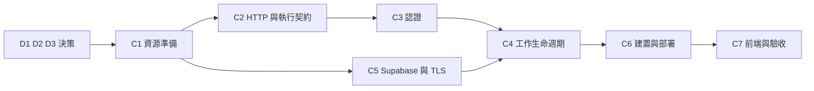

# 雲端部署第一階段執行計畫

> **最新進度（2026-09-26）。下一步為 `C7-6` 的 R3（09-28 或 09-29 晚上），見下方「`C7-6` 剩餘順序」。R4 已於 09-26 完成。**
>
> | 步驟 | 狀態 |
> |---|---|
> | `C1` 資源準備 | ✅ 完成（預算警示通知送達併入 `C7-7`） |
> | `C2` HTTP 層 | ✅ 完成 |
> | `C3` 認證 | ✅ 程式完成；**雲端驗收欠 `C7-3`**，在該項通過前不得宣稱 C3 已完成 |
> | `C4` 工作生命週期 | ✅ 程式完成；**雲端驗收欠 `C7-5`** |
> | `C5` Supabase／TLS | ✅ 完成 |
> | `C6-1` 建置推送 | ✅ 完成（見 [C6 證據](cloud-C6-evidence.md)） |
> | `C6-2`–`C6-4` 部署 | ⬜ **被 `refresh_max_tickers` 擋住**，見下 |
> | `C7-2` 逾時量測 | ✅ 完成；`C7-2` 其餘要求待 `C6` 部署後 |
> | `C7-7` 冷啟動 | ✅ 提前完成（2.3–3.4 秒） |
> | `C7-6` 外部來源驗收 | 🟡 **R1 已完成**（2026-09-23）；**R4 已完成**（2026-09-26，11 檔都帶 `market_closed`，台股價格等於官方收盤，美股價格為證據不足，見 [C7 證據](cloud-C7-evidence.md) R4 節）；~~R2–R5 未開始~~ R2、R3、R5 未開始，**須在清單到期前完成**（原為 2026-09-30 16:15（台北），同日請求外更新後延至約 17:10）。**09-25 補記**：台股 09-25、09-28 休市，R2 只剩 09-29、09-30 可跑；R4 已備妥，排在 09-26 08:00 之後，見 `C7-6` 項下。R2 已備妥（盤中參考改用 MIS，`scripts/c76_mis.py`）。R3、R5 沒有另做準備 |
> | 其餘 `C7` | ⬜ 未開始 |
>
> **`C7-6` 剩餘順序**（2026-09-25 補記，台北時間）。每一步的程序都在 `C7-6` 項下，執行 Job 的步驟都要在**執行 R1 的那台機器**上做（本 repo 另一個工作目錄沒有 gcloud）：
> 1. ~~**R4 雙邊休市**：09-26（六）08:00 起到 09-27（日）。見「R4 執行準備」。~~ **已完成**（09-26 10:51 台北，`c76-source-probe-h8cms`，portfolio revision **1**）。執行機器改為本 repo 的這個工作目錄：這台已安裝並登入 gcloud，之後的場次也可以在這台執行，gcloud 指令在 PowerShell 下執行（查日誌的引號陷阱見 C7 證據 R4 節）。**2026-09-26 補記：必須用 PowerShell 7（`pwsh`）**。這台終端機的預設是 5.1，在 5.1 下取日誌會靜默回 0 筆，見「R3 執行準備」。
> 2. **R3 美股盤中**：09-28（一）或 09-29（二）的 22:00–03:30。沿用同一支 Job、`C76_TICKERS=fixed`，美股口徑比對記為證據不足（使用者決定）。~~沒有另寫準備段，判定依「判定方式」與「每場記錄」。~~ **2026-09-26 補記：已備妥**，見 `C7-6` 項下「R3 執行準備」。建議 09-28 晚上跑，好讓 R5 能接在同一晚；`c76_report.py` 的逐檔判定是 R4 專用的，R3 不得貼用。
> 3. **R2 台股盤中**：09-29（二）或 09-30（三）的 10:30–12:30 觸發。J−30 分先啟動 MIS 記錄。見「R2 執行準備」。**2026-09-26 補記**：已確認這台跑得了 R2（MIS 記錄與比對在容器裡執行），但 MIS 的 `tlong` 比 `t` 晚 1 小時。使用者決定改用 `d`+`t` 對齊，`compare` 要**在 R2 之前**改好並測過，在收尾前只提交在本機、不推送。**已改好**（本機分支 `c76-mis-dt-align`），R2 當天從 worktree `D:\workspace\stock-quote-fetcher-c76-mis` 使用新版，做法見「R2 執行準備」。R2 期間筆電要插電，觸發前 35 分鐘先確認 Docker 可用。
> 4. **R5 吞吐量**：與 R2 或 R3 同一時段，**僅在該場沒有 429 時**，間隔超過 60 秒，`C76_TICKERS=wide:150`。取值方式見「`refresh_max_tickers` 的取法」。~~沒有另寫準備段。~~ **2026-09-26 補記：已備妥**，見 `C7-6` 項下「R5 執行準備」。首選 R3 同一晚。~~**有一項待使用者決定**~~：R5 處理到的幾乎全是台股，美股的單檔成本量不到。**同日使用者決定照原樣跑**，`c` 記為台股成本，美股以 R3、R4 的逐檔耗時作為旁證。
> 5. **清單在 09-30 約 17:10 到期**。這不是硬期限，只要執行 Job `finpo-catalog-refresh`（約 82 秒）就能延長，但**務必在到期前更新**：Job 若用 `218b4b962c5a` 映像，到期後 probe 存持股會失敗（`refresh_in_request = false`）；若用 `06e2df807527`，清單過期時會在請求內抓清單，並把約 135 秒混進報價耗時。不論量測是否完成，這次更新本來就是管理者的責任（`C6-3`）。
> 6. **收尾**：先把逐檔結果寫進 C7 證據，再以最後一場的 revision 執行 `C76_MODE=reset`，然後 `cloud_db purge` 各場的 manifest（先 dry-run），最後刪除 Job `c76-source-probe`，並依 R5 把 `refresh_max_tickers` 寫進 `deploy/cloud.toml`。完成後 `C6-2` 才能開始。**2026-09-26 補記**：推送 `cloud.toml` 會觸發建置，之後 `218b4b962c5a` 遲早會被清除政策刪掉，所以建置完成後要立刻把 `finpo-catalog-refresh` 改指向新映像，並以 `describe` 核對（見「R5 執行準備」最後一項）。
>
> **映像保留窗口（2026-09-25 補記）**：Artifact Registry 只保留最近 3 個版本。推送 `b6347e6` 後建置成功（run `36101318281`），推定窗口內為 `06e2df807527`、`218b4b962c5a`、`b6347e610e87`。**再推一次非純文件的提交就會擠掉 `06e2df807527`**，若 `c76-source-probe` 仍指向它，Job 會無法執行。在 R4 前以 `describe` 確認 Job 用的映像之前，不要推程式變更。推定依據是 `gh run list` 的建置紀錄，**未以 `gcloud artifacts docker images list` 核對**。
>
> **2026-09-26 補記：已核對，限制改寫如下**。`gcloud artifacts docker images list` 證實窗口內恰為上述三個；`describe` 證實 `c76-source-probe` 與 `finpo-catalog-refresh` **都用 `218b4b962c5a`**，沒有 Job 用 `06e2df807527`。因此**可以再推一次程式變更**（擠掉的是沒人用的 `06e2df807527`），但**第二次會擠掉 `218b4b962c5a`**，兩支 Job 都會無法執行，包括清單到期前必須跑的 `finpo-catalog-refresh`。在 `C7-6` 收尾、`c76-source-probe` 刪除之前，程式變更最多再推一次；若必須推第二次，先把兩支 Job 改指向新映像並以 `describe` 核對。**這一次已決定用在報表腳本 `scripts/c76_report.py` 的提交**（使用者決定，緊接在本補記之後推送）。推送之後，收尾前就不能再推程式變更，除非先把兩支 Job 改指向新映像。
>
> **`C6-2` 唯一未解的前提**：`deploy/cloud.toml` 的 `refresh_deadline_seconds` 已定案為 **110 秒**（125 秒邊緣上限 − 3.5 冷啟動 − 1 收尾 − 2 殘餘超出），但 `refresh_max_tickers` 仍未設，唯一依據是 `C7-6` 從 **GCP 出口**實測的單檔抓價成本。公司網路測得的結果不算數。
>
> **`C7-6` 的執行方式已有草稿**（2026-09-23，見 `C7-6` 項下）：以拋棄式 Cloud Run Job 在正式服務之外先量測，藉此解開與 `C6-2` 互等的循環。草稿內的選擇已於同日由使用者全數拍板（採 Job、寫入正式 `dashboard` 並於測後清除、保留官方清單、暫不設定 Finnhub 金鑰、R5 約 150 檔），~~**尚未執行任何場次**~~。測試資料清除程序（`cloud_db purge`）與量測腳本（`scripts/c76_probe.py`）已完成，R0 已在本機以假網路預演通過；~~尚未在 Cloud Run 上執行任何場次~~。**同日補記：R1 已在 Cloud Run 上執行**（`c76-source-probe-mhj2r`，結果見下段）；R2–R5 未執行，量測資料的清除也還沒做。
>
> **2026-09-23 新發現、~~處理方式待決定~~ 已於同日決定並實測（見本段補記）**：`C7-6` R1 量得官方清單更新從 GCP 需 **135 秒**（抓取約 62 秒、逐筆寫入 13,427 筆約 73 秒），**超過 125 秒的邊緣上限**，且這段路徑不受 `refresh_deadline_seconds` 約束。正式部署後，頁面上的「更新股票清單」會收到 524。影響 `C6-2`、`C7-2`、`C7-4`，不影響 `C7-6` 的報價量測。見 [C7 證據](cloud-C7-evidence.md) 的 `C7-6` 節。**同日補記：已決定兩者都做，程式已完成**（清單批次寫入；`[instruments] refresh_in_request = false`，清單改由管理者以 `stock-web --refresh-catalog` 在請求外更新）。雲端耗時尚未實測，須等新映像建置；另須確認單一 INSERT 能否在 10 秒的 `statement_timeout` 內完成。**同日再補記：已實測**。新映像 `218b4b962c5a` 以 Cloud Run Job `finpo-catalog-refresh`（`--args=--refresh-catalog`）執行成功：觸發到完成約 82 秒（R1 同一區間約 159 秒），INSERT 未碰到 10 秒上限。寫入耗時沒有單獨量出，界線見 C7 證據。**清單每 168 小時到期，到期前須由管理者手動更新一次。**
>
> **接手前必讀的三條硬性限制**：
> 1. **`C7-1` 之前不得對 `finpo` Worker 做任何部署**——它承載 `C1-6` 的 canary，是目前唯一能驗證 Access 生效的東西。
> 2. **`GET /healthz` 在 Cloud Run 公開網址上不可用**（被前端攔截、不抵達容器，回 404）。健康檢查探針改用 `/`。見 [C7 證據](cloud-C7-evidence.md)。
> 3. **抓價的時間預算是巢狀的**：125 秒邊緣硬上限 ⊃ `refresh_deadline_seconds` 110 ⊃ 一批內所有市場共用的 `budget` ⊃ `cycle_budget_seconds` 50 ⊃ `operation_timeout_seconds` 10。調高任何一層前先讀 `C7` 證據的算式。
>
> 詳見 [C6 證據](cloud-C6-evidence.md)、[C7 證據](cloud-C7-evidence.md)、[C3 證據](cloud-C3-evidence.md)、[C4 證據](cloud-C4-evidence.md)、[C5 證據](cloud-C5-evidence.md)；下方 09-17／09-20 段落保留作為歷史狀態，與本表衝突時以本表為準。

日期：2026-09-17；狀態：`D1` 已全項定案（Cloudflare Access ＋ Google，服務間以 HMAC 簽章）、`D2` 已定案（**Cloudflare Workers static assets**，單一 Worker 同時承載靜態檔與 `/api/` 代理；2026-09-17 由原訂的 Pages Functions 改採，理由見 `D2`）、`D3` 已定案（請求內同步完成，時間上限待實測回填）、`D4` 已定案（Cloud Run 與 Supabase 同置東京）、`D5` 已定案（假持股先行、上限 $10、不買網域）、`D6` 已定案（GitHub Actions 建置推送，以 Workload Identity Federation 免金鑰認證）。`D1`–`D6` 全數定案，**`C1` 已全部完成**（`C1-1`–`C1-9`；四項完成條件中「預算警示可收到通知」因零花費無法觸發，併入 `C7-7`，不構成阻擋）。**`C2` 已全部完成**（2026-09-18／09-20，`C2-1`–`C2-7` ＋ 補立的健康檢查端點；HTTP 層改為 FastAPI ＋ uvicorn，證據見 `docs/cloud-C2-evidence.md`）。下一步為 `C3`／`C4`／`C5`。

本文件把 [雲端部署評估](cloud-deployment-assessment.md) 第一階段（Cloudflare 靜態前端＋Cloud Run Python API＋Supabase PostgreSQL）拆成可逐項確認與逐步交付的工作。評估文件負責「為什麼選這個架構」與成本、風險；本文件負責「要先決定什麼」與「按什麼順序做、做完怎麼算數」。

## 1. 文件用途與閱讀方式

- 決策以 `D1`–`D5` 編號，執行步驟以 `C1`–`C7` 編號，步驟內項目再以 `C2-1` 形式編號，方便逐項討論與回溯。
- 每個決策列出「目的、選項、建議、影響範圍」；每個步驟列出「目的、前置、執行項目、完成條件」。**目的欄位是確認重點**：若某項目的目的無法成立，該項目應該刪掉或改寫，而不是照做。
- 引用程式位置使用 `檔案:行號`，對應本文件撰寫時的工作樹狀態；程式變動後需重新核對。
- 勾選代表交付完成且具驗證證據，證據沿用既有 `docs/step-N-evidence.md` 慣例，以 `docs/cloud-C1-evidence.md` 形式命名。
- 本文件是計畫，不是驗收報告。未實測的項目一律不得在文件中宣稱已驗證。

## 2. 第一階段的範圍

| 納入 | 不納入 |
|---|---|
| 既有 HTML／CSS／JavaScript 前端搬到 Cloudflare | React 改寫（第二階段） |
| Cloud Run 單一 Python API，min=0、按需抓價 | Spring Boot、服務拆分（第三階段） |
| Supabase PostgreSQL 保存持股與報價 | 搬移既有 POC 觀測資料（runs／attempts／catalog generations） |
| 單人受保護存取 | 多使用者資料隔離、`user_id` 資料模型 |
| 請求內有時限完成的報價更新 | 常駐 monitor、七天觀測、固定排程抓價 |
| GitHub Actions 建置並推送映像 | 自動化測試閘門、多環境（staging／prod）管道 |

`portfolio` 目前固定 `id=1`（dashboard.py:107），第一階段維持此模型，不宣稱支援多使用者。

### 長期目標為開放多人，第一階段明確不做（2026-09-17 補記）

本專案的**最終目標是開放給多人使用**。此前本文件未記載該目標，導致「單人」看起來像是尚未補上的缺口；實際上它是刻意的範圍限制，本文件的多個決策都建立在這個前提上：`D3` 的請求內同步、`C6-2` 的 `max=1`、`C4-5` 的 60 秒冷卻、`D5` 的單一 email 白名單，皆非疏漏。記下此目標是為了讓兩者不再混淆。

三條由此而來的規則：

1. **在 `user_id` 資料模型完成前，不得放寬 Access policy 的 email 白名單。** 多放一個人不會產生第二個使用者，而是兩個人共用同一份 `portfolio`（`id=1`）——對方看得到也改得動你的持股。這是資料模型尚未實作，不是權限設定疏失。
2. **開放多人的擋門項是資料模型與並行處理，不是入口認證。** `D1` 的 Access ＋ Google 這層本來就能服務多人；真正要做的是 `user_id` 資料隔離，以及重新評估 `D3`（兩人同時更新會互相卡住）與 `C6-2` 的 `max=1`。因此入口認證側的任何進展**都不足以宣稱支援多使用者**。
3. **本文件中的「單人」一律讀作當期範圍，不是最終目標。** 日後接手時不需把它當成待修正的缺陷。

**已完成的前瞻性試探（2026-09-17）**：嘗試將 Google OAuth consent screen 由 `Testing` 改為 `In production`，目的是及早得知 Google 端對開放多人有何前置要求。**結果：被擋下**，Google 要求 homepage URL 與 privacy policy URL，而該兩者需自有且可驗證的網域。**狀態維持 `Testing`，未補填欄位**；phase 1 不需要 production 模式，且該份隱私權政策屬開放多人時的實質義務，不應以佔位文字提前打發。完整錯誤訊息與三層阻礙分析見 `docs/cloud-C1-evidence.md` 的 `C1-6`；對網域決策的影響已回填 `D5`。

## 3. 開工前需要確認的決策

`D1`–`D3` 是阻擋項：未定就無法開始 `C2` 之後的實作，三項皆已定案。`D4`、`D5`、`D6` 亦已定案，`C1` 之後無待決的阻擋決策；剩餘未定項全部是待實測回填的**數值**，不是待選擇的方案，列於第 6 節。

`D3` 雖已定案採用哪種執行方式，但其中的**時間上限與單次檔數仍是未定的數值**，須待 `C7-2`（邊緣逾時）與 `C7-6`（實際抓價耗時）量測後回填；在此之前不得在程式或部署設定中寫入憑推測得到的數字。

### D1　入口認證方式（已定案）

- **決定（2026-09-15）**：
  - 人員身分：採**選項 1 — Cloudflare Access，以 Google 作為 identity provider**。前端不實作任何登入程式碼。
  - 服務間信任：採 **HMAC 共享秘密簽章**，由邊緣 Worker 產生、Cloud Run 以標準庫驗證。未採 Access Service Token（無 body 綁定與防重放）與驗 Access JWT（需新增 JWT 與加密依賴，與維持 5 個直接依賴的鎖定狀態衝突）。
- **目的**：現行程式沒有使用者認證。`/api/session` 對任何連得到服務的人直接發 token（web.py:72），token 只用來擋跨站寫入，不是身分驗證；GET 完全沒有驗證。放上公網前必須先有真正的入口。
- **前提**：靜態前端不能持有任何秘密。進得了瀏覽器的值（JS 檔、注入的環境變數、API 回應）使用者都看得到，因此**簽章不可能在瀏覽器端產生**。簽章必須由伺服器端元件加上，這是選項 1 與 `D2` 選項 1（Cloudflare 代理）必須綁在一起的原因。

這一題其實有兩層，要分開決定：

| 層 | 回答的問題 | 由誰負責 | 缺了會怎樣 |
|---|---|---|---|
| 人員身分 | 這是不是本人？ | Cloudflare Access（Google 登入） | 任何人開網址就能操作 |
| 服務間信任 | 這個請求是不是從我的代理來的？ | 代理端簽章、Cloud Run 驗簽 | 任何人直接打 `https://<service>.run.app` 即繞過 Access |

**已登入後的資料路徑**（選項 1 ＋ `D2` 選項 1）：

```
瀏覽器（靜態 HTML／JS，不持有任何秘密）
   │  fetch('/api/...')：相對路徑，瀏覽器自動帶 Access cookie
   ▼
Cloudflare Access ── 未登入 → 導向 Cloudflare 登入頁 → Google OAuth
   │  通過後轉發請求，並附上 Cf-Access-Jwt-Assertion
   ▼
Worker（伺服器端執行，秘密存於 Secret binding）
   │  加上 X-Timestamp 與 X-Signature = HMAC(secret, ts|method|path|sha256(body))
   ▼  HTTPS
Cloud Run：驗簽；失敗一律 401，且不信任任何可偽造的標頭
```

**首次進站的登入流程**：訪客不需要、也不會有 Cloudflare 帳號。Access 只是驗證仲介，不保管密碼；它把人轉給 Google 確認身分，再比對 policy 的 email 白名單。

```
1. 瀏覽器 GET https://<前端網域>/
       ▼
2. Access 檢查 CF_Authorization cookie → 沒有
       ▼
3. 302 導向 https://<team-name>.cloudflareaccess.com/...
   （此時 index.html 一個 byte 都還沒送出）
       ▼
4. Cloudflare 託管的登入頁，列出啟用的登入方式
   ※ 只啟用 Google 一種時會跳過選單，直接導向 Google
       ▼
5. Google OAuth 同意頁 → 使用者選擇帳號
       ▼
6. 回到 cloudflareaccess.com/cdn-cgi/access/callback
   Access 比對 policy（email 是否在白名單）
       ▼
7. 通過 → 於前端網域寫入 CF_Authorization cookie → 302 導回原網址
       ▼
8. 重新 GET / 並帶著 cookie → Access 放行 → 真正送出 index.html
```

登入頁由 Cloudflare 託管在 team domain 上，**不是加在專案裡的一頁**，與靜態檔案完全分離。三個容易混淆的帳號：

| 角色 | 是什麼 | 誰持有 |
|---|---|---|
| Cloudflare 帳號 | 設定 Workers 與 Zero Trust 的管理帳號 | 只有開發者 |
| Zero Trust team domain | `https://<team-name>.cloudflareaccess.com`，驗證關卡 | 開發者設定，訪客僅被導向 |
| Google 帳號 | 真正證明身分的憑據 | 訪客本人 |

關鍵安全性質在第 3 步：**未登入時靜態檔案完全沒有離開 Cloudflare**。這與「前端先載入、再用 JavaScript 判斷未登入就隱藏」是不同等級的保護——後者以開發者工具或 `curl` 即可取得全部程式碼。登入後每次請求自動帶 cookie，包含 `fetch('/api/...')`，因此前端不需處理任何 token；session 效期於 Zero Trust 設定，過期才重走上述流程（前端的過期處理見 `C3-3`）。

- **選項**：
  1. Cloudflare Access（Zero Trust Free，50 人以內）保護前端與 `/api/` 路由，Cloud Run 端另外驗證請求確實來自自己的 Cloudflare 專案。**前端不需實作任何登入程式碼。**
  2. Cloud Run 設為需要 IAM 驗證，本機以 `gcloud run services proxy` 存取。安全性最高，但前端失去「從瀏覽器直接開網址使用」的意義，與 Cloudflare 託管前端的決策衝突。
  3. 自建帳密登入與簽章 cookie。需自行處理密碼保存、重設與鎖定，是本階段最不划算的自建項目。
- **建議（已採納為決定）**：選項 1。人員身分交給 Access，以 Google 作為 identity provider；Cloudflare 與 Cloud Run 之間用共享秘密做 HMAC 簽章（時間戳＋方法＋路徑＋body digest），**由邊緣 Worker 產生、不經過瀏覽器**，後端驗簽以阻擋直接呼叫 `run.app` 繞過。以標準庫 `hmac`／`hashlib` 即可完成，不需新增 JWT 與加密依賴，維持目前 5 個直接依賴的鎖定狀態（pyproject.toml）。

**Google 登入的具體設定**（選項 1 的落地步驟，全部在主控台完成，無程式碼）：

1. Google Cloud Console 建立 OAuth 2.0 Client（Web application），授權的 redirect URI 填 `https://<team-name>.cloudflareaccess.com/cdn-cgi/access/callback`。
2. Cloudflare Zero Trust 新增 login method：個人 Gmail 選 **Google**，公司網域選 **Google Workspace**，填入上一步的 Client ID／Secret。
3. 建立 Self-hosted Access application，涵蓋前端網域與 `/api/` 路徑；policy 設 `Allow` + `Emails` 等於自己的帳號。單人階段用 email 白名單即可，不需群組。
4. 前端與 Python 後端都不實作 OAuth：瀏覽器拿到的是 Access 簽發的 cookie，代理端拿到的是 `Cf-Access-Jwt-Assertion`。

**HMAC 簽章規格**（已定案，`C3-1` 依此實作）：

- 簽章字串（canonical string）：`{timestamp}|{method}|{path+query}|{sha256(raw_body) 十六進位小寫}`。GET 等無 body 的請求，以空 bytes 的 sha256 當 digest，不可省略欄位。
- 標頭：`X-Timestamp`（Unix 秒）與 `X-Signature`（`hmac.new(secret, msg, hashlib.sha256).hexdigest()`，十六進位小寫）。
- 後端驗證順序：先檢查時間窗，再以 `hmac.compare_digest()` 比對，**不可用 `==`**。
- 時間窗：預設 ±60 秒。Cloudflare 與 GCP 皆為 NTP 同步，60 秒足夠；若 `C7-3` 實測有偏移再放寬並記錄理由。
- 驗簽必須對 Cloud Run 收到的**原始 body bytes** 計算，不能先反序列化再重組。
- 已知限制：時間窗內的重放無法阻擋（未引入 nonce 儲存）。單人、單一代理來源且全程 TLS 的前提下接受此風險；若日後開放多來源需重新評估。
- 秘密保存於 GCP Secret Manager（Cloud Run 端）與 Cloudflare 環境變數／Secret binding（代理端），兩邊同值；輪替方式見下方待確認項。

- **未採納的替代方案**（記錄理由，避免日後重複討論）：
  - Access **Service Token**：Cloudflare 官方機制，輪替在 Zero Trust 介面操作，實作最少；但秘密會在每次請求上線路，且無 body 綁定與時間窗。
  - 後端驗 `Cf-Access-Jwt-Assertion`：用 Cloudflare 公開 JWKS 驗簽並檢查 `aud`，沒有共享秘密要保管或輪替，安全性最乾淨；但需新增 JWT 驗證依賴並處理 JWKS 快取。若未來依賴政策放寬，這是優先的升級方向。
- **需一併確認**：
  - Cloudflare Access 能否直接保護 `workers.dev` 子網域，或必須綁自訂網域。官方文件把 `workers.dev` 與 Custom Domain 並列為 hostname-based Access 的同等選項，且另有 **Worker-level Access**（2026-08 推出）可一次涵蓋該 Worker 的所有 hostname，含 routes、Custom Domains、`workers.dev` 與 preview URL；**均不以擁有自訂網域為前提**（查證日 2026-09-17）。`D5` 已據此定案不買網域。**`C1-6` 已實測確認成立**（2026-09-17，見 `docs/cloud-C1-evidence.md`）。
  - 共享秘密的輪替方式：需支援「後端同時接受新舊兩把秘密」的過渡期，否則輪替必然造成中斷。後端讀取秘密的方式（環境變數或啟動時拉 Secret Manager）與輪替時是否需重新部署，一併於 `C1-7` 決定。
  - Access session 過期後，頁面上的 `fetch()` 會收到往 `cloudflareaccess.com` 的跨網域轉址而失敗（不是乾淨的 401）。前端需偵測此情況並整頁重新載入以觸發登入流程，見 `C3-3`。
- **影響範圍**：`C3` 全部、`C1-6`、`C2-2`、`C7-3`、`D5`（自訂網域）。

### D2　API 路由：瀏覽器直連或 Cloudflare 代理（已定案）

- **決定（2026-09-15；載體於 2026-09-17 修訂）**：採**選項 1 — 在 Cloudflare 邊緣代理 `/api/` 路由**。前端維持相對路徑呼叫，`D1` 的 HMAC 簽章在邊緣端加上。**載體採 Workers static assets**：單一 Worker 同時承載三個靜態檔與 `/api/*` 代理，不使用 Pages。
- **目的**：決定前端要不要改，以及安全標頭與跨來源規則由誰負責。
- **選項**：
  1. **在 Cloudflare 邊緣代理 `/api/` 路由**：前端維持相對路徑呼叫（static/app.js:13-14），`connect-src 'self'` 的 CSP 仍成立，不必處理跨來源與憑證；代價是代理屬動態執行，計入 Workers 額度，且多一層逾時要對齊。
  2. **瀏覽器直連 Cloud Run**：前端要集中設定 API base URL，後端要處理 OPTIONS、Origin 白名單、允許的方法與標頭；CSP 的 `connect-src` 也要改。
- **建議（已採納為決定）**：選項 1。前端改動最小，且與 `D1` 的簽章方案天然相容（簽章在代理端加上，秘密不會進瀏覽器）。

**載體的修訂（2026-09-17）**：原訂 Pages Functions，改採 Workers static assets。**決策本體未變**——在邊緣代理 `/api/`、前端維持相對路徑、簽章在伺服器端加上，三項都成立；變的只是哪個產品承載它。

觸發點是 `C1-6` 執行時，新版主控台的 `Create application` 預設建出的是 Worker 而非 Pages 專案。查證後判定改採較有利，理由三項：

| 面向 | Pages Functions（原訂） | Workers static assets（採用） |
|---|---|---|
| preview 網址的保護 | 需**兩個** Access application（`<project>.pages.dev` 與 `*.<project>.pages.dev`），且自動建立的 policy 預設與手建者不一致，須手動對齊 | **Worker-level Access 一個開關**涵蓋 routes、Custom Domains、workers.dev 與 preview |
| 額度衛生 | 手寫並驗證 `_routes.json`，原列為待驗風險項 | `run_worker_first` 指定 `/api/*`，其餘走靜態檔；無 `_routes.json` |
| 部署單元（`C6-1`） | Pages 專案，與 Worker 分屬兩種產品設定 | 單一 Worker ＋ 一份 wrangler 設定 |
| 平台方向 | 新功能已停滯 | Cloudflare 現行主推，新版主控台預設 |
| HMAC（WebCrypto）／10ms CPU 上限 | 相同 | 相同 |

第一項是改採的主因：preview 網址（`<hash>.<project>.pages.dev`）同樣託管一份完整前端且公開可讀，漏保護等同正門上鎖、側門大開。Pages 路線要靠人記得建第二個 application 並對齊 policy 才安全，Workers 路線是一個開關全包——**把安全性從「記得做」變成「預設如此」**。

已付出的代價：網址由 `<project>.pages.dev` 變為 `<worker>.<subdomain>.workers.dev`（較長，且 `subdomain` 為帳號層設定），並須改寫本節、`C7-1`、`C7-2` 與第 6 節風險表。

**機制說明**：Worker 與靜態檔是**同一個部署單元**。`assets` 把一個目錄掛成靜態資產，`run_worker_first` 指定哪些路徑要先交給 Worker 程式碼，其餘由邊緣直接供應靜態檔。

| 名詞 | 是什麼 | 計費 |
|---|---|---|
| Static assets | 掛在 Worker 上的靜態檔目錄 | 請求免費，不計 Workers 額度 |
| Worker | 跑在 Cloudflare 邊緣、收 request 回 Response 的 JS 函式 | 每次執行計 1 次請求 |
| `run_worker_first` | 路徑樣式陣列，決定哪些請求要啟動 Worker | 決定上面兩列如何分流 |

```
專案/
├── static/index.html · app.js · style.css   ← assets.directory
├── worker/index.js                          ← 接管 /api/*，加簽章後 fetch 到 Cloud Run
└── wrangler.jsonc                           ← assets 與 run_worker_first 設定
```

```jsonc
{
  "name": "finpo",
  "main": "./worker/index.js",
  "assets": {
    "directory": "./static/",
    "binding": "ASSETS",
    "run_worker_first": ["/api/*"]
  }
}
```

```
瀏覽器 GET /api/portfolio
   ▼ Cloudflare 邊緣
   ▼ Access 驗 CF_Authorization（擋在此處不計任何額度）
   ▼ run_worker_first 是否命中？
      ├─ 否（/app.js 等） → 直接吐靜態檔，免費、不計額度
      └─ 是（/api/*）     → 啟動 Worker（計 1 次請求）
                              ▼ 程式碼加簽章後 fetch 到 Cloud Run
```

`run_worker_first` 取代了原訂方案的 `_routes.json`。兩者解決同一個問題——哪些請求要啟動 Worker——差別在失敗模式：`_routes.json` 由 Pages CI 自動產生、預設等同 `include: ["/*"]`，不手動覆寫就會每個請求都啟動 Worker 而白白計額度，因此原本必須列為待驗項；`run_worker_first` 是明寫在 wrangler 設定中的宣告，沒有「自動產生一份錯的」這種失敗模式。**第 6 節風險表的 `_routes.json` 一列因此解除。**

**額度與費用**（依 Cloudflare 官方文件，查證日 2026-09-15）：

- Workers Free：100,000 requests／天、每次呼叫 10ms CPU；靜態資產請求不計入，egress 與頻寬不另計費。
- Free plan **沒有 overage billing**：超量是該類請求開始回錯誤、UTC 00:00 重置，不會產生帳單。要付費必須自行升級 Workers Paid（帳號層級最低 $5/月）。
- Cloudflare Access 走 Zero Trust Free（50 人以內），在 Worker 之前執行，不計入 Workers 額度。
- 本專案估算：前端每 1.8 秒輪詢 job（static/app.js:86），一次五分鐘更新約 170 次請求；一天十輪加日常操作約數千次，遠低於 100k。
- 結論：`run_worker_first` 的範圍對本階段是**額度衛生，不是成本阻擋項**；寫寬了也不會產生費用，差別只在是否浪費額度。

**實作注意**：

- Worker 執行環境沒有 Node 的 `hmac`／`hashlib`，`D1` 的簽章須以 WebCrypto（`crypto.subtle.importKey` ＋ `sign`）實作；後端 Python 仍用標準庫。兩側必須對同一 canonical string 產生相同的十六進位字串，需有跨語言一致性測試（`C7-2`）。
- 簽章須對**原始 body bytes** 計算：Worker 端以 `request.arrayBuffer()` 取得後，同一份 bytes 同時用於 digest 與轉發，不可先 `json()` 再重組。
- 10ms CPU 上限只計 CPU 時間，等待 Cloud Run 回應的時間不計入；HMAC-SHA256 為微秒等級，不會踩到此限制。
- `run_worker_first` 只列 `/api/*`。未命中的路徑先找靜態檔，找不到才回落到 Worker，因此 `C2-6` 決定的靜態檔集合不必在此重複宣告。
- **需一併確認**：
  - 代理的逾時上限是否容納 `D3` 決定的抓價時間；超過時的行為（回 504 或改非同步）。**未測**：Cloudflare 邊緣對長請求常見在約 100 秒切斷（524）；若屬實，與 `D3` 現況每批 `cycle_budget_seconds=300`（dashboard.py:256）直接衝突。須於 `C7-2` 以故意延遲回應的測試端點量出實際上限，再回頭定 `D3` 的 deadline。**2026-09-22 已量測**：實際為 **125 秒**而非 100 秒，且限制只在 Worker 的對外 subrequest——client-facing 到 600 秒無上限。與 `cycle_budget_seconds=300` 的衝突確實存在，但 `C4-1` 已把每批預算改為取「剩餘時間」與該值的較小值，衝突不再是硬傷。超過時的行為已確定：**回 524，且以 upstream response 形式交給 Worker**，不是 throw。見 [C7 證據](cloud-C7-evidence.md)。
  - Worker-level Access 官方載明**不支援 WebSocket**（upgrade 請求回 403）。本階段前端以 `fetch` 輪詢（static/app.js:86），不使用 WebSocket，故不受影響；但這條限制會封死「改用 WebSocket 推播取代 1.8 秒輪詢」這個未來選項，若日後要走該方向須改用 hostname-based Access。
- **影響範圍**：`C2-6`、`C4-1`、`C7-1`、`C7-2`、`D3`（逾時上限）。

### D3　報價更新的執行方式與上限（已定案）

- **決定（2026-09-15）**：採**選項 1 — 請求內同步完成**。`refresh()` 改為在請求存續期間跑完並回傳結果，設整體 deadline 與單次最多檔數；不引入 Cloud Tasks／Cloud Run Jobs。**整體 deadline 與單次檔數兩個數值本次不定**，待 `C7-2`（邊緣逾時上限）與 `C7-6`（實際抓價耗時）量測後回填。
- **目的**：現行 `refresh()` 寫入 job 後開 daemon 執行緒並立即回 202（dashboard.py:229）。Cloud Run 在請求結束後不保證配置 CPU，縮容或換 revision 會讓工作中斷，job 永遠停在 running。
- **選項**：
  1. 請求內同步完成，設整體 deadline 與單次最多檔數，完成後回傳結果。
  2. 導入 Cloud Tasks 或 Cloud Run Jobs 做真正的非同步工作。
- **建議（已採納為決定）**：選項 1。第一階段是單人按需更新，不需要關掉瀏覽器仍繼續執行；選項 2 的冪等與重試設計成本，留到確有需求時再付。

**選項 1 的機制**：不是「選擇」在請求內耗用 CPU，而是 **Cloud Run 只在請求存續期間保證配置 CPU**。回應一送出，CPU 即被節流到接近零，仍在執行的執行緒等同凍結。因此抓價工作只能整段塞在連線開著的時間內。

```
使用者按「更新報價」
   ▼ POST /api/refresh        ← 連線自此開始，全程保持開啟
   ▼ Cloud Run 冷啟動（min=0，此時可能尚無容器）
   ▼ ┌──────────────────────────────────┐
     │ 有 CPU 的區間                     │
     │  抓上市 → 抓上櫃 → 抓美股 → 寫 DB │
     └──────────────────────────────────┘
   ▼ 回傳結果，連線關閉
   ▼ CPU 被節流，閒置一段時間後容器銷毀
```

對照現行做法即可看出非改不可的理由：`refresh()` 寫完 job 就開 daemon 執行緒並立刻回 202（dashboard.py:229），該回應一送出連線即關閉，背景執行緒失去 CPU、抓到一半停住，job 永遠停在 `running` 且無人收拾。這不是效能問題，是設計前提不成立。

Cloud Run 的「CPU always allocated」可讓背景執行緒續跑，但需為閒置時間付費，且縮容與換 revision 照樣中斷工作，解決不了根本問題，故不列為選項。

**選項 1 隨之而來的三個限制**：

1. **瀏覽器必須全程連著**。關閉分頁、裝置睡眠或換網路都會中斷工作。單人按需更新可接受，這正是選項 1 相對選項 2 放棄的性質。
2. **三層逾時取最小值**，實際可執行時間由最短的一層決定：

   | 層 | 上限 | 狀況 |
   |---|---|---|
   | 瀏覽器 `fetch` | 自行控制 | 可設 |
   | Cloudflare 邊緣（`D2`） | 約 100 秒？ | **未測，很可能是瓶頸** |
   | Cloud Run request timeout | 預設 5 分鐘，可調至 60 分 | 可設 |

   現行每批預算 300 秒（dashboard.py:256）。若邊緣確實卡在約 100 秒，調大 Cloud Run timeout 無法解決，必須縮小單次檔數，或回頭採選項 2。
3. **concurrency 不可設為 1**。前端每 1.8 秒輪詢 job（static/app.js:86），這些輪詢與長請求是各自獨立的請求；若 `max=1` 且 concurrency 亦為 1，輪詢會全部排在長請求之後，等待期間完全沒有進度可顯示。此數字須與本決策一併定，不能留到 `C6-2` 才處理。

   **2026-09-22 補記（`C4-1` 完成後）**：結論不變，但理由已經換了。`C4-1` 後前端是等待長請求本身，只有在另一個實例持有租約時才會回到輪詢，所以「等待期間沒有進度可顯示」已不再是主要理由。真正綁死這個數字的是**平台探測**：長請求佔住實例時 `/healthz` 仍須能被回應，否則實例會被判定不健康而遭終止。已寫入 `C6-2`。

- **待實測回填的數值**（決策已定，數字未定）：整體 deadline（撰寫本節時為每批 5 檔、每批 `cycle_budget_seconds=300`，dashboard.py:256,261，**整份清單沒有總時間上限**）、單次最多檔數、Cloud Run request timeout、`D2` 代理鏈的逾時，以及 Cloud Run concurrency 下限，須一併對齊後才寫進程式與部署設定。在 `C7-2` 與 `C7-6` 量測完成前，不得寫入憑推測得到的數字。

  **2026-09-22 補記（`C4-1` 完成後）**：上述「整份清單沒有總時間上限」已不再成立——`C4-1` 加上了整體 deadline 與單次檔數兩個設定鍵（`[scheduler] refresh_deadline_seconds`、`refresh_max_tickers`），機制完成。**但本項的要求未解除**：兩個鍵的預設值刻意沿用既有行為（300 秒、不設上限）而非量測值，`deploy/cloud.toml` 仍未寫入任何數字。`C7-2`／`C7-6` 量測後必須回填，`C6-2` 不得在回填前部署。另 `C6-2` 的 request timeout 必須大於 deadline，否則平台會在程式自己收尾前切斷請求。
- **重新評估的觸發條件**：若 `C7-2` 量出的邊緣逾時，扣掉冷啟動後不足以在單次請求內完成一份可用的清單（連縮小檔數也不可行），則本決策作廢，回到選項 2 重新評估，並同步調整 `C4` 的工作生命週期設計。

  **2026-09-22 結果：未觸發，`D3` 維持成立。** `C7-2` 量出的上限為 **125 秒**，扣除冷啟動後仍足以在單次請求內完成一份小清單。附帶取得的一項結構性資訊：client-facing 到 600 秒無上限，125 秒只限制 Worker 的對外 subrequest，因此**若日後改為串流分批輸出，可用時間可大幅放寬**——這是目前已知唯一能繞過 125 秒的方向，本階段不做。詳見 [C7 證據](cloud-C7-evidence.md)。
- **影響範圍**：`C4` 全部、`C6-2`（request timeout 與 concurrency）。

### D4　區域、帳號與現有額度（已定案）

- **決定（2026-09-15）**：
  - Cloud Run 區域：**`asia-northeast1`（東京）**。
  - Supabase 區域：**`ap-northeast-1`（東京，AWS）**。
  - Artifact Registry 區域：**`asia-northeast1`**，與 Cloud Run 同區，避免冷啟動跨區拉映像。
  - GCP 與 Supabase 皆**新建專用專案**：目前兩邊都沒有在運行任何專案，免費額度未被其他工作負載消耗，評估文件的成本結論前提成立。
- **目的**：區域決定延遲與計價；既有額度決定「免費」的判斷是否成立。免費額度按帳務帳號共用，不是每個專案各有一份。

**為什麼不是選離使用者最近的區域**：使用者在台灣，直覺會挑最近的節點，但本階段的瓶頸不在「使用者 ↔ Cloud Run」這一段：

| 路徑 | 每次更新的往返次數 | 受區域影響的程度 |
|---|---|---|
| 瀏覽器 → Cloudflare 邊緣（台北有節點） | 靜態檔就近供應 | 與 GCP 區域無關 |
| Cloudflare → Cloud Run | 每個 API 請求 1 次 | 低，只影響單次 TTFB |
| Cloud Run → Supabase | **每檔報價多次**（寫報價、更新 job 狀態、前端每 1.8 秒輪詢觸發的查詢） | **高，直接吃掉 `D3` 的 deadline** |

`D3` 已定案請求內同步完成，整體 deadline 還受 `D2` 的邊緣逾時封頂。抓價流程對資料庫是多次往返，若 Cloud Run 與 Supabase 跨海，每次往返多出的數十毫秒會乘上檔數，直接壓縮單次可處理的檔數。因此**優先讓 Cloud Run 與 Supabase 同城**，使用者端延遲其次。

**候選組合比較**（Cloud Run 計價層級與 Supabase 區域清單查證日 2026-09-15）：

| 組合 | Cloud Run 計價層 | 與 Supabase 同城 | 結論 |
|---|---|---|---|
| `asia-east1`（彰化）＋ Supabase 東京 | Tier 1 | ✗ 跨海 | 離使用者最近，但 DB 往返跨海，不採 |
| **`asia-northeast1`（東京）＋ Supabase `ap-northeast-1`** | **Tier 1** | **✓** | **採用** |
| `asia-southeast1`（新加坡）＋ Supabase `ap-southeast-1` | Tier 2（較貴） | ✓ | 可行備案；計價較貴且離使用者較遠，不採 |
| `asia-southeast2`（雅加達）＋ 印尼 Supabase | Tier 2 | ✗ | **Supabase 沒有印尼區域**，組合不成立，排除 |

兩項查證結果需要點名，因為它們推翻了「挑最近的國家」這個直覺：

- GCP 其實有**台灣區域 `asia-east1`（彰化）**，且屬 Tier 1 計價，比日本更近使用者。不選它的唯一理由是 Supabase 那一端沒有台灣可配對，選了反而讓延遲成本最高的那一段變成跨海。
- **Supabase 沒有印尼區域**。其亞太可選為 `ap-northeast-1`（東京）、`ap-northeast-2`（首爾）、`ap-southeast-1`（新加坡）、`ap-southeast-2`（雪梨）、`ap-south-1`（孟買）。首爾雖近，但 Cloud Run 的 `asia-northeast3`（首爾）是 Tier 2，配對不划算。

- **仍需於 `C1` 確認（非阻擋項）**：
  - Supabase Free plan 建立專案時能否自由指定 `ap-northeast-1`，或會被導向 general region（Singapore）。若被限制，整組改採新加坡（Supabase `ap-southeast-1` ＋ Cloud Run `asia-southeast1`），**不得只改一邊而拆成跨區**。於 `C1-4` 確認。
  - Supabase 在 AWS 上，Cloud Run → Supabase 屬對外網際網路出口，任一組合都會計 egress；實際流量與費用於 `C7-7` 首月帳單檢視。
  - 免費額度的前提是「同一 Billing 帳號下無其他專案消耗」。日後在該帳號新增專案時，成本結論需重算。
- **影響範圍**：`C1-1`、`C1-2`、`C1-4`、`C5-1`、`C6-1`、`C6-2`、成本結論。

### D5　第一版資料與預算（已定案）

- **決定（2026-09-15）**：
  - 初始資料：先用匿名範本 `持股範本.xlsx` 的假持股；真實持股待 `C7` 全數通過再匯入，並核對筆數、幣別與精度。
  - 每月費用上限：**$10**，以 **$5 為警示門檻**。
  - 預估使用量：**每日更新 1–3 次**。
  - 自訂網域：**第一階段不買**，直接使用 `<worker>.<subdomain>.workers.dev`（依 `D2` 的載體修訂；原訂為 `<project>.pages.dev`）。**開放多人時則必須買**，理由見下方 2026-09-17 補記。
  - 第一階段的成功定義：**整套能在雲端順利運作**（`C7` 驗收全通過），不是功能完整度。
- **目的**：決定初始化要匯入什麼，以及什麼情況算超支。

**每日 1–3 次更新的用量推估**（費率與免費額度查證日 2026-09-15；依 `C6-2` 的 1 vCPU／1 GiB、min=0、max=1。單次更新佔用實例時間假設為冷啟動＋抓價約 110 秒，**實際值待 `C7-6` 量測回填**）：

| 項目 | 免費額度 | 本專案推估（每月，以每日 3 次上限計） | 佔比 |
|---|---|---|---|
| Cloud Run vCPU 時間 | 180,000 vCPU-秒 | 90 次 × 約 110 秒 ≈ 9,900 | 約 6% |
| Cloud Run 記憶體 | 360,000 GiB-秒 | 同上 ≈ 9,900 | 約 3% |
| Cloud Run 請求數 | 2,000,000 | 約 5,000（含每 1.8 秒的 job 輪詢） | ＜1% |
| Workers 請求數（靜態檔不計入） | 100,000／天 | 每日約 200 | ＜1% |
| Supabase 資料庫容量 | 500 MB | 持股與報價，遠低於此（`C5-6` 實測） | 低 |
| Supabase egress | 5 GB／月 | 低 | 低 |

**推估結論：常態費用為 $0。** 因此 $5–10 的上限不是會用掉的預算，而是**異常偵測門檻**——真的逼近它，代表有東西跑掉了（無限重試、60 秒冷卻失效、抓價迴圈），應當成故障處理，而不是升級方案。

**唯一可能產生實際帳單的來源是 GCP**：

- Cloudflare Free **沒有 overage billing**（見 `D2`）：超量是該類請求開始回錯誤並於 UTC 00:00 重置，不會產生帳單。
- Supabase Free 同樣以「限制」取代「收費」。
- GCP **會**照量計費，超出免費額度即產生費用。因此預算警示只需要在 GCP 端設（`C1-8`）。

最可能先出現的小額項目是 **Artifact Registry 儲存**：免費 0.5 GB，而 `C6-4` 要求保留可回滾的舊映像，多留幾版就會超出。超出後約 $0.10／GB／月，即使累積到 2 GB 也僅約 $0.20／月。連同亞洲區出口流量，於 `C7-7` 檢視首月帳單確認。

**「不買網域」的前提已初步查證**：Cloudflare 官方文件把 `workers.dev` 主機名與 Custom Domain 並列為 Access 的同等選項，另有 **Worker-level Access** 可對 Worker 本身啟用一次、涵蓋其所有 hostname（含 preview URL），**均不以擁有自訂網域為前提**（查證日 2026-09-17）。**`C1-6` 已於 2026-09-17 實測成立**，見 `docs/cloud-C1-evidence.md`。

- 退路成本：若實測不成立而必須買網域，Cloudflare Registrar 以成本價出售，`.com` 約 $10／年（約 $0.9／月），仍在本決策的上限內。也就是說這個風險會影響工期，不會擊穿預算。

**與「首要目標是確認能在雲端運作」一致的兩個取捨**：

1. **先假資料、後真實持股**。驗收期間會反覆重建 schema、砍掉重來、故意中斷容器與重新部署（`C7-5`），此時資料庫內容不應該是真實持股。
2. **第一階段不追加功能**。`D3` 已放棄「關掉瀏覽器仍繼續執行」、`C5-5` 建議移除雙 schema fallback，都是為了先把「能不能穩定跑起來」這題答完。

**開放多人時必須買網域（2026-09-17 補記，不改變第一階段決定）**：`C1-6` 的前瞻性試探已實測，Google OAuth consent screen 要切換至 External production **必須提供 homepage URL 與 privacy policy URL**，而該兩者必須掛在自有且已於 Google Search Console 驗證的網域下——`workers.dev` 與 `cloudflareaccess.com` 皆不符。此外隱私權政策頁需公開可讀，不能放在受 Access 保護的 Worker 上（Traffic scope 為 `All traffic`，全站導向登入）。

因此「不買網域」的成立範圍要講清楚：

| 情境 | 是否需要網域 |
|---|---|
| 第一階段（單人，consent screen 維持 `Testing`） | **不需要**，本決策不變 |
| 開放多人（consent screen 須為 `In production`） | **需要**，且須另備公開載體放首頁與隱私權政策 |

成本仍在本決策的上限內（Cloudflare Registrar `.com` 約 $10／年，約 $0.9／月），**此項不是預算問題而是工期與前置作業問題**。多人階段的規劃須將「買網域 ＋ 撰寫隱私權政策 ＋ Search Console 驗證」與 `user_id` 資料模型並列為前置，不可假設入口認證已就緒。

- **需一併留意（不是決策，但會被誤判成程式故障）**：Supabase Free plan 的專案**閒置 7 天會被暫停**，需手動恢復。每日更新 1–3 次不會觸發；但驗收期間若中斷一週以上再回來，連線失敗的原因是專案被暫停，不是程式問題。
- **影響範圍**：`C1-8`、`C6-3`、`C7-4`、`C7-7`。

### D6　建置與部署管道（已定案）

- **決定（2026-09-16）**：
  - 建置與推送：**GitHub Actions**（`ubuntu-latest` 標準 runner），取代原訂的本機建置。
  - GCP 認證：**Workload Identity Federation（OIDC）**，不產生也不保存 service account 金鑰。
  - 觸發方式：push 到 `main` 時**建置並推送映像**；**部署到 Cloud Run 一律手動觸發**（`workflow_dispatch`），驗收期間不自動上線。
  - Cloud Build **維持不啟用**。
- **目的**：決定映像由誰建、憑證怎麼給。原訂 `C6-1` 的本機建置在本專案的實際環境下有三個具體障礙，換到 Actions 可一次解決。

**為什麼從本機建置改為 Actions**：

| 本機建置的問題 | 在 Actions 上的狀況 |
|---|---|
| 開發機是 Windows，交付目標是 `linux/amd64`，需 Docker Desktop ＋ buildx 跨平台建置 | `ubuntu-latest` 原生即 `linux/amd64`，無跨平台步驟 |
| 公司網路需 `company_ca` build secret（Dockerfile 的 `--mount=type=secret,id=company_ca`） | runner 在乾淨網際網路上，該 secret **不傳入即整段跳過**，交付映像與公司環境徹底脫鉤 |
| 映像 digest 靠人工記錄，容易與實際部署不一致（`C6-4`） | digest 由 workflow 輸出並留在 run log，天然留痕 |

Dockerfile 三處 `company_ca` 掛載本來就是條件式（`if [ -f /run/secrets/company_ca ]`），因此**改用 Actions 不需要改 Dockerfile**。

**費用（查證日 2026-09-16）**：

- 本專案的 GitHub repository（`tommy12lin/stock-quote-fetcher`）為 **public**，GitHub Actions 標準 runner 對 public repository **免費且不限分鐘數**，log 與 artifact 儲存亦不計費。private repository 的 2,000 分鐘／月免費額度不適用於本專案，因為本專案不受分鐘數限制。
- GCP 端：Workload Identity Federation 不計費；映像推入 Artifact Registry 屬**入站流量**，GCP 不對 ingress 計費。
- 結論：**改用 Actions 的增量費用為 $0**，兩端皆然，`D5` 的成本結論不變。唯一可能的小額項目仍是 Artifact Registry 儲存。

**認證方式的選擇**：

| 選項 | 說明 | 結論 |
|---|---|---|
| Service account JSON 金鑰存入 GitHub Secret | 實作最快 | **不採**。長期有效的明文憑證，外洩即等同專案寫入權，且須人工輪替 |
| **Workload Identity Federation（OIDC）** | Actions 以短期 OIDC token 換取 GCP access token | **採用**。無長期憑證、無輪替負擔、可綁定到單一 repository |

**public repository 新增的兩個限制**（本機建置時不存在，改用 Actions 才出現）：

1. **workflow 執行紀錄公開可見**。任何人都能讀 build log，因此 workflow 不得輸出任何秘密、資料庫連線資訊或 DSN。
2. **WIF provider 必須綁定 repository**。若 provider 的條件只寫「接受來自 GitHub 的 OIDC token」，**任何人的任何 repository 都能換到本專案的 GCP 憑證**。attribute condition 必須包含 `assertion.repository == 'tommy12lin/stock-quote-fetcher'`，且 service account binding 須以 `principalSet` 限定到同一 repository。workflow 不得使用 `pull_request_target`，也不得在 fork 的 PR 上授予 `id-token: write`。

- **影響範圍**：`C1-2`（啟用的 API 清單）、`C1-9`（新增）、`C6-1`（改寫）、`C6-4`（digest 來源）。

## 4. 執行步驟

### C1　帳號與雲端資源準備

- **目的**：先把身分與資源備妥，讓後續步驟的失敗都是程式問題，不是權限問題。
- **前置**：`D4`、`D5`（`C1-8` 的預算金額）、`D6`（`C1-9` 的建置身分）。
- **執行項目**：
  - [x] `C1-1` 新建 GCP project 與 Billing（目前帳號下無其他專案），區域一律使用 `D4` 定案的 `asia-northeast1`，確認部署身分權限。
  - [x] `C1-2` 於 `asia-northeast1` 建立 Artifact Registry repository（與 Cloud Run 同區）；啟用 Cloud Run、Artifact Registry、Secret Manager，以及 `D6` 的 WIF 所需的 IAM Service Account Credentials（`iamcredentials`）與 Security Token Service（`sts`）。依 `D6` **不啟用 Cloud Build**。實際建立的 repository 名為 `finpo`（非 `stock-quote`）；`iamcredentials` 與 `sts` 於執行 `C1-9` 時補啟用。見 `docs/cloud-C1-evidence.md`。
  - [x] `C1-3` 建立 runtime service account，只授予所需 secret 的讀取權；建置／部署身分另行管理，不共用。實際為 `finpo-runtime`（本文件原記為 `stock-quote-runtime`，2026-09-17 更正），無任何專案層級角色；授權層級改為 **secret 層而非 version 層**（version 層會使 `C1-7` 的輪替一新增版本即失效），並追加建立 `db-password`。理由見 `docs/cloud-C1-evidence.md`。
  - [x] `C1-4` 於 `ap-northeast-1`（東京）建立 Supabase 專案；若 Free plan 無法指定該區域，依 `D4` **整組**改採新加坡並同步把 Cloud Run 移到 `asia-southeast1`。從 Connect 複製 **Session pooler** 的 host／port／dbname，不自行拼 host。實測結果：Free plan **可**指定 `ap-northeast-1`，`D4` 成立，見 `docs/cloud-C1-evidence.md`。
  - [x] `C1-5` 建立應用專用非管理角色。**不可使用 Supabase 預設的管理帳號**：`check_permissions()` 明確禁止 `rolsuper`／`rolcreatedb`／`rolcreaterole`（storage.py:122）。pooler 的角色名格式為 `[ROLE].[PROJECT-REF]`。實際角色為 `finpo_app`，`app` 與 `dashboard` 兩 schema 皆通過 `db-check --connection-only`。
  - [x] `C1-6` 依 `D1` 準備入口認證：建立 Google OAuth 2.0 Client、在 Cloudflare Zero Trust 設定 Google identity provider，並確認 Access 可涵蓋預定的前端網址（`workers.dev` 子網域是否適用，含 preview URL）。**注意主控台導覽已改版**：Zero Trust 併入 `dash.cloudflare.com`，`Login methods` 更名為 `Integrations → Identity providers`，`Access` 更名為 `Access controls`。team name、OAuth consent screen 的 App name 皆為**帳號層**設定，全帳號共用，不得以單一專案命名；Worker 名稱與 Access application 名才是專案層。
  - [x] `C1-7` 產生代理與後端共用的簽章秘密，存入 Secret Manager 與 Cloudflare 環境變數，並記錄輪替方式。須建立 `proxy-hmac-secret`（current）與 `proxy-hmac-secret-prev`（previous）**兩組**，使輪替不必變更 Cloud Run 部署設定；理由與輪替程序見 `docs/cloud-C1-evidence.md`。
  - [x] `C1-8` 依 `D5` 在 GCP Billing 建立預算：金額 $10，警示門檻 $5（50%）與 $10（100%）。Cloudflare 與 Supabase 的 Free plan 不會產生帳單，無需另設。**預算警示只會通知，不會停止計費**，因此仍須於 `C7-7` 實際核對帳單。實際建立為 `finpo-monthly`，Scope 僅 `finpo-508709`，金額 **TWD 300**（帳戶幣別為 TWD，約當 $9.4，偏保守方向），門檻以 50%／100% 百分比表示且皆為 `Actual`；另**取消 Credits 的 `Promotions and others`**，否則試用金會抵銷成本使警示永不觸發，與 `D5`「異常偵測門檻」的用途不符。理由與未實測項見 `docs/cloud-C1-evidence.md`。
  - [x] `C1-9` 依 `D6` 建立 GitHub Actions 的建置／部署身分：新增 deploy service account（與 `C1-3` 的 runtime SA 分開，不共用），授予 Artifact Registry 寫入與 Cloud Run 部署所需角色；建立 Workload Identity Pool 與 GitHub OIDC provider，attribute condition **必須**限定 `assertion.repository`，SA binding 以 `principalSet` 綁定同一 repository。**不得產生 service account 金鑰**。實際的 deploy SA 名為 `finpo-deploy`（非 `stock-quote-deploy`，與 `finpo-runtime` 命名一致）；`Service Account User` 綁在 runtime SA 資源層而非專案層；以 run `35196067829` 實測推送成功，全程無金鑰。**三項留待條件見 `docs/cloud-C1-evidence.md` 的 `C1-9`**：attribute condition 未做反面測試、provider 未限定 ref、action 釘在可變 tag。
- **完成條件**：以該專用角色從本機連上 Supabase，`check_permissions()` 通過；以 Google 帳號可通過 Access 登入測試頁；預算警示已建立且可收到通知；GitHub Actions 能以 WIF 取得 GCP 憑證並成功推送一個測試映像到 Artifact Registry，全程無 service account 金鑰。
- **證據**：連線與權限查詢輸出（不含密碼與完整 DSN）。

### C2　HTTP 層與 Cloud Run 執行契約

- **目的**：讓程式能在「由平台指定 port、隨時縮容、可能同時存在新舊版本」的環境啟動並接受正常 HTTPS 請求。目前的 HTTP 層是本機 POC 設計，不改連啟動與回應都不會成立。
- **前置**：`D1`、`D2`。
- **執行項目**：
  - [x] `C2-1` 將 `ThreadingHTTPServer`（web.py:15）換成成熟的 WSGI／ASGI 層，沿用既有路由與 `Dashboard` 邏輯。新增依賴須同步更新 `uv.lock` 並維持 `--frozen` 建置。實際採 **FastAPI ＋ uvicorn**（`fastapi==0.141.1`、`uvicorn==0.53.0`，不採 `uvicorn[standard]`）；依賴以 `--only-binary :all:` 及映像內 `--no-cache` 建置雙重確認無原始碼編譯；新增 `tests/test_web.py`（23 項），容器內全套件 227 passed／0 failed。四項刻意的行為變更與三項未驗證事項見 `docs/cloud-C2-evidence.md`。
  - [x] `C2-2` Host／Origin 白名單改為可設定：現在寫死 `localhost`／`127.0.0.1` 且 Origin 只接受 `http://`（web.py:61,66），任何雲端 HTTPS 網址都會被判 403。需保留本機模式，並明確定義代理標頭的信任範圍。實作為兩個環境變數 `WEB_ALLOWED_HOSTS`（可設 `*` 明確停用 Host 檢查）與 `WEB_ALLOWED_ORIGINS`（**不接受萬用字元**），未設定時完全等同原本的 loopback 行為；格式錯誤於啟動時即失敗，不留到請求時才顯現。**代理標頭一律不信任**：`X-Forwarded-*`／`Forwarded` 不參與任何判斷，uvicorn 亦設 `proxy_headers=False`。理由與 `C7-2` 的連帶要求見 `docs/cloud-C2-evidence.md`。
  - [x] `C2-3` 啟動時綁定 `0.0.0.0` 並讀取平台提供的 `PORT`：目前 `--port` 預設 8765，且只有 `--container` 才監聽全介面（web.py:123-124）。優先序為 `--port` ＞ `PORT` ＞ `8765`，無效的 `PORT` 於啟動時即失敗；`--container` **維持明確開關**不改自動偵測，但已烘進 `web` 映像的 ENTRYPOINT，部署端不需記得加。
  - [x] `C2-4` 新增 Web 啟動配置：Dockerfile 的 ENTRYPOINT 是 `stock-poc`、CMD 是 `--help`，直接部署原映像不會啟動 Web。可加 image target 或在 Cloud Run 覆寫 command／args。**採 image target**：新增 `stock-web` 進入點與 Dockerfile 的 `web` stage（`ENTRYPOINT ["stock-web", "--container"]`），Dockerfile 改為共用 `base` ＋ `web`／`runtime` 兩個末端，`web` 刻意排在 `runtime` 之前以維持 `docker build .` 的預設目標不變。**`C6-1` 建置時須指定 `--target web`。**
  - [x] **健康檢查端點**（原無此項，`C2-1` 期間發現完成條件缺對應交付）：新增 `GET /healthz`，只回 `{"status": "ok"}`，不碰資料庫、不 migration、不抓行情；路徑刻意在 `/api/` 之外，使 `C3-1` 的驗簽不必為它開例外；`Guard` 對該路徑豁免。實測**資料庫整個停掉後健康檢查仍回 200、同時 API 回 503**。
  - [x] `C2-5` 讓雲端設定檔進得了映像：`.dockerignore` 先排除全部、只放行 `pyproject.toml`／`uv.lock`／`README.md`／`src`。`DB_` 開頭環境變數可覆寫資料庫設定（config.py 的 `load_database_config`），但 `providers`／`scheduler`／`instruments`／`tls` 只能從 TOML 讀，因此仍需一份不含秘密的雲端 config 進入映像或以唯讀方式掛載。**採「進映像」**：`deploy/cloud.toml` → `/app/cloud.toml`，由 `web` stage `COPY`（`--chmod=0644` 以求建置可重現），`--config` 烘進 ENTRYPOINT。未採 Secret Manager 掛檔，因為該檔**依 `config.py` 的欄位白名單本來就不可能含秘密**，且設定離開 git 會失去審查軌跡與原子回滾。實際內容只有 `[instruments] max_age_hours = 168`，其餘沿用預設；`[scheduler]` 待 `C7-2`／`C7-6` 回填。理由與驗證見 `docs/cloud-C2-evidence.md`。
  - [x] `C2-6` 決定 Python 端是否繼續提供 `/`、`/app.js`、`/style.css`（web.py:82）。前端搬到 Cloudflare 後，Python 回應的 CSP 不會套用到該靜態頁，安全標頭改由 Cloudflare 配置。**決定：不提供**，三條路由已移除，Python 端的 CSP 同步收緊為 `default-src 'none'`。`src/.../static/` 的檔案保留（是 `C7-1` 要部署的來源），但 Python 已不讀取，故 `C2-7` 的範圍縮為只剩 `migrations/`。**代價：本機目前沒有可用的頁面開啟路徑**（另起 server 會因 Origin 不符被 `C2-2` 的檢查擋下寫入），三個選項見 `docs/cloud-C2-evidence.md`。
  - [x] `C2-7` 確認最終映像內 `static/` 與 `migrations/` 皆可讀取（web.py 與 storage.py 以套件資源方式載入）。**範圍已縮為 `migrations/`**：`C2-6` 決定後 Python 不再讀 `static/`（該目錄仍隨套件出貨，是 `C7-1` 要部署到 Cloudflare 的來源）。以容器內 `--initialize` 實際套用 migration ＋ 單元測試列舉讀取套件資源，雙重確認。
- **完成條件**：容器以指定 port 啟動，健康檢查可通過，且健康檢查不觸發 migration 或任何外部行情抓取。
- **證據**：以雲端等價參數在本機啟動容器的輸出、健康檢查回應。
- **已知缺口（2026-09-18 於 `C2-1` 期間發現，同日補上）**：完成條件要求健康檢查，但 `C2-1`–`C2-7` 原本沒有任何一項會產生健康檢查端點。已於 `C2-3`／`C2-4` 一併補上 `GET /healthz` 並另立項目，完成條件三項皆已取得證據（見 `docs/cloud-C2-evidence.md` 的端到端驗證）。

### C3　認證與 session token

**2026-09-22 進度**：C3-1–C3-4 的程式與本機驗證全部完成，四項皆已勾選。**勾選代表程式交付，不代表雲端驗收**：真實 Access 過期與 Cloud Run 縮容後的恢復由 `C7-3` 實測，在該項通過前不得宣稱 C3 的雲端完成條件已達成。重跑紀錄與拆分理由見 [C3 證據](cloud-C3-evidence.md)。下列「目前」描述為開工前問題。

**部署契約**：Secret Manager 的 `proxy-hmac-secret` → `PROXY_HMAC_SECRET`（必填）；`proxy-hmac-secret-prev` → `PROXY_HMAC_SECRET_PREV`（選填）。各非空秘密至少 32 bytes。缺少 current 時 API 拒絕啟動；初始化／清單更新命令不需要此秘密。

- **目的**：把「只擋跨站寫入」升級為「擋未授權存取」，並解除 token 與程序生命週期綁死的問題。
- **前置**：`D1`、`C2`。
- **執行項目**：
  - [x] `C3-1` 依 `D1` 的 HMAC 簽章規格實作後端驗證：所有 API（含 GET）都要通過驗證，不能只保護前端頁面；以 `hmac.compare_digest()` 比對、對原始 body bytes 計算 digest、先檢查時間窗再驗簽。
  - [x] `C3-2` 改掉每程序各自產生的 token：原本 token 是啟動時的 `secrets.token_urlsafe(32)`，現已改為用途區隔的無狀態簽章，效期一小時，支援過期重取；固定秘密不放進 JavaScript。
  - [x] `C3-3` 前端對應調整：目前啟動時取一次 token（static/app.js:93），需支援 401／403 後重新取得並重試一次；另需處理 Access session 過期——此時 `fetch()` 會因跨網域轉址而失敗而非回 401，應偵測後整頁重新載入以觸發 Google 登入。前端不實作登入表單。**程式已完成**：`renewSession()` 於 401／403 且 code 為 `unauthorized`／`session_expired` 時重取 session 並重試一次（`/api/session` 自身排除在重試外，不遞迴）；`fetch` 以 `redirect:'manual'` 發出，`opaqueredirect`、`redirected` 或 `text/html` 回應即整頁重載。另追加兩項計畫未要求但必要的處置：重載前把草稿、匯率與原 revision 暫存同分頁 sessionStorage 並於登入後恢復（否則重新登入會吃掉未保存的修改），以及 60 秒重載冷卻（`fetch` 無法區分跨網域轉址與網路故障，無冷卻會在斷網時無限重載）。**本項勾選只涵蓋程式與模擬測試**，真實 Access 過期與 Cloud Run 縮容後的恢復由 `C7-3` 驗收。
  - [x] `C3-4` 確認未授權請求的回應不洩漏內部資訊，且失敗訊息與既有錯誤處理風格一致。
- **完成條件**（2026-09-22 拆為兩段，理由見下）：
  - **程式面（已達成）**：未帶有效憑證的 GET／PUT／POST 一律被拒；前端在憑證失效與跨網域轉址兩種情況下都能自行恢復。以本機 HTTP 測試與前端模擬測試驗證。
  - **雲端面（待 `C7-3`）**：瀏覽器閒置至服務縮容後再操作，不需手動重新整理即可繼續使用。此項需要真實的 Cloud Run 縮容與 Access session 過期，本機造不出來，因此不併入上列勾選。
  - 拆分理由：原完成條件把「程式是否寫對」與「雲端是否真的會恢復」綁在同一句，使 `C3-3` 在程式早已交付後仍掛著未勾選，看起來像有未寫的程式。拆開後 C3 的程式面得以結清，雲端面則明確留下一個不會被遺漏的欠項。
- **證據**：授權與未授權請求的對照紀錄。

### C4　工作生命週期、單例假設與復原

**2026-09-22 進度**：`C4-1`–`C4-6` 的程式與資料庫整合驗證全部完成，六項皆已勾選。**`C4-1` 的兩個數值仍未定**：機制已完成且可設定，deadline 與單次檔數的實際值待 `C7-2`／`C7-6` 量測，`C6-2` 不得在回填前部署。真實容器終止與重新部署的驗收由 `C7-5` 承接。見 [C4 證據](cloud-C4-evidence.md)。下列「目前」描述為開工前問題。

- **目的**：移除「單一長駐程序」假設。Cloud Run 會縮容到零、會同時存在新舊 revision，目前的背景執行緒、行程內鎖與全站 advisory lock 在這個環境下都會出錯。
- **前置**：`D3`、`C2`、`C5`。
- **執行項目**：
  - [x] `C4-1` 依 `D3` 將 `refresh()` 改為請求內有時限完成（dashboard.py:207），設整體 deadline 與單次最多檔數。前端可沿用 job 查詢介面（static/app.js:114 的 `watch()` 每 1.8 秒輪詢），只需改善等待狀態顯示。**機制已完成**：`refresh()` 在請求內跑完並回傳完成的 job，路由改回 200（另一實例持有租約時才回 202 讓前端輪詢）；整體 deadline 由 `[scheduler] refresh_deadline_seconds` 設定，每批預算取「剩餘時間」與 `cycle_budget_seconds` 的較小值並逐批重建，使單一 cycle 不可能活過 deadline；單次檔數由 `refresh_max_tickers` 設定，超出的檔數在完成訊息中明列而非默默丟棄。**切片前先依最後報價時間由舊到新排序**（2026-09-22 補正）：否則每次都從清單第一筆開始，被 deadline 或上限擋掉的尾端永遠輪不到，「再次更新」也拿不到其餘報價。缺陷與修正見 [C4 證據](cloud-C4-evidence.md)。前端改為等待這個長請求，並把被截斷的連線與 Access 過期分開處理（見 `C3-3`）。**兩個數值刻意維持未定**：預設 300 秒沿用原本每批就已花掉的預算、單次不設上限，皆非新的推測值；`D3` 禁止在 `C7-2`／`C7-6` 量測前寫入猜測數字。

    **2026-09-23 更新**：`refresh_deadline_seconds` 已定案為 **110 秒**並寫入 `deploy/cloud.toml`（125 邊緣上限 − 3.5 冷啟動 − 1 收尾 − 2 殘餘超出 = 118.5，取 110）。`refresh_max_tickers` 仍未設，待 `C7-6`。**同時修正一個會使 deadline 失效的缺陷**：`QuoteRunner.run()` 讓每個市場各拿一份完整 `cycle_budget_seconds`，因此一批同時含台股與美股時最壞耗時為 deadline ＋ 50 秒；deadline 為 300 時看不出來，壓到 110 後就會直接撞上 125 秒邊緣切斷。修法是 `run()` 新增 `budget=` 共用總額，`monitor.py` 直接呼叫 `run_cycle()` 故語義不變。見 [C7 證據](cloud-C7-evidence.md)。
  - [x] `C4-2` 移除 Web 啟動時取得的全程序 advisory lock（web.py:314，取不到時於 web.py:316 結束）：新 revision 啟動時拿不到鎖會直接以 `parser.error` 結束，部署將失敗。**已移除**，啟動不再取任何鎖，也不再於啟動時掃描 job。實測同一 schema 可同時跑兩個服務且各自 `/healthz` 回 200，資料庫端無任何 advisory lock。
  - [x] `C4-3` 將 `Dashboard.mutex`（dashboard.py:95 建立、dashboard.py:208 使用）這個行程內 `threading.Lock` 換成資料庫層的原子認領；跨實例時記憶體鎖不具任何互斥效果。**已改為 `claim()`**：單一交易內以 `pg_try_advisory_xact_lock` 取得認領權，交易內完成逾期回收、冷卻判斷與寫入新 job。交易範圍的鎖由 commit、rollback 與連線中斷一併釋放，不會有任何東西活過取得它的程序。
  - [x] `C4-4` 改寫 `recover_jobs()`（dashboard.py:276，由 web.py:317 在取得上述 lease 後呼叫）：目前啟動就把所有 queued／running 的 job 標成失敗，在多實例或新舊版本重疊時會誤判其他存活實例正在執行的工作。改為 owner／lease／逾期回收，未確認過期不得宣告失敗。**已改寫**：job 文件內記 `owner` 與 `lease_expires_at`，每次進度寫入即續約（進度寫入就是唯一的心跳）。只有租約真的到期才回收；租約未到期一律不動。改在 `claim()` 內回收而非啟動時，因為啟動時無從分辨別的存活實例與被遺棄的工作。租約長度由設定導出（每批預算＋單次操作逾時＋30 秒緩衝），必然大於 60 秒冷卻，因此回收後不會立刻撞到自己的冷卻。
  - [x] `C4-5` 保留 60 秒更新冷卻（dashboard.py:218 的判斷、dashboard.py:219 的回應）並確認它在多實例下仍然有效。**已保留**，判斷讀的是 job 列而非行程記憶體，已實測第二個實例同樣看得到冷卻並回 429。
  - [x] `C4-6` 確認工作超時或容器被終止時，先前可用的報價仍保留，下一次請求能安全重新開始。**已確認**：deadline 只停止後續批次，已完成批次寫入的報價不受影響；逾時的 job 只改自己的狀態，不碰 `portfolio` 也不刪 `quotes`。已實測被 deadline 截斷後 `quotes` 筆數與持股文件皆不變。
- **完成條件**（2026-09-22 拆為兩段，理由同 `C3`）：
  - **程式面（已達成）**：job 不會永久停在 running（租約到期即回收，讀取端亦不會顯示死掉的 running），也不會把其他實例的工作標成失敗（租約未到期一律不動）。以隔離 PostgreSQL 的整合測試驗證。
  - **雲端面（待 `C7-5`）**：真的在更新途中終止容器或重新部署後的 job 狀態。此項需要 Cloud Run 的實際縮容與 rollout，本機造不出來。
- **證據**：`docs/cloud-C4-evidence.md`，含中斷與多實例情境的 job 狀態紀錄。

### C5　Supabase 連線、TLS 與 schema

- **目的**：把本機 PostgreSQL 的連線假設改成跨網際網路連線該有的樣子，並確認 pooler 能接受現有連線方式。這步的結論會回頭影響 `C4`（session 層鎖是否可用）。
- **前置**：`C1`。
- **執行項目**：
  - [x] `C5-1` 使用 **session pooler**。`Storage.acquire_lock()` 依賴 session 層 advisory lock（storage.py:135），transaction pooler 不適用；這是連線模式的決定性理由，不能只因為 Cloud Run 是 serverless 就選 transaction 模式。**已實測（2026-09-16）**：session pooler 下 A 取鎖後執行其他語句，B 仍取不到，釋放後 B 可取得，行為符合預期，`C4-3` 的前提成立。
  - [x] `C5-2` 管理者完成 dashboard schema、三版 migration 與兩張儀表板表初始化；runtime 僅有 USAGE、業務表 SELECT／INSERT／UPDATE、migration 紀錄 SELECT，無 CREATE／DELETE／TRUNCATE。14 張表啟用 RLS，政策限定既有 runtime 角色；撤除舊 app schema 存取權。雲端實測讀写及權限反面測試通過。
  - [x] `C5-3` 明確設定 TLS，預設 verify-full。**2026-09-22 實測**：系統信任庫不能驗證目前 pooler 憑證鏈；改用官方 Supabase CA，已由實際非 root Web 映像驗證。公開 CA 隨映像出貨於 `/app/supabase-ca.crt`，`deploy/cloud.toml` 指定該路徑，不降級至 require。
  - [x] `C5-4` 移除被 pooler 靜默忽略的 startup options，連線後 SET 並 SHOW 核對 UTC、statement_timeout、lock_timeout 與 search_path；不符即關閉連線。Supabase 實測預設為 10s／3s；短時限測試分別取得 SQLSTATE 57014／55P03。
  - [x] `C5-5` 移除 catalog／valuation 對舊 POC schema 的 fallback，解除 database.schema 與 dashboard schema 不得相同的限制；雲端 runtime 對 app schema 無權仍可操作。只需初始化 dashboard，未搬移 POC 資料。
  - [x] `C5-6` 證據預設保存 30 天；管理工具預設 dry-run、明確 --apply 才清理。保留最新 20 筆快取候選及其引用鏈、進行中工作、campaign 與最新兩代清單。隔離 DB 清理與重跑測試通過，雲端已量測每表／索引容量，dashboard 合計 401,408 bytes；沒有清除雲端資料。
- **完成條件**：以 runtime 角色完成一次連線、權限檢查、寫入與讀取，TLS 驗證通過，鎖行為與逾時符合預期。
- **證據**：連線參數（去識別）、TLS 驗證結果、鎖與逾時測試輸出。

### C6　建置、部署與一次性初始化

- **目的**：產出可回滾的映像與可重現的部署設定，並把資料庫初始化從服務啟動路徑移除。
- **前置**：`C2`–`C5`、`D5`、`D6`。
- **順序規則（2026-09-20 補立，硬性）**：**`C3-1` 完成前不得把 Cloud Run 接上任何真實資料。** 依 `D1`，Cloud Run 必須允許未驗證呼叫（Cloudflare Worker 以一般 HTTPS 呼叫它），因此 `run.app` 網址一旦外流，**唯一的關卡就是 HMAC 驗簽**；`C3-1` 未完成時那道關卡不存在，等同把資料庫內容開在公網上。`D5` 的「假持股先行」已涵蓋此風險，但該規則的理由是成本與資料價值，與本條的理由不同，故另立。另：`C5-3` 的 Supabase 憑證鏈確認亦須早於 `C6-2`，否則首次部署即連不上資料庫。
- **執行項目**：
  - [x] `C6-1` 依 `D6` 以 GitHub Actions 建置 linux/amd64 並推送 Artifact Registry，沿用 lockfile 與非 root 設計；移除公司專用 `company_ca_file` 與 relaxed TLS 設定（config.example.toml 的 `[tls]`）。runner 不傳入 `company_ca` build secret，Dockerfile 的條件式掛載會自動跳過，不需改 Dockerfile。workflow 權限最小化：預設 `contents: read`，僅需換取 GCP 憑證的 job 才加 `id-token: write`。映像路徑固定為 `asia-northeast1-docker.pkg.dev/finpo-508709/finpo/stock-quote:<tag>`——repository 以專案命名、image 以服務命名，使同一財務系統的其他服務共用同一 repository；Artifact Registry 不支援 repository 改名，此路徑為終局。**由 `C1-9` 帶出的三條**：（a）workflow 引用的 action 須釘 commit SHA 而非可變 tag——帶 `id-token: write` 的 workflow 若用到被汙染的 action，等同交出 deploy SA 權限；（b）WIF provider 目前只限定 `assertion.repository`、未限定 ref，任何分支都能換到憑證，若部署只該由 `main` 觸發須另加 `assertion.ref` 條件或在 workflow 層限制；（c）須設 Artifact Registry cleanup policy 只保留最近數個 tag——實測（`C2-1`）第一個 tag 約 125 MB、其後每個增量 tag 約 82 MB，約第 6 個即超出 0.5 GB 免費額度，建議只留最近 3 個。**另須指定 `--target web`**（`C2-4` 新增的 stage）：預設目標 `runtime` 的 ENTRYPOINT 是 CLI，部署上去不會啟動服務。

    **2026-09-23 完成**（run `35806642267`，48 秒，digest `sha256:99ee3a38…`，tag 取 commit SHA 前 12 碼）。三條待辦全數處置：(a) 兩個 action 釘 commit SHA 並只留這兩個——`id-token: write` 之下每多一個第三方 action 就多一個等同交出 deploy SA 權限的入口；(b) ref 限制以 job 層 `if: github.ref == 'refs/heads/main'` 實作，**provider 層的 `assertion.ref` 刻意未加**（加了會使日後無法從分支驗證 workflow 改動）；(c) cleanup policy 已設保留最近 3 個版本。映像已從 Artifact Registry 拉回實測：ENTRYPOINT 確為 web、非 root、`linux/amd64`、`cloud.toml` 與 `supabase-ca.crt` 就位、`/tmp` 無公司 CA 殘骸。**新增一項須留意**：`ubuntu-latest` 將於 2026-10-19 起遷移至 Ubuntu 26，建置環境會在無人改動下改變。詳見 [C6 證據](cloud-C6-evidence.md)。
  - [ ] `C6-2` 部署設定：1 vCPU／1 GiB、min=0、max=1，concurrency 依 `D3` 設定（**不可為 1**；`C4-1` 完成後更新期間通常沒有並行輪詢，但長請求佔住實例時 `/healthz` 探測仍須能被回應，否則實例會被判定不健康而遭終止），request timeout 依 `D3` 對齊且**必須大於 `refresh_deadline_seconds`**，否則平台會在程式自己收尾前切斷請求；**部署前必須先把 `C4-1` 的 `refresh_deadline_seconds` 與 `refresh_max_tickers` 依 `C7-2`／`C7-6` 的量測值寫進 `deploy/cloud.toml`**；`DB_PASSWORD` 與必要 provider key 放 Secret Manager（`db-password` 已於 `C1-3` 建立並授權給 `finpo-runtime`）；簽章秘密以 `proxy-hmac-secret` 與 `proxy-hmac-secret-prev` 兩個環境變數掛載（皆參照 `latest`），兩組於 `C1-7` 已建立，因此輪替時不需變更部署設定；日誌輸出 stdout／stderr 並限制內容與保留量。若設定 startup／liveness probe，**指向 `C2-4` 新增的 `GET /healthz`，不可指向任何 `/api/` 路徑**（`C3-1` 上線後探測無法簽章，會全數 401）；`web` 映像已自帶啟動命令，**不需覆寫 command／args**。**另須設定 `C2-2` 的兩個環境變數**：`WEB_ALLOWED_HOSTS`（Cloud Run 服務主機名，或明確設為 `*`）與 `WEB_ALLOWED_ORIGINS`（前端 Worker 的 `https://` 來源）；兩者未設定時服務會套用本機預設值而把所有雲端請求判 403。
  - [ ] `C6-3` 以獨立管理者執行 `python -m stock_quote_fetcher.cloud_db bootstrap-sql` 產生的 SQL，再以 runtime 執行 `web --refresh-catalog`。C5 已先完成首次 schema／空持股初始化並驗證可重跑；C6 仍須完成部署環境的一次性執行程序與官方清單更新。**不得以 runtime 執行 migration／web --initialize**，其 CREATE 權限已於 C5-2 撤除；Web 啟動仍不自動 migration。

    **2026-09-23 補記**：`web --refresh-catalog` 不再只是一次性初始化，而是**唯一的清單更新途徑**。`C7-6` R1 量得請求內更新清單需 135 秒，超過邊緣上限，雲端因此設 `refresh_in_request = false`。清單每 168 小時到期，**到期前須由管理者再執行一次**，建議建成常設的 Cloud Run Job，只附加 `--args=--refresh-catalog`（未實測）。見 [C7 證據](cloud-C7-evidence.md) 的 `C7-6` 節。
  - [ ] `C6-4` 記錄映像 digest、部署設定與 secret 版本，確認可回滾。digest 由 `D6` 的 workflow 輸出並留存於 run log，回滾即以該 digest 手動觸發重新部署。資料庫 migration 需向後相容：回滾映像不等於回滾資料庫。
- **完成條件**：服務可由記錄的映像 digest 重新部署並啟動成功，初始化步驟可獨立重跑。
- **證據**：映像 digest、部署設定輸出、初始化執行紀錄。

### C7　Cloudflare 前端與端到端驗收

- **目的**：完成使用者實際會走的路徑，並用實測取代推論。本階段所有「可行」的說法都要在這步變成量測結果。
- **前置**：`C6`、`D1`、`D2`。
- **執行項目**：
  - [ ] `C7-1` 依 `D2` 以 Workers static assets 部署既有三個靜態檔（`assets.directory` 指向 `static/`），於 Cloudflare 端配置安全標頭（CSP、`X-Content-Type-Options`、`Referrer-Policy` 等）。**在本項執行前不得對 `finpo` Worker 做任何部署**：它目前承載的是 `C1-6` 刻意留下的 canary（`C1-6-CANARY-OK`），而正式前端尚未上線，沒有它就沒有任何東西可用來驗證 Access 是否生效；本項部署真實前端後 canary 才功成身退。**本項另承接一件事**：`C7-2` 量出的 125 秒得自不受 Access 保護的探針，Access 不參與回應路徑故理論上不會縮短該上限，但未實測；在此處 canary 退場、真實前端上線時一併確認。
  - [ ] `C7-2`（**逾時量測已於 2026-09-22 完成，其餘待 `C6`**）依 `D2` 在同一 Worker 內實作 `/api/*` 代理，`assets.run_worker_first` 僅列 `/api/*`，並以實際請求核對靜態檔路徑不會啟動 Worker；驗證 Worker 端 WebCrypto 與後端 Python 對同一 canonical string 產生相同簽章；以故意延遲回應的測試端點量出代理的實際逾時上限，並對齊前端、代理與後端的逾時。**`C2-2` 追加的必辦事項：Worker 轉發時必須原樣帶上瀏覽器的 `Origin` 標頭**，否則後端會把所有寫入請求判 403；理由是 HMAC 簽章擋不住「惡意網站以 `credentials:'include'` 觸發、Access 放行、Worker 照簽」這條跨站路徑，Origin 白名單是該路徑唯一的防線（見 `docs/cloud-C2-evidence.md` 的 `C2-2`）。

    **逾時量測結果（2026-09-22，見 [C7 證據](cloud-C7-evidence.md)）**：Worker→Cloud Run 的 subrequest 上限為 **125 秒**（最後成功點 124 秒；130／150／300／600 皆在 125.0–125.2 秒被 524 切斷），client-facing 則到 600 秒無上限。**524 是以 upstream response 的形式回到 Worker 手上，`fetch()` 不會 throw**——正式 Worker 必須檢查這個狀態碼並轉成給前端的明確錯誤，否則瀏覽器只會拿到一個看似成功的空回應。量測用的慢 origin 不能是另一個 Worker（`error code: 1042`），已改以拋棄式 Cloud Run 服務取得，該服務與映像已刪除。**本項其餘要求（代理實作、`run_worker_first` 核對、HMAC 互通、`Origin` 轉發、三層逾時對齊）仍待 `C6` 部署後執行。** 另：經 Access 保護路徑的逾時確認原訂在此處做，因會覆寫 `finpo` Worker 上的 `C1-6` canary 而改排到 `C7-1`。
  - [ ] `C7-3` 啟用入口驗證，並驗證無法繞過代理直接呼叫 `run.app`。後端驗證需依賴可靠簽章或憑證，不得只檢查可偽造的標頭。另須實測：未授權的 Google 帳號被 Access 拒絕、無痕視窗開啟會導向 Google 登入、session 過期後前端可自行恢復。**本項承接 `C3-3` 的雲端驗收**：`C3-3` 的勾選只涵蓋程式與模擬測試，C3 完成條件中「閒置至服務縮容後再操作，不需手動重新整理即可繼續使用」要在此處取得實測證據。此處未過即視為 C3 尚未收尾，不得因 `C3-3` 已勾選而略過。
  - [ ] `C7-4` 功能驗收：上傳 Excel、預覽、儲存、版本衝突（409）、報價更新、缺價／失敗、查詢結果與前端提示。使用 `D5` 決定的資料。
  - [ ] `C7-5` 持久性驗收：關閉瀏覽器、等待縮容後重開，確認持股仍在；更新中途終止與重新部署，確認 job 不永久卡住。**本項承接 `C4` 的雲端完成條件**：`C4` 的勾選只涵蓋程式與資料庫整合測試，真實容器終止與 rollout 下的 job 狀態要在此處取得實測證據。
  - [ ] `C7-6` 外部來源驗收：實測台股上市、上櫃、美股與 ETF 從 GCP 出口抓價，記錄 429／封鎖／逾時與品質旗標。**公司網路測試通過不能證明 GCP 出口可用。** 本項同時提供 `refresh_max_tickers` 的唯一依據（單檔實際抓價成本）。

    **本項承接 POC 步驟 9 的兩項（2026-09-23）**：步驟 9 的「持續觀測」已因 `D3`（請求內同步完成）與 `D5`（`min=0`）而作廢並結案，但其中兩件事與觀測時長無關、對雲端同樣必要，若不在此明文承接就會隨步驟 9 一併消失：

      - **盤中抓取確實取得當日成交，而非收盤舊價**。驗收計畫第 1 節第 3 項的原話是「排除只有歷史資料卻誤判成功的情況」。
      - **抓到的價格與官方口徑一致**（同交易日、同時間、同價格口徑），即原 V10 的價格比對。

    **這兩項在新設計裡比舊設計更重要，不是更不重要。** 舊模型有排程，抓價時間已知；新模型由使用者任意時間觸發，半夜按「更新報價」就會拿到收盤價。程式已會標 `stale`／`market_closed`／`freshness_unknown` 並逐股顯示（`static/app.js`），但**那些旗標標得對不對從未被驗證過**——步驟 9 的報告明確記為「時效達標率為證據不足：有超過門檻的樣本，且無法獨立判斷是否因無成交而變舊」。兩項都是單次抓取即可驗證的性質，須在開盤時段執行，不需要連續觀測。見 [步驟 9 證據](step-9-evidence.md) 第 10 節。

    **2026-09-23 補記：執行方式（草稿）**。本段是計畫，**尚未執行任何一項**。原標為「待確認」的選擇已於同日由使用者拍板，各處就地註明。

    **先解開一個循環**：`C6-2` 要等本項的數值才能部署，而本項要求從 GCP 出口量測；若「GCP 出口」只能是正式服務，兩者就會互等。解法比照 `C7-2`／`C7-7`：用**與正式服務分離的拋棄式 Cloud Run 資源**先量，不動 `C6-2` 的服務。

    **載具：拋棄式 Cloud Run Job**（2026-09-23 使用者決定採用；未採拋棄式 service）

    | 項目 | 設定 | 理由 |
    |---|---|---|
    | 名稱 | `c76-source-probe`，`asia-northeast1` | 與正式服務同區；與 `C6-2` 分離，用畢刪除 |
    | 映像 | `C6-1` 管道產出、**含 `2a94be4`** 的 web 映像，以 digest 指定 | 量的必須是要部署的同一份程式。`2a94be4` 之前的映像，混市場的批次會超出 deadline 達 50 秒，且烘進映像的 `cloud.toml` 還沒有 110 秒的 deadline，量到的耗時不代表現行程式 |
    | 執行方式 | 覆寫 command 為 `python -c <量測腳本>`，在行程內呼叫 `Dashboard('/app/cloud.toml')` 的 `save()` 與 `refresh()` | 走 `run_job` 本身（依新鮮度排序、分批、每批寫入 Supabase、重試與冷卻），不另寫一條抓價迴圈；不另建映像，腳本原始碼附於證據檔 |
    | 規格與身分 | 1 vCPU／1 GiB、`finpo-runtime`、`--max-retries=0` | 比照 `C6-2`；失敗不自動重跑，以免重跑掩蓋 429 |
    | 秘密與設定 | `DB_PASSWORD`（Secret Manager）與 `DB_*` 連線設定比照 `C6-2`；**不掛 HMAC 秘密** | 不經 HTTP，沒有簽章要驗。「`Dashboard` 不讀 HMAC 秘密」是讀程式得出的，**未實測**，R0 預演時確認 |

    選 Job 而非 service 的理由：Job 沒有網址，不存在 `run.app` 外流的問題，也不需要簽章或臨時 Worker 就能觸發。**代價是它和正式 service 不是同一種資源**：兩者同區且都沒有設 VPC egress，推定走同一組 Google 出口，但**未實測**；此差異由 `C7-4` 在正式路徑上的更新耗時覆核（見下方「本項量不到的」）。

    **資料**：寫入 Supabase 的 `dashboard` schema，持股為 `D5` 的假持股，沿用步驟 9 的 11 檔固定名單（上市股 2、上櫃股 2、上市與上櫃 ETF 各 1、美股 3 含 BRK.B、美股 ETF 2）。會留下 `portfolio`（`id=1` 被覆寫）以及 runs／attempts／quotes 紀錄。**2026-09-23 使用者決定：直接寫入正式 `dashboard` schema，測試完畢清除**（不另開 schema）。清除方式見下方「測試資料清除」。

    **場次**（台北時間。美股一般時段在 2026-11-01 前為 21:30–04:00，之後為 22:30–05:00）：

    | 場次 | 時段 | 名單 | 主要回答 |
    |---|---|---|---|
    | R0 預演 | 任意 | 11 檔 | 在本機以 `step-3` 的隔離容器程序跑同一支腳本，只驗證腳本能跑，**不算量測** |
    | R1 官方清單 | 任意 | — | `refresh(catalog_only=True)`：TWSE／TPEx／美股官方清單能否從 GCP 出口取得、耗時多久。Supabase 內若沒有新鮮清單，`run_job` 會先抓整份清單，不先做這場會汙染 R2 之後的耗時 |
    | R2 台股盤中 | 10:00–13:00（避開開盤，以及 13:25 起的收盤集合競價） | 11 檔 | 台股是否取得當日成交；同一次抓取中美股應為 `market_closed` |
    | R3 美股盤中 | 22:00–03:30 | 11 檔 | 美股是否取得當日成交；台股應為 `market_closed` |
    | R4 雙邊休市 | 週末任意時段 | 11 檔 | 「半夜按更新」情境：全部應為 `market_closed`，價格應等於前一交易日的官方收盤價 |
    | R5 吞吐量 | 與 R2 或 R3 同一時段，**僅在該場沒有 429 時** | 約 150 檔台美股混合（使用者決定，理由見下） | 單檔邊際成本，以及 deadline 截斷時是否正確收尾 |

    台美股一般時段不重疊，因此 R2、R3 每一場都同時涵蓋「開盤中」與「休市中」兩種旗標情境。

    **R5 名單約 150 檔的理由**（2026-09-23 使用者決定）：R5 需要一份「110 秒內處理不完」的名單，才量得到截斷行為與邊際成本。實際打出去的請求數由 deadline 決定，與名單長度無關；同一來源每次請求至少間隔 1 秒，所以 110 秒內不會超過約一百多次。150 檔在持股上限 500 筆之內（`web_input.py` 的 `validate_rows`）。名單從官方清單挑選、台美股混合，順便驗證一批含兩個市場時的共用預算（`2a94be4`）；實際名單記入證據檔。**150 只是量測用的名單大小，不是 `refresh_max_tickers` 的候選值。**

    **名單大小與開放多人無關**：每次更新處理的是觸發者自己的那份持股，`refresh_max_tickers` 限制的是單次請求。報價以標的為單位共用、不分使用者，因此開放多人後，所有使用者持股的聯集影響的是整個服務從同一組 GCP 出口打 Yahoo 的**總請求量**（也就是 429 風險）。這屬於第 2 節所列、開放多人時須重新評估的 `D3` 與 `max=1`，不在本項範圍。

    **每場記錄**：執行時刻（UTC 與台北）、映像 digest、Job execution 名稱；逐檔的嘗試次數，以及每次的 `status`、`elapsed_ms`、HTTP 狀態與 `retry_after`；`price`、`price_kind`、`quote_time`、`trading_date`、`session`、品質旗標；每批與整個 `run_job` 的牆鐘時間；job 最終狀態與訊息。429、封鎖（含回應為 HTML 或 captcha）、逾時**逐筆記錄，不以重跑取得通過**。

    **停止條件**：任一場出現 429 或封鎖，就停止升級（不進 R5、不加大名單），並保留紀錄。來源冷卻會持久化並被下一次更新沿用（`restore_cooldowns`），所以 429 之後要等冷卻結束才能再跑，否則量到的是冷卻而不是來源。另外受 `C4-5` 的 60 秒更新冷卻限制，兩場之間必須間隔超過 60 秒。

    **承接自步驟 9 的兩項，判定方式如下（草案）**：
      - **當日成交**（R2 看台股、R3 看美股）：`quote_time` 落在該交易所當日一般時段內、`trading_date` 為當地當日、`price_kind` 為 `last_trade`、旗標不含 `market_closed`。另在同一分鐘內以官方盤中來源人工核對每市場至少一檔，記錄時刻與數值（**2026-09-25 補記：台股不能照這句做**，Yahoo 台股宣告延遲 20 分鐘，同一分鐘比到的是兩筆不同的成交，改法見下方「R2 執行準備」）。低成交量標的（006201）若被標 `stale`，要用它實際的最後成交時間說明是否合理，不直接算成誤判。
      - **官方口徑一致**：以 R4 為主要樣本。休市時抓到的價格應等於前一交易日一般時段的收盤價：台股對照 TWSE／TPEx 盤後資料，美股對照比較來源的收盤價，依 `poc-validation.md` 第 5 節以一個最小報價單位為調查門檻。**參考資料可以從任何網路取得**，因為要驗證的是 GCP 抓到的 Yahoo 價格，不是參考來源能否連到。R2／R3 的盤中價格若沒有同時刻的參考值，盤中價格正確性記為**證據不足**，不以收盤比對代替。**美股參考來源：2026-09-23 使用者決定先不設定 Finnhub 金鑰。** 因此在另定參考來源之前，美股的官方口徑比對記為**證據不足**，不得因台股比對通過就宣稱美股價格正確。日後若改用 Finnhub，比對可以在本機以既有的本機秘密設定執行，不必把金鑰放上 GCP（R4 休市期間價格不變，參考值從哪個網路取得都一樣）；另外，若比較來源與 Yahoo 共用上游，不能作為獨立證明。
      - **旗標正確性**：除上兩項外，逐檔核對 `market_closed`／`stale`／`freshness_unknown` 是否符合當下的實際市場狀態，並統計 `freshness_unknown` 的出現比例（Yahoo 未宣告延遲時會標這個旗標）。

    **`refresh_max_tickers` 的取法（草案）**：從 R5 取兩個值：單檔邊際成本 `c`（每批牆鐘時間 ÷ 批內檔數，含 Supabase 寫入，取 p95），以及固定開銷 `F`（`run_job` 開始到第一批開始，取最大值）。上限候選為 `floor((110 − F) ÷ c)`。結論二選一，**兩者都必須附數據**：
      - 寫入該值；或
      - 維持 `0`（只由 deadline 約束）。條件是 R5 證明截斷時會正確收尾：回傳部分完成訊息，且整個 `run_job` 在 `C7-7` 算式的 118.5 秒理論上限內結束。

    讀程式可知，同一來源的兩次請求之間至少間隔 1 秒（`quoting.py` 的 `next_operation`），所以 `c` 不會低於約 1 秒。**這是程式推導，不是量測**，只能用來估 R5 名單要多大，不得當成 `c` 寫進設定。另外，一次 429 會觸發預設 60 秒的來源冷卻，使該次更新其餘標的全部變成 `rate_limited`。上限檔數防不了這種失敗模式，須分開記錄，不混進 `c`。

    **本項量不到的**（須由他處補上，不得因本項通過而宣稱）：
      - Job 與正式 service 的出口是否相同 → 由 `C7-4` 在正式路徑上的更新耗時與結果覆核。
      - Job 的路徑上沒有 125 秒的邊緣上限 → 端到端是否容得下，由 `C7-2` 的三層逾時對齊與 `C7-4` 確認。
      - 經過 Access 的路徑 → `C7-1`。

    **完成與收尾**：結果寫入 `docs/cloud-C7-evidence.md` 的 `C7-6` 節（含腳本原始碼與臨時資源表）；`refresh_max_tickers` 的決定與算式同步寫進 `deploy/cloud.toml` 的註解與本文件第 6 節。刪除 Job，並複驗 `gcloud run jobs list` 為 0 筆。

    **測試資料清除**（草案）。現有工具做不到，須另備：
      - **現有的 `cloud_db prune` 不適用**：它只刪 7 天以上的紀錄，且保留每個快取鍵最新的 20 筆報價（`cloud_db.py` 的 `prune`），剛產生的測試資料一筆都刪不到。須另備一個以本次 run_id 為範圍的清除程序，刪除順序比照 `prune` 的外鍵順序（valuations → valuation_totals → quotes → fetch_attempts → cycles → holdings → runs），並一併刪除本次的 refresh_jobs 列。
      - **範圍以 run_id 圈定，不以時間圈定**：量測腳本每場印出它產生的 run_id 與 job_id，記入證據檔。以時間範圍刪除可能誤刪同時段的其他資料。
      - **先匯出，後刪除**：刪除後資料庫裡就沒有證據了，因此逐檔結果必須先寫進 `docs/cloud-C7-evidence.md`，確認完成後才清除。
      - **由管理者執行，先 dry-run**：runtime 帳號沒有 DELETE 權限，只有管理者能刪。程序預設只列出各表將刪除的筆數，由使用者確認後才加 `--apply` 執行。刪除不可逆。
      - **時機**：若有 429，要等該次來源冷卻結束後才清。冷卻是從 fetch_attempts 重建的（`storage.py` 的 `provider_cooldowns`），提早刪除會讓之後的服務看不到一個仍然有效的冷卻。
      - **`portfolio` 還原為空持股**，但 revision 會繼續遞增，不會回到 0，照實記錄。
      - **官方清單不清除**（2026-09-23 使用者決定保留）：R1 寫入的清單 generation 是官方資料，不是測試資料，`C6-3` 本來就要產生它。
      - 清除後複驗：以 run_id 查各表為 0 筆、`portfolio` 為空，結果記入證據檔。

    **2026-09-23 補記：清除程序已實作**，為 `python -m stock_quote_fetcher.cloud_db purge --manifest <檔案> [--apply]`。清單格式恰為 `{"runs": [...], "refresh_jobs": [...]}`，由量測腳本產生；格式不符時在連線前就拒絕。以下任一情況都會**整筆拒絕、不刪任何資料**：run 或更新工作不存在、run 仍在執行或屬於 campaign、更新工作仍在進行、其他 run 的估值仍引用這些報價、來源冷卻仍由這些嘗試紀錄維持。實際刪除筆數與預覽不符時整筆回復。刪除順序與 `prune` 共用同一份外鍵順序（`RUN_TABLES`）。

    **`portfolio` 不由此程序還原**，改由 runtime 以既有的 `Dashboard.save()` 存入空持股：它本來就有 revision 檢查，若量測後有人另存過持股，會回 409 而不會蓋掉。

    **測試**：`tests/test_cloud_db.py` 新增 4 個案例。其中一個案例讓兩個 run 在同一時刻寫入，驗證只刪清單列出的那個，時間範圍做不到這點。冷卻案例先斷言冷卻確實生效，避免測到一個碰不到的條件。完整套件在隔離容器下 **366 passed、0 skipped**（基準 362，新增 4）。另以變異測試確認每道防線都有測試守住：分別拿掉「引用檢查」「冷卻檢查」「執行中 run」「進行中更新工作」「不存在的 run」「dry-run」六處，每一處都會讓至少一個案例失敗。**「刪除筆數與預覽不符」這道防線沒有測試**：收集鎖讓該情境無法在測試中重現，它只是防範未知情況的保險。

    **2026-09-23 補記：量測腳本已撰寫**，為 `scripts/c76_probe.py`。以 `C76_MODE` 選場次：`catalog`（R1）、`refresh`（R2–R5，`C76_TICKERS` 為 `fixed` 或 `wide:N`）、`reset`（最後還原空持股）。每行輸出為 `C76 ` 加一個 JSON 物件，方便在 Cloud Logging 過濾。內容包括：每批牆鐘時間；逐次嘗試的狀態、耗時與品質旗標，旗標分兩份——抓取當下存的，以及該次估值看到的；頁面讀取時重新判定的旗標；以及一行供 `cloud_db purge` 使用的 manifest。
      - **run id 的取得方式**：`run_job` 不對外交出 run id，腳本改以更新前後兩次快照的差集取得。這只在沒有其他寫入者時成立；`C6-2` 部署前沒有任何服務在寫，且收集鎖本來就讓更新互斥。測試另先寫入一個無關的 run，驗證差集不會把它算進去。
      - **`wide:N` 的選股**：從官方清單的股票與 ETF 中，台美股各半，依 `instrument_id` 的雜湊排序後挑選。這樣選出來的標的是分散的，不會像依字母順序那樣集中在同一類；只要清單是同一代，每次都挑出同一批。
      - **R0 已以測試形式完成，網路為假資料**：`tests/test_c76_probe.py` 透過正式進入點 `main()`，在拋棄式 PostgreSQL 上依序跑 catalog → refresh（`wide:4`）→ 以過期 revision 執行 reset（驗證會回 409 而不蓋掉持股）→ 正確 revision 的 reset → 以兩場的 manifest 執行 purge，確認量測寫入的資料全部清除、先前存在的 run 與官方清單都保留。完整套件在隔離容器下 **369 passed、0 skipped**（基準 366，新增 3）。變異測試：把差集換成「全部 run」時測試會失敗。另在同一個 Python 環境以 Job 預定的 `python -c "exec(base64…)"` 形式執行腳本，確認能載入套件並回傳正確的結束碼；base64 後的腳本約 11 KB。
      - **R0 證明不了的**（在 Cloud Run 上第一次執行時才會知道）：`gcloud run jobs` 的 command／args 覆寫與逐次執行時覆寫環境變數的實際行為、約 11 KB 的環境變數是否在 Cloud Run 的上限內、映像內的 `/app/.venv/bin/python` 路徑，以及真實來源的任何行為。「更新工作不屬於本實例時不列入 manifest」這道防線沒有測試，因為需要兩個實例同時更新才造得出來。

    **2026-09-23 補記：R1 已執行**（`c76-source-probe-mhj2r`）。上一段列為 R0 證明不了的項目中，已結清三項：Job 的 command／args 覆寫、逐次覆寫環境變數、約 11 KB 的環境變數。結果：官方清單 13,427 筆可從 GCP 出口取得，但**清單更新耗時 135 秒，超過 125 秒的邊緣上限**，處理方式待決定。另記一個缺陷：在 Git Bash 下 `--command=/app/...` 被靜默改寫成 Windows 路徑，建立後以 `describe` 核對時抓到，執行前已改正，改正方式為 `MSYS2_ARG_CONV_EXCL="--command="`（不可用 `MSYS_NO_PATHCONV=1`，會讓 gcloud 本身起不來）。詳見 [C7 證據](cloud-C7-evidence.md) 的 `C7-6` 節。

    R1 若在 Supabase 寫入了官方清單，可以作為 `C6-3` 的參考，但 `C6-3` 規定的執行程序（`web --refresh-catalog`）仍須照做，不以本項代替。

    **2026-09-25 補記：場次時程受台股休市影響**。依 TWSE 2026 年休市表，**09-25（五，中秋節）與 09-28（一，教師節）台股休市**，美股兩天照常開盤。清單約在 09-30 17:10（台北）到期，因此：
      - **R2 只剩 09-29（二）、09-30（三）兩個上午可跑**，而 R5 要和 R2 或 R3 排在同一時段。若這兩天出現 429，依停止條件就來不及在到期前跑 R5，須先以 `finpo-catalog-refresh` 更新清單再延後。
      - R4 的參考日：**台股為 09-24（四）**，美股為 09-25（五）。
      - 程式以 `exchange_calendars` 判定休市（`quality.py`）。以 lockfile 的版本 4.13.2 在本機拋棄式環境查詢，XTAI 在 09-25、09-28 為非交易日，09-24、09-29 為交易日；XNYS 四天都是交易日。**未在映像內查詢**，但映像以同一份 lockfile 建置。

    **2026-09-25 補記：R4 執行準備**。本段是準備，**R4 尚未執行**。
      - **時段**：台北時間 09-26（六）**08:00 之後**到 09-27（日）結束。週六 04:00 美股收盤，但盤後交易要到 08:00 才結束，在此之前跑可能拿到盤後價，而不是「雙邊休市」的情境。
      - **參考資料**：台股 09-24 的官方收盤價已從 TWSE／TPEx 取得，數值見 [C7 證據](cloud-C7-evidence.md) `C7-6` 節的「R4 參考資料」。**美股參考來源仍未定**（Finnhub 金鑰暫不設定），在另定來源之前美股口徑比對記為證據不足。**2026-09-25 使用者決定：R4 的美股維持證據不足，不另找來源。**
      - **執行機器**：本 repo 的另一個工作目錄（2026-09-25 這台）**沒有安裝 gcloud**，R1 的原始日誌 `output/c76/r1.jsonl` 也不在這裡。R4 須在執行 R1 的那台機器上跑，或先在這台安裝並登入 gcloud。**2026-09-25 使用者決定：回 R1 那台機器跑**，執行前先 `git pull` 取得本段。
      - **執行前核對**（值以 `/` 開頭的參數有被 Git Bash 改寫的前例）：`gcloud run jobs describe c76-source-probe --region=asia-northeast1`，確認 command 為 `/app/.venv/bin/python`、`C76_PROBE` 存在，並**記下映像 digest**。C7 證據的 R1 節對這個 Job 用的映像說法不一致：一處寫已改用 `218b4b962c5a`，另一處寫「R2–R5 使用的 `06e2df807527`」。以 `describe` 的結果為準，並在證據中更正。
      - **執行**：`gcloud run jobs execute c76-source-probe --region=asia-northeast1 --update-env-vars=C76_MODE=refresh,C76_TICKERS=fixed --wait`。這是 R1 已驗證過的逐次覆寫方式。
      - **取日誌**：以 execution 名稱過濾 `textPayload` 開頭為 `C76 ` 的行，依時間排序，存成 `output/c76/r4.jsonl`。
      - **執行後必須記下的**：`portfolio` 行的 revision（最後 `reset` 要用），以及 `manifest` 行（併入清除清單）。其餘依上方「每場記錄」與「判定方式」。
      - **預期**（判定依據，不是結果）：11 檔都帶 `market_closed`；台股 `trading_date` 為 09-24，價格等於 C7 證據「R4 參考資料」表的收盤價；美股 `trading_date` 為 09-25。任何一檔不符都照實記錄，不重跑。
      - **2026-09-26 補記：R4 已執行**，結果見 [C7 證據](cloud-C7-evidence.md) 的 R4 節。執行機器改為本 repo 的這個工作目錄（使用者決定，取代上方「回 R1 那台機器跑」），`describe` 核對通過，Job 映像為 `218b4b962c5a`；上方所說 C7 證據對映像的矛盾已在該節更正。
      - **2026-09-26 補記：證據草稿由腳本產生**，不手抄 11 檔的數值。在**有 `output/c76/r4-reference/` 的這台**（參考原始檔 Git 忽略，只在這台）執行 `python -m scripts.c76_report --probe output/c76/r4.jsonl --reference output/c76/r4-reference --execution <execution 名稱> --digest <describe 記下的 digest>`，所以 `r4.jsonl` 要從 R1 那台複製過來。輸出一段 markdown：執行資訊（含 revision 與 manifest）、各批牆鐘時間、逐次嘗試、非成功的嘗試（含 HTTP 狀態與 retry-after），以及逐檔判定。判定把預期拆開逐項檢查：`market_closed` 在「存入」「估值」「頁面」三層分別看；兩個市場的 `trading_date` 各自比對；台股價格要求**相等**，一個 tick 只是調查門檻，差距在一個 tick 內也列為不符；美股固定為證據不足。缺嘗試、缺參考值、缺旗標都列為不符，不當成通過。草稿貼入 C7 證據前須人工核對。腳本新增 8 個離線案例，驗證情形見 C7 證據。**腳本本身不需要推上 GitHub 才能用**；推送會觸發建置，須等 R4 的 `describe` 確認 Job 映像後才推（見抬頭「映像保留窗口」）。

    **2026-09-26 補記：R3 執行準備**。本段是準備，**R3 尚未執行**。
      - **這是本專案第一次在美股盤中抓價**。step 9 的 monitor 在美股盤中那段停機，美股整批錯過（[步驟 9 證據](step-9-evidence.md)），所以美股盤中的時效旗標沒有任何先前的觀測。下列預期是依程式規則推出的判定依據，**不是已知結果**。
      - **時段**：美股一般時段在 2026-11-01 前為台北 21:30–04:00。觸發時間取 **22:00–03:30**，也就是避開開盤後與收盤前各 30 分鐘。**建議 09-28（一）晚上**，理由有兩點：
        1. 台股 09-28 休市，台股 6 檔應該仍是 09-24 的收盤，可以用 R4 已取得的參考值**再比對一次**，不必另取參考資料。
        2. 若 R3 沒有 429，R5 可以接在同一晚跑，R2 就還有 09-29、09-30 兩個上午可選。若改在 09-29 晚上跑 R3，R5 只能和 R2 排在 09-30 上午，沒有退路。
        09-29（二）晚上為備案；該日台股有開盤，台股 6 檔的 `trading_date` 應為 09-29，沒有現成的參考值，台股價格比對記為證據不足（`C7-6` 的判定方式只要求 R3 看美股）。
      - **執行機器**：本 repo 的這個工作目錄（2026-09-26 已安裝並登入 gcloud），gcloud 指令一律在 **PowerShell** 下執行。電腦只需在觸發到取完日誌的期間開著；R4 從觸發到 `--wait` 返回約 85 秒。
      - **2026-09-26 補記：一定要用 PowerShell 7（`pwsh`），不能用 Windows PowerShell 5.1**。這台 Windows Terminal 的**預設設定檔是 5.1**（「Windows PowerShell」），7.6.6 是另一個叫「PowerShell」的設定檔，也可以在任何視窗輸入 `pwsh` 進入。以 R4 的 execution 實測，同一段取日誌程式：
        - pwsh 7 取到 29 行，存出的檔案與 `r4.jsonl` **逐位元組相同**；
        - 5.1 取到 **0 行、沒有報錯**。5.1 呼叫外部程式時會剝掉引數裡的雙引號，所以過濾條件失效。另外 5.1 不支援 `Out-File -Encoding utf8NoBOM`，會直接報錯；改用 `-Encoding utf8` 的話檔案會帶 BOM，而 `_jsonl` 不會去掉第一行的 BOM，`start` 行會被靜默略過。

        所以每次開始前先執行：
        ```powershell
        if ($PSVersionTable.PSVersion.Major -lt 7) { throw '請改用 pwsh 7' }
        Set-Location D:\workspace\stock-quote-fetcher
        (Get-Command gcloud).Source   # 應為 ...\gcloud.ps1
        ```
        本段以下的引號規則都是在 pwsh 7 下實測的。
      - **執行前核對**：
        1. `gcloud run jobs describe c76-source-probe --region=asia-northeast1`：command 為 `/app/.venv/bin/python`，映像 digest 仍為 `sha256:5ceea993…`（`218b4b962c5a`）。
        2. `gcloud artifacts docker images list asia-northeast1-docker.pkg.dev/finpo-508709/finpo/stock-quote --include-tags`：確認 `218b4b962c5a` 仍在。09-26 推送 `244fd00` 後 Registry 暫時有 4 個版本，清除政策會在之後刪掉 `06e2df807527`，那沒有影響。**`218b4b962c5a` 不見的話就停下來，不執行**：這代表 09-26 之後又有人推了程式變更。
        3. 確認清單未過期：到期約在 09-30 17:10（台北），R3 在此之前，不用處理。
        4. 與上一場（R4）的間隔遠超過 `C4-5` 的 60 秒，不用處理。
      - **執行**：`gcloud run jobs execute c76-source-probe --region=asia-northeast1 --update-env-vars="C76_MODE=refresh,C76_TICKERS=fixed" --wait`。記下觸發時刻（UTC）與 execution 名稱。**`--update-env-vars` 的值必須加雙引號**：2026-09-26 以 `--verbosity=debug` 實測，經 `gcloud.ps1` 時沒加引號的逗號會被換成空白（`--region=asia-northeast1,x` 被解析成 `"asia-northeast1 x"`），`C76_MODE` 會變成 `refresh C76_TICKERS=fixed`。R4 沒出事，是因為當時呼叫的是 `gcloud.cmd`。凡是值裡有逗號的 gcloud 參數，在 PowerShell 下一律加引號。
      - **取日誌**（PowerShell）。引號寫法要看 `gcloud` 解析成哪個檔案，寫錯時查詢**不會報錯，只會靜默回 0 筆**（見 C7 證據 R4 節）。新開的 PowerShell 視窗裡，`gcloud` 解析成 `gcloud.ps1`，用**一般雙引號**；R4 當時以完整路徑呼叫 `gcloud.cmd`，才需要寫成 `\"`。2026-09-26 以 R4 的 execution 實測：`gcloud.ps1` 用一般雙引號查到 31 筆，用 `\"` 查到 0 筆。執行前先以 `(Get-Command gcloud).Source` 確認解析結果：
        ```powershell
        $filter = 'resource.type="cloud_run_job" AND labels."run.googleapis.com/execution_name"="<execution 名稱>"'
        $all = gcloud logging read $filter --order=asc --limit=1000 --freshness=1d --format=json | ConvertFrom-Json
        [string[]]$lines = $all | Where-Object { $_.textPayload -and $_.textPayload.StartsWith('C76 ') } | ForEach-Object { $_.textPayload }
        [IO.File]::WriteAllLines((Join-Path (Get-Location) 'output/c76/r3.jsonl'), $lines)
        $lines | ForEach-Object { ($_.Substring(4) | ConvertFrom-Json).kind } | Group-Object -NoElement
        ```
        （2026-09-26 補記：存檔從 `Out-File` 改成 `[IO.File]::WriteAllLines`，它寫出的 UTF-8 不帶 BOM；在 pwsh 7 下重現 R4，結果與 `r4.jsonl` 雜湊相同。）核對行數：預期 `attempt` 11 行、`view` 11 行，`error` 0 行。回 0 筆時先懷疑過濾條件和 shell 版本，不要當成日誌尚未寫入。若行數不到預期、但也不是 0，可能是日誌還在寫入：等 1 分鐘再查一次，以第二次的結果為準，兩次的行數都記下來。
      - **執行後必須記下的**：`portfolio` 行的 revision（R4 為 1，R3 應為 **2**），以及 `manifest` 行（併入清除清單）。
      - **決定要不要接著跑 R5**（2026-09-26 補記）：不必等容器，直接在 pwsh 7 裡檢查。這段也以 R4 的日誌實測過，結果為 0 筆：
        ```powershell
        $lines | ForEach-Object { $_.Substring(4) | ConvertFrom-Json } | Where-Object { $_.kind -eq 'attempt' -and $_.status -ne 'success' } | ForEach-Object { '{0} {1} {2} {3}' -f $_.ticker, $_.status, $_.adapter.reason, $_.adapter.retry_after_seconds }
        ```
        有任何一筆 `rate_limited`，或 `reason` 為 `http_429`，就不跑 R5。其他非成功的情形也先停下來看清楚再決定；例如 `reason` 為 `content_type` 時，可能是被導到 HTML 頁面，屬於封鎖。
      - **證據整理**：`scripts/c76_report.py` 可以產生執行資訊、各批、逐次嘗試與非成功嘗試的表格，但它的**「逐檔判定」一節是 R4 專用的**：它預期美股帶 `market_closed`、`trading_date` 為 09-25，套在 R3 上會把正確的美股結果全部判成不符。**R3 不得貼用該節**，改依下方預期逐檔人工判定。把腳本改成可設定預期是程式變更，推送會觸發建置，而映像窗口已不容許再推（見抬頭「映像保留窗口」），所以留到 `C7-6` 收尾後再處理。
      - **預期**（判定依據，不是結果）：
        - **美股 5 檔**（當日成交，依「判定方式」）：`price_kind` 為 `last_trade`；`trading_date` 為紐約當日（09-28 晚上跑則為 09-28）；`quote_time` 落在當日一般時段內；`session` 為 `regular`；旗標不含 `market_closed`。R4 顯示 Yahoo 對美股宣告延遲 0 秒，依 `quality.py`，最後成交若早於接收時刻 70 秒以上，就會被標 `stale`。這 5 檔流動性高，推測不會中，**但未觀測過**，中了就照實記錄。**頁面旗標另外判定**：`view` 行是在更新結束後讀頁面時，以讀取時刻重新判定的。第一檔美股在更新開始後約 20 秒被抓取，到讀頁面時已經過了一段時間，所以頁面這層比存入那層更容易出現 `stale`。兩層不同時，照實分開記錄，不要當成矛盾。**價格正確性為證據不足**（沒有比較來源，2026-09-25 使用者決定）。
        - **台股 6 檔**：都帶 `market_closed`。09-28 晚上跑的話，`trading_date` 為 09-24，價格應等於 C7 證據「R4 參考資料」表的收盤；R4 被標 `session_unknown` 的 2330、3529、006201 應該再次被標，因為規則與報價都沒變。
        - 任何一檔不符都照實記錄，不重跑。
      - **停止條件**：出現 429 或封鎖時，**不跑 R5**，照「停止條件」等冷卻結束。沒有 429 的話，R5 可以在同一晚接著跑，兩場間隔超過 60 秒；R5 的準備另記。

    **2026-09-26 補記：R5 執行準備**。本段是準備，**R5 尚未執行**。
      - **要回答的**：單檔邊際成本 `c`、固定開銷 `F`，以及 deadline 截斷時是否正確收尾。取值方式見上方「`refresh_max_tickers` 的取法」；本段補上它沒寫到的細節。
      - **時段**：
        - **首選**：R3 的同一晚，而且 **R3 沒有任何 429 或封鎖**（`rate_limited`，或 `reason` 為 `http_429`）。R3 的 `--wait` 返回後**至少等 2 分鐘**再觸發：`C4-5` 要求兩次更新間隔 60 秒，從上一個更新工作建立的時刻起算，多等一些是為了留餘裕。仍在 22:00–03:30 內。
        - **備案**：R3 有 429 的話，這一晚不跑，改排在 R2 之後的同一個上午，前提是 R2 沒有 429。
      - **執行前核對**：與 R3 相同，包括 `describe`，以及確認 Registry 裡還有 `218b4b962c5a`。另外要確認上一場的「非成功的嘗試」裡沒有 `rate_limited`。
      - **執行**（PowerShell，值要加引號，原因見「R3 執行準備」）：`gcloud run jobs execute c76-source-probe --region=asia-northeast1 --update-env-vars="C76_MODE=refresh,C76_TICKERS=wide:150" --wait`
      - **取日誌**：與 R3 相同，存成 `output/c76/r5.jsonl`。預期 `view` 150 行、`portfolio` 1 行（含 150 檔名單）；`attempt` 只有實際處理到的那些檔，**不會是 150**。
      - **執行後必須記下的**：`portfolio` 的 revision（R3 之後應為 3）與 `manifest`；以及 150 檔的名單，這是計畫書要求記入證據的。
      - **2026-09-26 發現：R5 實際量到的幾乎全是台股，與「台美股混合」的設想不同**（~~待使用者決定~~ 同日已決定採 (a)，見本項末）。`select_wide` 先挑 75 檔台股、再挑 75 檔美股，`Dashboard.save` 保留原本順序，而 `order_by_staleness` 遇到都沒抓過報價的標的時，同分會照存檔順序排。110 秒內大約處理得到 40 檔左右，所以處理到的會是前面的台股。這個數字只是依 R4 每檔約 2.5–3.7 秒推估，不是量測。影響：
        - `c` 量到的是台股的單檔成本。美股的單檔成本 R5 量不到。R4 的逐檔 `elapsed_ms`，台股（排除第一檔）為 2,479–2,696、美股為 2,525–2,746，量級相近，但只是單一樣本的**旁證**，而且量的東西不同：`elapsed_ms` 不含批次內的寫入。
        - 「一批含兩個市場時的共用預算」在 R5 裡不會發生。R4 的第二批已經在雲端跑過一次，R3 也會再跑一次，但兩次都是在沒有截斷的情況下。
        - 選項 (a)：照原樣跑，`c` 記為台股成本，美股以 R3、R4 的逐檔耗時作為旁證，並寫明是旁證。(b)：把 `select_wide` 改成台美股交錯。這要改 `scripts/c76_probe.py`，重跑 R0 測試，並以 `gcloud run jobs update` 更新 Job 的 `C76_PROBE`。腳本放在環境變數裡，所以 Job 不需要新映像；但這個提交一推上 `main` 就會觸發建置，而映像窗口已不容許再推（見抬頭），只能先留在本機、收尾後再推。**建議 (a)**：兩個市場走的是同一個來源（Yahoo）、同一套每秒一次的間隔，而 (b) 會在場次期間多出一個「已部署卻沒推送」的腳本版本。
        - **2026-09-26 使用者決定：採 (a)**。R5 照原樣以 `wide:150` 執行，不改腳本。證據中把 `c` 記為**台股的單檔成本**；美股以 R3、R4 的逐檔 `elapsed_ms` 作為旁證，並寫明它是旁證、量法不同。不得據此宣稱已量得美股的 `c`。若 R5 實際處理到的標的裡含美股（例如名單與固定 11 檔重疊，而被排到後面），照實記下是哪幾檔。
      - **預期**（判定依據，不是結果）：
        - 更新工作為 `partial`，訊息含「N 檔未在時限內處理」與「再次更新會優先處理這些標的」（`run_job` 的寫法）。
        - 最後一批裡，超過預算的標的會是 `timeout`，`adapter.reason` 為 `cycle_budget_exhausted`，`executed` 為 false。**這是預算截斷，不是來源逾時**。停止條件本來就只看 429 與封鎖，逾時不在其中；但「每場記錄」要求逐筆記錄逾時，記錄時要把這兩種分開：`executed` 為 true 的才是真的向來源送出後逾時。
        - `refresh()` 的耗時超出 110 秒的部分，應在算式預留的 3 秒內（收尾 1 秒加殘餘超出 2 秒）。計畫書的判準是整個 `run_job` 在 118.5 秒內結束。
        - 已下市或 Yahoo 不支援的標的，可能回 `unsupported_symbol` 或 `provider_error`，照實記錄。這些標的有實際送出請求，所以計入 `c`。
      - **從日誌計算**：
        - `F`：第一批的 `started_at` 減 `job` 行的 `refresh_started_at`。這段包含讀持股、認領工作、載入清單、解析 150 檔、取鎖與排序，是「`run_job` 開始到第一批開始」的**上界**。R4 在 11 檔時為 1.60 秒。
        - `c`：每批的牆鐘時間（`batch` 行 `ended_at − started_at`）除以該批檔數，取 p95。**排除**含 `cycle_budget_exhausted` 的批，也排除含 `rate_limited` 的批。批數只有個位數時，p95 實際上就是最大值，要寫明樣本數。
        - **計畫書的算式沒算到的三段**，照實量出並記下：
          1. 批與批之間的空檔 `G`（前一批 `ended_at` 到下一批 `started_at`）：R4 為 0.46、0.30 秒。
          2. 最後一批結束到 `refresh()` 返回：R4 為 0.19 秒。
          3. **`refresh()` 在進入 `run_job` 之前的時間**：110 秒的 deadline 從 `run_job` 開始才起算，但 125 秒的邊緣上限從請求進來就開始算，118.5 秒的算式沒有包含這一段。R5 只能給出上界，即 `F`。
        - 候選值照計畫書為 `floor((110 − F) ÷ c)`。另外算一個保守版：把每批的空檔併入，`c' = (牆鐘 + 其後空檔) ÷ 檔數`。兩個都記下，**用哪一個由使用者決定**。
      - **停止條件**：R5 本身出現 429 時照實記錄，不重跑。429 之後的來源冷卻會延續到下一場（預設 60 秒，或依 `retry-after`），所以下一場（例如隔天的 R2）與 `purge` 都要等冷卻結束。
      - **證據整理**：`c76_report.py` 的執行資訊、各批、逐次嘗試與非成功嘗試表格可以用，**逐檔判定不能用**：它逐一檢查 R4 的 11 檔，套在 150 檔名單上會全部列成缺漏。`c`、`F` 與空檔依上面的定義另外計算，算法與原始數字一併寫進證據。
      - **R5 之後的連帶影響**（收尾時才會碰到，先記下）：把 `refresh_max_tickers` 寫進 `deploy/cloud.toml` 是程式變更，推送會觸發建置。那一次推送之後，清除政策遲早會刪掉 `218b4b962c5a`，而 `finpo-catalog-refresh` 還指向它。所以收尾時的順序要是：先刪掉 `c76-source-probe`，推送 `cloud.toml`，建置完成後**立刻**把 `finpo-catalog-refresh` 改指向新映像，並以 `describe` 核對。09-30 17:10 前那次清單更新若要在推送之前做，就用現在的 `218b4b962c5a` 跑。

    **2026-09-25 補記：R2 執行準備**。本段是準備，**R2 尚未執行**。
      - **為什麼原本的人工核對不能用**：Yahoo 台股宣告延遲 20 分鐘（`poc-validation.md` 第 4 節的 09-07 補註），步驟 9 也觀測到成交時間比接收時間早約 20 分鐘（[步驟 9 證據](step-9-evidence.md)）。在 Job 執行的那一分鐘查官方盤中價，比到的是 20 分鐘後的另一筆成交，不相等也不代表 Yahoo 錯。
      - **改法**：以 TWSE MIS（`mis.twse.com.tw` 的 `getStockInfo`，上市與上櫃都涵蓋）在 Job 執行前後連續記錄快照。每筆快照帶最後成交時間 `tlong`（毫秒）與成交價 `z`。比對時，只有 MIS 的 `tlong` **恰好等於** Yahoo 的 `quote_time` 才算對齊，差額以 `poc-validation.md` 第 5 節的一個最小報價單位為調查門檻。時間對不上的樣本記為未對齊，並附上前後兩筆快照供調查，**即使鄰近快照價格相同也不算對齊**。一筆都對不上時，盤中價格正確性記為**證據不足**。工具為 `scripts/c76_mis.py`（`record` 與 `compare`）。
      - **MIS 的另一個用途**：006201 若被標 `stale`，MIS 快照裡它的最後成交時間可以獨立說明當下是否真的沒有成交。
      - **時段**：09-29（二）或 09-30（三）。Job 的觸發時間 J 取 **10:30–12:30**，使 Yahoo 帶回的成交（約 J−20 分）落在開盤 20 分鐘後、13:25 收盤集合競價之前。
      - **程序**：
        1. J−30 分：在任一台有專案環境的機器啟動 `python -m scripts.c76_mis record --out output/c76/r2-mis.jsonl --minutes 40`（每 5 秒一次，這是 MIS 自己頁面的輪詢間隔；腳本拒絕更快）。參考資料不必從 GCP 取得。
        2. J：在 R1 那台執行 `gcloud run jobs execute c76-source-probe --region=asia-northeast1 --update-env-vars=C76_MODE=refresh,C76_TICKERS=fixed --wait`，執行前的 `describe` 核對同 R4。**2026-09-26 補記**：若在這台以 PowerShell 執行，`--update-env-vars` 的值要加雙引號，取日誌的引號寫法也要照「R3 執行準備」，原因見該段。
        3. 取日誌存成 `output/c76/r2.jsonl`，記下 `portfolio` 的 revision 與 `manifest`。
        4. 等 MIS 記錄結束，執行 `python -m scripts.c76_mis compare --probe output/c76/r2.jsonl --mis output/c76/r2-mis.jsonl`。
      - **預期**（判定依據，不是結果）：
        - **台股 6 檔**：`price_kind` 為 `last_trade`，`trading_date` 為當日，`quote_time` 在當日一般時段內，旗標不含 `market_closed`。依 `quality.py` 的規則，1200 秒的宣告延遲本身不會觸發 `stale`；但最後成交若早於「現在 − 1200 − 70 秒」就會被標 `stale`，006201 可能會中。
        - **美股 5 檔**：都帶 `market_closed`。
      - **R2 之後**：若 R2 沒有 429，同一時段接著跑 R5，兩場要間隔超過 60 秒（`C4-5`）。R5 的準備另記。
      - **已驗證的**：腳本新增 8 個離線案例，完整套件在隔離容器下 **384 passed、0 skipped**（基準 376）。變異測試：把鄰近快照當成對齊、不檢查一個 tick、ETF 誤用股票級距、不過濾名單、任一次失敗就中止記錄、只記一次、不拒絕過快輪詢，七處都會讓至少一個案例失敗。另在 runner container 以真實網路執行 `record` 15 秒，MIS 回 200、`rtcode` `0000`，六檔都有資料。
      - **尚未驗證的**：當天台股休市，MIS 回的是 09-24 收盤那一筆，**盤中的 `tlong` 是逐筆成交時間還是 5 秒撮合批次時間，未觀測**。Yahoo 的 `quote_time` 是否會與其中一筆恰好相等，要到 R2 才知道。若粒度不同而一筆都對不上，照上述規則記為證據不足，**不放寬對齊條件來湊出樣本**。
      - **2026-09-26 補記：在這台的執行方式已實測**（09-26 12:08 台北，台股休市）。
        - **Python 環境用容器**。這台的 uv 為 0.9.11，與專案鎖定的 0.12.10 不符，也沒有 `.venv`，所以沿用 `step-3` 的 runner 映像，另外建一個記錄用容器：repo 以唯讀掛載，只有 `output/c76` 可寫。從建立到 `uv sync` 完成約 10 秒。
          ```powershell
          docker run -d --name c76-mis-recorder --mount "type=bind,source=$((Get-Location).Path),target=/workspace,readonly" --mount "type=bind,source=$((Get-Location).Path)\output\c76,target=/workspace/output/c76" -w /workspace -e UV_PROJECT_ENVIRONMENT=/tmp/stock-poc-venv -e UV_CACHE_DIR=/tmp/uv-cache -e PYTHONDONTWRITEBYTECODE=1 -e PYTHONIOENCODING=utf-8 python:3.14.7-slim-trixie@sha256:cad9a2c871761c413caa6fdd6441c783451e740a48aaeba60ae62a8b53525ef6 sleep infinity
          docker exec c76-mis-recorder sh -ec 'python -m pip install -q --root-user-action=ignore uv==0.12.10; uv sync --frozen -q'
          docker exec -d c76-mis-recorder sh -ec 'uv run --frozen python -m scripts.c76_mis record --out output/c76/r2-mis.jsonl --minutes 40'
          ```
          記錄要用 `docker exec -d` 在背景跑，這樣關掉終端機不會中斷它。比對用 `docker exec c76-mis-recorder sh -ec 'uv run --frozen python -m scripts.c76_mis compare --probe output/c76/r2.jsonl --mis output/c76/r2-mis.jsonl'`。做完以 `docker rm -f c76-mis-recorder` 移除。
        - **實測結果**：以 `--minutes 0.25` 記錄，3 次輪詢都是 HTTP 200、`rtcode` 0000、6 檔都有資料；寫入掛載的 `output/c76` 成功。`compare` 拿 R4 的日誌對這份快照跑過一次，正常結束（6 檔都是 `before_recording`，因為快照是休市日的）。這只是冒煙測試，檔案已移出 `output/c76`，不算 R2 的證據。
        - **當天的前置條件**：Docker Desktop 雖然設定成登入時自動啟動，但 09-26 早上它沒有在跑，手動啟動後約 2–3 分鐘引擎才就緒。所以 **J−35 分之前要先確認 `docker info` 有回應**。電源設定：睡眠為「永不」；休眠插電 12 小時、用電池 3 小時。這台有電池，**R2 期間要插電**。從 J−30 到比對完成約 45 分鐘，這段時間電腦不能休眠或斷網。
        - **發現：MIS 的 `tlong` 與 `t` 差 1 小時，`compare` 可能一筆都對不上**（~~待使用者決定~~ 同日已決定採 (b)，見本項末）。同一筆快照裡，6 檔都是 `d` 20260924、`t` 13:30:00，但 `tlong` 為 1790231400000，換算是 **2026-09-24 14:30:00（台北）**，比 `t` 晚整整 1 小時。`compare` 只拿 `tlong` 和 Yahoo 的 `quote_time` 做精確比對。原因不明：可能是休市日快照特有的（例如收盤資料在 14:30 盤後定價交易結束時才定稿），也可能盤中也這樣。**盤中的情況要到 09-29 才觀測得到**，也就是 R2 當天。09-25 準備 R2 時也記錄過一次休市日的 MIS，但當時的紀錄沒有提到這點。另外，休市日的 `t` 是整數的 13:30:00，Yahoo 的收盤 `quote_time` 則帶秒數（13:30:04–13:30:39，見 C7 證據 R4 節），所以就算以 `t` 對齊，收盤那一筆也對不上；盤中逐筆成交的情況未知。可能的做法：
          - (a) 維持原規則，只用 `tlong`。若盤中也有偏移，就照規則記為證據不足。
          - (b) **在 R2 之前**先定好改用 `d` 加 `t`（台北時間）作為對齊鍵，`tlong` 只記錄、並統計它與 `d`+`t` 是否一致。`record` 本來就保留 `d`、`t`、`tlong` 三欄，不必改記錄程式，只要改 `compare`。`compare` 只在本機執行、不在 Job 裡，但它在 `scripts/` 下，提交推送會觸發建置，所以要留到 `C7-6` 收尾後才推。
          - 無論選哪一個，都必須在 R2 **之前**決定。看到結果之後才換對齊鍵，等於放寬條件來湊樣本，上面已經明文禁止。
          - **2026-09-26 使用者決定：採 (b)**，在 R2 之前定案。R2 的對齊規則改為：
            1. **對齊鍵**：MIS 的 `d`（YYYYMMDD）加 `t`（HH:MM:SS），視為台北時間，換算成 UTC 後，必須與 Yahoo 的 `quote_time` **逐秒完全相等**才算對齊。
            2. **`tlong` 只記錄**：每一筆對齊或未對齊的結果，都附上該快照的 `tlong`，並統計整份記錄中 `tlong` 與 `d`+`t` 一致的比例與差值。它不參與對齊判定。
            3. **其餘規則不變**：價差以一個最小報價單位為調查門檻；未對齊的樣本附上前後快照，不計入對齊數；一筆都對不上時，盤中價格正確性記為證據不足。
            4. 收盤那一筆（Yahoo 帶秒數，MIS `t` 為 13:30:00）預期對不上。R2 的觸發時段本來就避開收盤，這不影響 R2。
          - **尚未實作**：要改 `scripts/c76_mis.py` 的 `compare`，並補上**在修正前會失敗**的測試，以隔離容器跑完整套件。**必須在 R2 之前完成**。這個修改只影響本機的比對，Job 用不到；但它在 `scripts/` 下，推送會觸發建置，所以在 `C7-6` 收尾前**只提交在本機、不推送**。R2 的證據要記下比對時所用 `c76_mis.py` 的 git blob 雜湊，讓人能確認用的是哪一版。
          - **2026-09-26 補記：已實作**，提交在本機分支 `c76-mis-dt-align`（`bf55be2`），**未推送**。`c76_mis.py` 的 blob 為 `3a7d4b2a9e0b1d28da35a853ce2d4afddb96ec28`。`compare` 的輸出每檔一行，最後多一行 `{"kind": "tlong_agreement", ...}`。測試與變異測試見該提交的說明；完整套件在隔離容器下 394 passed、0 skipped。以休市日的真實快照對 R4 日誌跑過：18 筆快照的 `tlong` 都比 `d`+`t` 晚 3600 秒，收盤那一筆照預期對不上。
          - **R2 當天怎麼用新版**：`main` 的工作目錄裡是**舊版** `compare`，不要切換分支。分支已另外取出到 worktree **`D:\workspace\stock-quote-fetcher-c76-mis`**，記錄容器改掛這個目錄；`output/c76` 仍然掛 `main` 的，讓日誌與 MIS 記錄都留在 `main` 那邊。把上面第一行 `docker run` 的第一個 `--mount` 換成：
            ```powershell
            --mount "type=bind,source=D:\workspace\stock-quote-fetcher-c76-mis,target=/workspace,readonly" --mount "type=bind,source=D:\workspace\stock-quote-fetcher\output\c76,target=/workspace/output/c76"
            ```
            其餘指令不變。`record` 兩版的程式完全相同，所以記錄和比對都可以用同一個容器。
          - **09-26 以這個做法實測通過**：`compare` 輸出了摘要行（18 筆快照，偏移都是 3600 秒），`record` 記錄 6 秒寫入 2 筆，檔案落在 `main` 的 `output/c76`。**實測時抓到一個坑**：worktree 裡沒有 `output/c76`（被 Git 忽略），而它的父目錄是唯讀掛載，Docker 無法建立掛載點，容器會停在 `Created`，錯誤訊息是 `mkdirat …/workspace/output: read-only file system`。已在 worktree 裡**預先建立空的 `output\c76` 目錄**，Git 不追蹤它，不影響分支內容。若 worktree 重建過，要記得再建一次。
          - **收尾後**：`c76-source-probe` 刪除、不再需要 `218b4b962c5a` 之後，把 `c76-mis-dt-align` 合併進 `main` 再推送，然後以 `git worktree remove` 移除 worktree。
  - [ ] `C7-7` 營運驗收：DB 匯出與還原演練、前版映像回滾、計費與 DB 容量檢查、冷啟動與抓價耗時量測。
- **完成條件**：評估文件第 6 節 C 的 8 項全部通過，且量測數據取代先前的估算假設。
- **證據**：`docs/cloud-C7-evidence.md`，含各項實測輸出與量測值。

## 5. 順序與相依



`C2` 與 `C5` 可並行。`C4` 排在 `C5` 之後，因為連線模式與鎖的實測結果會改變工作互斥的實作方式；也必須排在 `C6` 之前，因為它決定 Cloud Run 的 timeout 與 concurrency 設定。

## 6. 尚未決定與已知風險

| 項目 | 現況 | 何時必須解決 |
|---|---|---|
| ~~共享秘密輪替的過渡期處理~~ | **已解決**：`C1-7` 定案兩組 secret＋驗簽接受一組秘密；程序見 `docs/cloud-C1-evidence.md` | `C3-1` 依此實作 |
| 抓價整體 deadline 與單次上限 | **deadline 已定案為 110 秒**（2026-09-23 寫入 `deploy/cloud.toml`）：125 邊緣上限 − 3.5 冷啟動實測 − 1 收尾 − 2 殘餘超出 = 118.5，取 110 留餘裕。**`refresh_max_tickers` 仍未定**，待 `C7-6` 量出單檔實際成本 | `C6-2` 部署前需回填 `refresh_max_tickers` |
| ~~Worker 對外請求的實際逾時上限~~ | **已量測（2026-09-22）**：Worker→Cloud Run 的 subrequest 在 **125.0–125.2 秒**被 524 切斷（130／150／300／600 四點皆同一時間，固定計時器），最後成功點 124 秒。原記「約 100 秒」**低估**，方向正確。另發現 **client-facing 到 600 秒無上限**，兩段差一個數量級——故 `C6-2` 的 request timeout 設多大都無法放寬 125 秒。證據見 [C7 證據](cloud-C7-evidence.md) | — |
| Worker 不得 fetch 同 zone 的另一個 Worker | **新增（2026-09-22）**：`workers.dev` 全帳號同屬一個 zone，Worker 互打回 `error code: 1042`。本階段 `C7-2` 的代理打的是 `run.app`，不受影響；但封死「以第二個 Worker 分擔長工作」這個選項 | 若日後要拆 Worker，需改用 service binding 或自有網域 |
| ~~自動產生的 `_routes.json` 是否只涵蓋 `/api/*`~~ | **已解除**：`D2` 改採 Workers static assets 後，改以 wrangler 的 `run_worker_first` 明文宣告，無自動產生的失敗模式 | — |
| ~~Access 能否保護免費子網域（含 preview URL）~~ | **已解決**：`C1-6` 實測 `workers.dev` 可受 Worker-level Access 保護，未登入時靜態檔不送出、`/api/*` 亦在保護傘內，`D5` 的「不買網域」成立 | — |
| Worker-level Access 不支援 WebSocket | 已知行為；本階段以 `fetch` 輪詢，不受影響，但封死日後改用 WebSocket 推播的選項 | 若日後要改推播，需改用 hostname-based Access |
| Supabase Free 專案閒置 7 天被暫停 | 已知行為；每日更新不會觸發，驗收若中斷一週以上會誤判為程式故障 | `C7` 期間留意 |
| ~~pooler 是否接受 startup options~~ | **已解決（2026-09-22）**：連線後 SET＋SHOW 已實作，Supabase 上已驗證設定值與實際兩種逾時 | C5-4 完成，證據見 cloud-C5-evidence.md |
| 行情來源對 GCP 出口的接受度 | 未測；技術上可抓取不等同取得授權 | `C7-6`；公開展示前另需核對使用條款 |
| ~~Supabase Free plan 能否指定 `ap-northeast-1`~~ | **已解決**：`C1-4` 實測可指定東京，`D4` 成立，Artifact Registry 不需重建 | — |
| ~~WIF provider 未綁定 repository 等同公開授予 GCP 寫入權~~ | **已處置**：`C1-9` 的 provider attribute condition 為 `assertion.repository == 'tommy12lin/stock-quote-fetcher'`，SA binding 亦以 `principalSet` 限定同一 repository。**惟阻擋效力僅由設定查核確認，未做反面測試** | — |
| WIF provider 未限定 ref | 現況：本 repo 的任何分支都能換到 deploy SA 憑證。`C1-9` 的測試正是靠此性質從測試分支通過 | `C6-1`；正式部署管道限定觸發分支前 |
| public repository 的 workflow log 公開可見 | 已知行為；workflow 不得輸出秘密或資料庫連線資訊 | `C6-1` 撰寫 workflow 時 |
| 亞洲區出口流量與映像儲存費用 | 未量測，可能產生小額費用；Supabase 在 AWS 上，Cloud Run 連線屬對外出口 | `C7-7` 後檢視首月帳單 |

## 7. 與評估文件的對照

| 本文件 | 評估文件依據 |
|---|---|
| D1、D2 | 第 2 節「第一階段需決定的 API 路由」、第 6 節 A 最後兩項 |
| D3、C4 | 第 3 節「背景更新：第一版最重要的取捨」 |
| C2、C3 | 第 3 節缺口表（HTTP 層、Host／Origin、token、PORT、Dockerfile、dockerignore） |
| C5 | 第 4 節「Supabase 準備與迁移」 |
| C6、C7 | 第 6 節 B、C |
| D4、D5、C7-7 | 第 5 節成本評估、第 8 節「單人使用是否能完全免費」 |
| D6 | 本文件新增；評估文件假設本機建置，未涵蓋 CI/CD 管道 |
