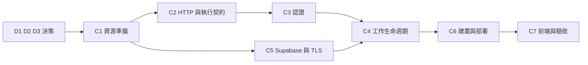

# 雲端部署第一階段執行計畫

> **最新進度（2026-09-23）。下一步為 `C7-6`。**
>
> | 步驟 | 狀態 |
> |---|---|
> | `C1` 資源準備 | ✅ 完成（預算警示通知送達併入 `C7-7`） |
> | `C2` HTTP 層 | ✅ 完成 |
> | `C3` 認證 | ✅ 程式完成；**雲端驗收欠 `C7-3`**，在該項通過前不得宣稱 C3 已完成 |
> | `C4` 工作生命週期 | ✅ 程式完成；**雲端驗收欠 `C7-5`** |
> | `C5` Supabase／TLS | ✅ 完成 |
> | `C6-1` 建置推送 | ✅ 完成（見 [C6 證據](cloud-C6-evidence.md)） |
> | `C6-2`–`C6-4` 部署 | ⬜ **被 `refresh_max_tickers` 擋住**，見下 |
> | `C7-2` 逾時量測 | ✅ 完成；`C7-2` 其餘要求待 `C6` 部署後 |
> | `C7-7` 冷啟動 | ✅ 提前完成（2.3–3.4 秒） |
> | 其餘 `C7` | ⬜ 未開始 |
>
> **`C6-2` 唯一未解的前提**：`deploy/cloud.toml` 的 `refresh_deadline_seconds` 已定案為 **110 秒**（125 秒邊緣上限 − 3.5 冷啟動 − 1 收尾 − 2 殘餘超出），但 `refresh_max_tickers` 仍未設，唯一依據是 `C7-6` 從 **GCP 出口**實測的單檔抓價成本。公司網路測得的結果不算數。
>
> **接手前必讀的三條硬性限制**：
> 1. **`C7-1` 之前不得對 `finpo` Worker 做任何部署**——它承載 `C1-6` 的 canary，是目前唯一能驗證 Access 生效的東西。
> 2. **`GET /healthz` 在 Cloud Run 公開網址上不可用**（被前端攔截、不抵達容器，回 404）。健康檢查探針改用 `/`。見 [C7 證據](cloud-C7-evidence.md)。
> 3. **抓價的時間預算是巢狀的**：125 秒邊緣硬上限 ⊃ `refresh_deadline_seconds` 110 ⊃ 一批內所有市場共用的 `budget` ⊃ `cycle_budget_seconds` 50 ⊃ `operation_timeout_seconds` 10。調高任何一層前先讀 `C7` 證據的算式。
>
> 詳見 [C6 證據](cloud-C6-evidence.md)、[C7 證據](cloud-C7-evidence.md)、[C3 證據](cloud-C3-evidence.md)、[C4 證據](cloud-C4-evidence.md)、[C5 證據](cloud-C5-evidence.md)；下方 09-17／09-20 段落保留作為歷史狀態，與本表衝突時以本表為準。

日期：2026-09-17；狀態：`D1` 已全項定案（Cloudflare Access ＋ Google，服務間以 HMAC 簽章）、`D2` 已定案（**Cloudflare Workers static assets**，單一 Worker 同時承載靜態檔與 `/api/` 代理；2026-09-17 由原訂的 Pages Functions 改採，理由見 `D2`）、`D3` 已定案（請求內同步完成，時間上限待實測回填）、`D4` 已定案（Cloud Run 與 Supabase 同置東京）、`D5` 已定案（假持股先行、上限 $10、不買網域）、`D6` 已定案（GitHub Actions 建置推送，以 Workload Identity Federation 免金鑰認證）。`D1`–`D6` 全數定案，**`C1` 已全部完成**（`C1-1`–`C1-9`；四項完成條件中「預算警示可收到通知」因零花費無法觸發，併入 `C7-7`，不構成阻擋）。**`C2` 已全部完成**（2026-09-18／09-20，`C2-1`–`C2-7` ＋ 補立的健康檢查端點；HTTP 層改為 FastAPI ＋ uvicorn，證據見 `docs/cloud-C2-evidence.md`）。下一步為 `C3`／`C4`／`C5`。

本文件把 [雲端部署評估](cloud-deployment-assessment.md) 第一階段（Cloudflare 靜態前端＋Cloud Run Python API＋Supabase PostgreSQL）拆成可逐項確認與逐步交付的工作。評估文件負責「為什麼選這個架構」與成本、風險；本文件負責「要先決定什麼」與「按什麼順序做、做完怎麼算數」。

## 1. 文件用途與閱讀方式

- 決策以 `D1`–`D5` 編號，執行步驟以 `C1`–`C7` 編號，步驟內項目再以 `C2-1` 形式編號，方便逐項討論與回溯。
- 每個決策列出「目的、選項、建議、影響範圍」；每個步驟列出「目的、前置、執行項目、完成條件」。**目的欄位是確認重點**：若某項目的目的無法成立，該項目應該刪掉或改寫，而不是照做。
- 引用程式位置使用 `檔案:行號`，對應本文件撰寫時的工作樹狀態；程式變動後需重新核對。
- 勾選代表交付完成且具驗證證據，證據沿用既有 `docs/step-N-evidence.md` 慣例，以 `docs/cloud-C1-evidence.md` 形式命名。
- 本文件是計畫，不是驗收報告。未實測的項目一律不得在文件中宣稱已驗證。

## 2. 第一階段的範圍

| 納入 | 不納入 |
|---|---|
| 既有 HTML／CSS／JavaScript 前端搬到 Cloudflare | React 改寫（第二階段） |
| Cloud Run 單一 Python API，min=0、按需抓價 | Spring Boot、服務拆分（第三階段） |
| Supabase PostgreSQL 保存持股與報價 | 搬移既有 POC 觀測資料（runs／attempts／catalog generations） |
| 單人受保護存取 | 多使用者資料隔離、`user_id` 資料模型 |
| 請求內有時限完成的報價更新 | 常駐 monitor、七天觀測、固定排程抓價 |
| GitHub Actions 建置並推送映像 | 自動化測試閘門、多環境（staging／prod）管道 |

`portfolio` 目前固定 `id=1`（dashboard.py:107），第一階段維持此模型，不宣稱支援多使用者。

### 長期目標為開放多人，第一階段明確不做（2026-09-17 補記）

本專案的**最終目標是開放給多人使用**。此前本文件未記載該目標，導致「單人」看起來像是尚未補上的缺口；實際上它是刻意的範圍限制，本文件的多個決策都建立在這個前提上：`D3` 的請求內同步、`C6-2` 的 `max=1`、`C4-5` 的 60 秒冷卻、`D5` 的單一 email 白名單，皆非疏漏。記下此目標是為了讓兩者不再混淆。

三條由此而來的規則：

1. **在 `user_id` 資料模型完成前，不得放寬 Access policy 的 email 白名單。** 多放一個人不會產生第二個使用者，而是兩個人共用同一份 `portfolio`（`id=1`）——對方看得到也改得動你的持股。這是資料模型尚未實作，不是權限設定疏失。
2. **開放多人的擋門項是資料模型與並行處理，不是入口認證。** `D1` 的 Access ＋ Google 這層本來就能服務多人；真正要做的是 `user_id` 資料隔離，以及重新評估 `D3`（兩人同時更新會互相卡住）與 `C6-2` 的 `max=1`。因此入口認證側的任何進展**都不足以宣稱支援多使用者**。
3. **本文件中的「單人」一律讀作當期範圍，不是最終目標。** 日後接手時不需把它當成待修正的缺陷。

**已完成的前瞻性試探（2026-09-17）**：嘗試將 Google OAuth consent screen 由 `Testing` 改為 `In production`，目的是及早得知 Google 端對開放多人有何前置要求。**結果：被擋下**，Google 要求 homepage URL 與 privacy policy URL，而該兩者需自有且可驗證的網域。**狀態維持 `Testing`，未補填欄位**；phase 1 不需要 production 模式，且該份隱私權政策屬開放多人時的實質義務，不應以佔位文字提前打發。完整錯誤訊息與三層阻礙分析見 `docs/cloud-C1-evidence.md` 的 `C1-6`；對網域決策的影響已回填 `D5`。

## 3. 開工前需要確認的決策

`D1`–`D3` 是阻擋項：未定就無法開始 `C2` 之後的實作，三項皆已定案。`D4`、`D5`、`D6` 亦已定案，`C1` 之後無待決的阻擋決策；剩餘未定項全部是待實測回填的**數值**，不是待選擇的方案，列於第 6 節。

`D3` 雖已定案採用哪種執行方式，但其中的**時間上限與單次檔數仍是未定的數值**，須待 `C7-2`（邊緣逾時）與 `C7-6`（實際抓價耗時）量測後回填；在此之前不得在程式或部署設定中寫入憑推測得到的數字。

### D1　入口認證方式（已定案）

- **決定（2026-09-15）**：
  - 人員身分：採**選項 1 — Cloudflare Access，以 Google 作為 identity provider**。前端不實作任何登入程式碼。
  - 服務間信任：採 **HMAC 共享秘密簽章**，由邊緣 Worker 產生、Cloud Run 以標準庫驗證。未採 Access Service Token（無 body 綁定與防重放）與驗 Access JWT（需新增 JWT 與加密依賴，與維持 5 個直接依賴的鎖定狀態衝突）。
- **目的**：現行程式沒有使用者認證。`/api/session` 對任何連得到服務的人直接發 token（web.py:72），token 只用來擋跨站寫入，不是身分驗證；GET 完全沒有驗證。放上公網前必須先有真正的入口。
- **前提**：靜態前端不能持有任何秘密。進得了瀏覽器的值（JS 檔、注入的環境變數、API 回應）使用者都看得到，因此**簽章不可能在瀏覽器端產生**。簽章必須由伺服器端元件加上，這是選項 1 與 `D2` 選項 1（Cloudflare 代理）必須綁在一起的原因。

這一題其實有兩層，要分開決定：

| 層 | 回答的問題 | 由誰負責 | 缺了會怎樣 |
|---|---|---|---|
| 人員身分 | 這是不是本人？ | Cloudflare Access（Google 登入） | 任何人開網址就能操作 |
| 服務間信任 | 這個請求是不是從我的代理來的？ | 代理端簽章、Cloud Run 驗簽 | 任何人直接打 `https://<service>.run.app` 即繞過 Access |

**已登入後的資料路徑**（選項 1 ＋ `D2` 選項 1）：

```
瀏覽器（靜態 HTML／JS，不持有任何秘密）
   │  fetch('/api/...')：相對路徑，瀏覽器自動帶 Access cookie
   ▼
Cloudflare Access ── 未登入 → 導向 Cloudflare 登入頁 → Google OAuth
   │  通過後轉發請求，並附上 Cf-Access-Jwt-Assertion
   ▼
Worker（伺服器端執行，秘密存於 Secret binding）
   │  加上 X-Timestamp 與 X-Signature = HMAC(secret, ts|method|path|sha256(body))
   ▼  HTTPS
Cloud Run：驗簽；失敗一律 401，且不信任任何可偽造的標頭
```

**首次進站的登入流程**：訪客不需要、也不會有 Cloudflare 帳號。Access 只是驗證仲介，不保管密碼；它把人轉給 Google 確認身分，再比對 policy 的 email 白名單。

```
1. 瀏覽器 GET https://<前端網域>/
       ▼
2. Access 檢查 CF_Authorization cookie → 沒有
       ▼
3. 302 導向 https://<team-name>.cloudflareaccess.com/...
   （此時 index.html 一個 byte 都還沒送出）
       ▼
4. Cloudflare 託管的登入頁，列出啟用的登入方式
   ※ 只啟用 Google 一種時會跳過選單，直接導向 Google
       ▼
5. Google OAuth 同意頁 → 使用者選擇帳號
       ▼
6. 回到 cloudflareaccess.com/cdn-cgi/access/callback
   Access 比對 policy（email 是否在白名單）
       ▼
7. 通過 → 於前端網域寫入 CF_Authorization cookie → 302 導回原網址
       ▼
8. 重新 GET / 並帶著 cookie → Access 放行 → 真正送出 index.html
```

登入頁由 Cloudflare 託管在 team domain 上，**不是加在專案裡的一頁**，與靜態檔案完全分離。三個容易混淆的帳號：

| 角色 | 是什麼 | 誰持有 |
|---|---|---|
| Cloudflare 帳號 | 設定 Workers 與 Zero Trust 的管理帳號 | 只有開發者 |
| Zero Trust team domain | `https://<team-name>.cloudflareaccess.com`，驗證關卡 | 開發者設定，訪客僅被導向 |
| Google 帳號 | 真正證明身分的憑據 | 訪客本人 |

關鍵安全性質在第 3 步：**未登入時靜態檔案完全沒有離開 Cloudflare**。這與「前端先載入、再用 JavaScript 判斷未登入就隱藏」是不同等級的保護——後者以開發者工具或 `curl` 即可取得全部程式碼。登入後每次請求自動帶 cookie，包含 `fetch('/api/...')`，因此前端不需處理任何 token；session 效期於 Zero Trust 設定，過期才重走上述流程（前端的過期處理見 `C3-3`）。

- **選項**：
  1. Cloudflare Access（Zero Trust Free，50 人以內）保護前端與 `/api/` 路由，Cloud Run 端另外驗證請求確實來自自己的 Cloudflare 專案。**前端不需實作任何登入程式碼。**
  2. Cloud Run 設為需要 IAM 驗證，本機以 `gcloud run services proxy` 存取。安全性最高，但前端失去「從瀏覽器直接開網址使用」的意義，與 Cloudflare 託管前端的決策衝突。
  3. 自建帳密登入與簽章 cookie。需自行處理密碼保存、重設與鎖定，是本階段最不划算的自建項目。
- **建議（已採納為決定）**：選項 1。人員身分交給 Access，以 Google 作為 identity provider；Cloudflare 與 Cloud Run 之間用共享秘密做 HMAC 簽章（時間戳＋方法＋路徑＋body digest），**由邊緣 Worker 產生、不經過瀏覽器**，後端驗簽以阻擋直接呼叫 `run.app` 繞過。以標準庫 `hmac`／`hashlib` 即可完成，不需新增 JWT 與加密依賴，維持目前 5 個直接依賴的鎖定狀態（pyproject.toml）。

**Google 登入的具體設定**（選項 1 的落地步驟，全部在主控台完成，無程式碼）：

1. Google Cloud Console 建立 OAuth 2.0 Client（Web application），授權的 redirect URI 填 `https://<team-name>.cloudflareaccess.com/cdn-cgi/access/callback`。
2. Cloudflare Zero Trust 新增 login method：個人 Gmail 選 **Google**，公司網域選 **Google Workspace**，填入上一步的 Client ID／Secret。
3. 建立 Self-hosted Access application，涵蓋前端網域與 `/api/` 路徑；policy 設 `Allow` + `Emails` 等於自己的帳號。單人階段用 email 白名單即可，不需群組。
4. 前端與 Python 後端都不實作 OAuth：瀏覽器拿到的是 Access 簽發的 cookie，代理端拿到的是 `Cf-Access-Jwt-Assertion`。

**HMAC 簽章規格**（已定案，`C3-1` 依此實作）：

- 簽章字串（canonical string）：`{timestamp}|{method}|{path+query}|{sha256(raw_body) 十六進位小寫}`。GET 等無 body 的請求，以空 bytes 的 sha256 當 digest，不可省略欄位。
- 標頭：`X-Timestamp`（Unix 秒）與 `X-Signature`（`hmac.new(secret, msg, hashlib.sha256).hexdigest()`，十六進位小寫）。
- 後端驗證順序：先檢查時間窗，再以 `hmac.compare_digest()` 比對，**不可用 `==`**。
- 時間窗：預設 ±60 秒。Cloudflare 與 GCP 皆為 NTP 同步，60 秒足夠；若 `C7-3` 實測有偏移再放寬並記錄理由。
- 驗簽必須對 Cloud Run 收到的**原始 body bytes** 計算，不能先反序列化再重組。
- 已知限制：時間窗內的重放無法阻擋（未引入 nonce 儲存）。單人、單一代理來源且全程 TLS 的前提下接受此風險；若日後開放多來源需重新評估。
- 秘密保存於 GCP Secret Manager（Cloud Run 端）與 Cloudflare 環境變數／Secret binding（代理端），兩邊同值；輪替方式見下方待確認項。

- **未採納的替代方案**（記錄理由，避免日後重複討論）：
  - Access **Service Token**：Cloudflare 官方機制，輪替在 Zero Trust 介面操作，實作最少；但秘密會在每次請求上線路，且無 body 綁定與時間窗。
  - 後端驗 `Cf-Access-Jwt-Assertion`：用 Cloudflare 公開 JWKS 驗簽並檢查 `aud`，沒有共享秘密要保管或輪替，安全性最乾淨；但需新增 JWT 驗證依賴並處理 JWKS 快取。若未來依賴政策放寬，這是優先的升級方向。
- **需一併確認**：
  - Cloudflare Access 能否直接保護 `workers.dev` 子網域，或必須綁自訂網域。官方文件把 `workers.dev` 與 Custom Domain 並列為 hostname-based Access 的同等選項，且另有 **Worker-level Access**（2026-08 推出）可一次涵蓋該 Worker 的所有 hostname，含 routes、Custom Domains、`workers.dev` 與 preview URL；**均不以擁有自訂網域為前提**（查證日 2026-09-17）。`D5` 已據此定案不買網域。**`C1-6` 已實測確認成立**（2026-09-17，見 `docs/cloud-C1-evidence.md`）。
  - 共享秘密的輪替方式：需支援「後端同時接受新舊兩把秘密」的過渡期，否則輪替必然造成中斷。後端讀取秘密的方式（環境變數或啟動時拉 Secret Manager）與輪替時是否需重新部署，一併於 `C1-7` 決定。
  - Access session 過期後，頁面上的 `fetch()` 會收到往 `cloudflareaccess.com` 的跨網域轉址而失敗（不是乾淨的 401）。前端需偵測此情況並整頁重新載入以觸發登入流程，見 `C3-3`。
- **影響範圍**：`C3` 全部、`C1-6`、`C2-2`、`C7-3`、`D5`（自訂網域）。

### D2　API 路由：瀏覽器直連或 Cloudflare 代理（已定案）

- **決定（2026-09-15；載體於 2026-09-17 修訂）**：採**選項 1 — 在 Cloudflare 邊緣代理 `/api/` 路由**。前端維持相對路徑呼叫，`D1` 的 HMAC 簽章在邊緣端加上。**載體採 Workers static assets**：單一 Worker 同時承載三個靜態檔與 `/api/*` 代理，不使用 Pages。
- **目的**：決定前端要不要改，以及安全標頭與跨來源規則由誰負責。
- **選項**：
  1. **在 Cloudflare 邊緣代理 `/api/` 路由**：前端維持相對路徑呼叫（static/app.js:13-14），`connect-src 'self'` 的 CSP 仍成立，不必處理跨來源與憑證；代價是代理屬動態執行，計入 Workers 額度，且多一層逾時要對齊。
  2. **瀏覽器直連 Cloud Run**：前端要集中設定 API base URL，後端要處理 OPTIONS、Origin 白名單、允許的方法與標頭；CSP 的 `connect-src` 也要改。
- **建議（已採納為決定）**：選項 1。前端改動最小，且與 `D1` 的簽章方案天然相容（簽章在代理端加上，秘密不會進瀏覽器）。

**載體的修訂（2026-09-17）**：原訂 Pages Functions，改採 Workers static assets。**決策本體未變**——在邊緣代理 `/api/`、前端維持相對路徑、簽章在伺服器端加上，三項都成立；變的只是哪個產品承載它。

觸發點是 `C1-6` 執行時，新版主控台的 `Create application` 預設建出的是 Worker 而非 Pages 專案。查證後判定改採較有利，理由三項：

| 面向 | Pages Functions（原訂） | Workers static assets（採用） |
|---|---|---|
| preview 網址的保護 | 需**兩個** Access application（`<project>.pages.dev` 與 `*.<project>.pages.dev`），且自動建立的 policy 預設與手建者不一致，須手動對齊 | **Worker-level Access 一個開關**涵蓋 routes、Custom Domains、workers.dev 與 preview |
| 額度衛生 | 手寫並驗證 `_routes.json`，原列為待驗風險項 | `run_worker_first` 指定 `/api/*`，其餘走靜態檔；無 `_routes.json` |
| 部署單元（`C6-1`） | Pages 專案，與 Worker 分屬兩種產品設定 | 單一 Worker ＋ 一份 wrangler 設定 |
| 平台方向 | 新功能已停滯 | Cloudflare 現行主推，新版主控台預設 |
| HMAC（WebCrypto）／10ms CPU 上限 | 相同 | 相同 |

第一項是改採的主因：preview 網址（`<hash>.<project>.pages.dev`）同樣託管一份完整前端且公開可讀，漏保護等同正門上鎖、側門大開。Pages 路線要靠人記得建第二個 application 並對齊 policy 才安全，Workers 路線是一個開關全包——**把安全性從「記得做」變成「預設如此」**。

已付出的代價：網址由 `<project>.pages.dev` 變為 `<worker>.<subdomain>.workers.dev`（較長，且 `subdomain` 為帳號層設定），並須改寫本節、`C7-1`、`C7-2` 與第 6 節風險表。

**機制說明**：Worker 與靜態檔是**同一個部署單元**。`assets` 把一個目錄掛成靜態資產，`run_worker_first` 指定哪些路徑要先交給 Worker 程式碼，其餘由邊緣直接供應靜態檔。

| 名詞 | 是什麼 | 計費 |
|---|---|---|
| Static assets | 掛在 Worker 上的靜態檔目錄 | 請求免費，不計 Workers 額度 |
| Worker | 跑在 Cloudflare 邊緣、收 request 回 Response 的 JS 函式 | 每次執行計 1 次請求 |
| `run_worker_first` | 路徑樣式陣列，決定哪些請求要啟動 Worker | 決定上面兩列如何分流 |

```
專案/
├── static/index.html · app.js · style.css   ← assets.directory
├── worker/index.js                          ← 接管 /api/*，加簽章後 fetch 到 Cloud Run
└── wrangler.jsonc                           ← assets 與 run_worker_first 設定
```

```jsonc
{
  "name": "finpo",
  "main": "./worker/index.js",
  "assets": {
    "directory": "./static/",
    "binding": "ASSETS",
    "run_worker_first": ["/api/*"]
  }
}
```

```
瀏覽器 GET /api/portfolio
   ▼ Cloudflare 邊緣
   ▼ Access 驗 CF_Authorization（擋在此處不計任何額度）
   ▼ run_worker_first 是否命中？
      ├─ 否（/app.js 等） → 直接吐靜態檔，免費、不計額度
      └─ 是（/api/*）     → 啟動 Worker（計 1 次請求）
                              ▼ 程式碼加簽章後 fetch 到 Cloud Run
```

`run_worker_first` 取代了原訂方案的 `_routes.json`。兩者解決同一個問題——哪些請求要啟動 Worker——差別在失敗模式：`_routes.json` 由 Pages CI 自動產生、預設等同 `include: ["/*"]`，不手動覆寫就會每個請求都啟動 Worker 而白白計額度，因此原本必須列為待驗項；`run_worker_first` 是明寫在 wrangler 設定中的宣告，沒有「自動產生一份錯的」這種失敗模式。**第 6 節風險表的 `_routes.json` 一列因此解除。**

**額度與費用**（依 Cloudflare 官方文件，查證日 2026-09-15）：

- Workers Free：100,000 requests／天、每次呼叫 10ms CPU；靜態資產請求不計入，egress 與頻寬不另計費。
- Free plan **沒有 overage billing**：超量是該類請求開始回錯誤、UTC 00:00 重置，不會產生帳單。要付費必須自行升級 Workers Paid（帳號層級最低 $5/月）。
- Cloudflare Access 走 Zero Trust Free（50 人以內），在 Worker 之前執行，不計入 Workers 額度。
- 本專案估算：前端每 1.8 秒輪詢 job（static/app.js:86），一次五分鐘更新約 170 次請求；一天十輪加日常操作約數千次，遠低於 100k。
- 結論：`run_worker_first` 的範圍對本階段是**額度衛生，不是成本阻擋項**；寫寬了也不會產生費用，差別只在是否浪費額度。

**實作注意**：

- Worker 執行環境沒有 Node 的 `hmac`／`hashlib`，`D1` 的簽章須以 WebCrypto（`crypto.subtle.importKey` ＋ `sign`）實作；後端 Python 仍用標準庫。兩側必須對同一 canonical string 產生相同的十六進位字串，需有跨語言一致性測試（`C7-2`）。
- 簽章須對**原始 body bytes** 計算：Worker 端以 `request.arrayBuffer()` 取得後，同一份 bytes 同時用於 digest 與轉發，不可先 `json()` 再重組。
- 10ms CPU 上限只計 CPU 時間，等待 Cloud Run 回應的時間不計入；HMAC-SHA256 為微秒等級，不會踩到此限制。
- `run_worker_first` 只列 `/api/*`。未命中的路徑先找靜態檔，找不到才回落到 Worker，因此 `C2-6` 決定的靜態檔集合不必在此重複宣告。
- **需一併確認**：
  - 代理的逾時上限是否容納 `D3` 決定的抓價時間；超過時的行為（回 504 或改非同步）。**未測**：Cloudflare 邊緣對長請求常見在約 100 秒切斷（524）；若屬實，與 `D3` 現況每批 `cycle_budget_seconds=300`（dashboard.py:256）直接衝突。須於 `C7-2` 以故意延遲回應的測試端點量出實際上限，再回頭定 `D3` 的 deadline。**2026-09-22 已量測**：實際為 **125 秒**而非 100 秒，且限制只在 Worker 的對外 subrequest——client-facing 到 600 秒無上限。與 `cycle_budget_seconds=300` 的衝突確實存在，但 `C4-1` 已把每批預算改為取「剩餘時間」與該值的較小值，衝突不再是硬傷。超過時的行為已確定：**回 524，且以 upstream response 形式交給 Worker**，不是 throw。見 [C7 證據](cloud-C7-evidence.md)。
  - Worker-level Access 官方載明**不支援 WebSocket**（upgrade 請求回 403）。本階段前端以 `fetch` 輪詢（static/app.js:86），不使用 WebSocket，故不受影響；但這條限制會封死「改用 WebSocket 推播取代 1.8 秒輪詢」這個未來選項，若日後要走該方向須改用 hostname-based Access。
- **影響範圍**：`C2-6`、`C4-1`、`C7-1`、`C7-2`、`D3`（逾時上限）。

### D3　報價更新的執行方式與上限（已定案）

- **決定（2026-09-15）**：採**選項 1 — 請求內同步完成**。`refresh()` 改為在請求存續期間跑完並回傳結果，設整體 deadline 與單次最多檔數；不引入 Cloud Tasks／Cloud Run Jobs。**整體 deadline 與單次檔數兩個數值本次不定**，待 `C7-2`（邊緣逾時上限）與 `C7-6`（實際抓價耗時）量測後回填。
- **目的**：現行 `refresh()` 寫入 job 後開 daemon 執行緒並立即回 202（dashboard.py:229）。Cloud Run 在請求結束後不保證配置 CPU，縮容或換 revision 會讓工作中斷，job 永遠停在 running。
- **選項**：
  1. 請求內同步完成，設整體 deadline 與單次最多檔數，完成後回傳結果。
  2. 導入 Cloud Tasks 或 Cloud Run Jobs 做真正的非同步工作。
- **建議（已採納為決定）**：選項 1。第一階段是單人按需更新，不需要關掉瀏覽器仍繼續執行；選項 2 的冪等與重試設計成本，留到確有需求時再付。

**選項 1 的機制**：不是「選擇」在請求內耗用 CPU，而是 **Cloud Run 只在請求存續期間保證配置 CPU**。回應一送出，CPU 即被節流到接近零，仍在執行的執行緒等同凍結。因此抓價工作只能整段塞在連線開著的時間內。

```
使用者按「更新報價」
   ▼ POST /api/refresh        ← 連線自此開始，全程保持開啟
   ▼ Cloud Run 冷啟動（min=0，此時可能尚無容器）
   ▼ ┌──────────────────────────────────┐
     │ 有 CPU 的區間                     │
     │  抓上市 → 抓上櫃 → 抓美股 → 寫 DB │
     └──────────────────────────────────┘
   ▼ 回傳結果，連線關閉
   ▼ CPU 被節流，閒置一段時間後容器銷毀
```

對照現行做法即可看出非改不可的理由：`refresh()` 寫完 job 就開 daemon 執行緒並立刻回 202（dashboard.py:229），該回應一送出連線即關閉，背景執行緒失去 CPU、抓到一半停住，job 永遠停在 `running` 且無人收拾。這不是效能問題，是設計前提不成立。

Cloud Run 的「CPU always allocated」可讓背景執行緒續跑，但需為閒置時間付費，且縮容與換 revision 照樣中斷工作，解決不了根本問題，故不列為選項。

**選項 1 隨之而來的三個限制**：

1. **瀏覽器必須全程連著**。關閉分頁、裝置睡眠或換網路都會中斷工作。單人按需更新可接受，這正是選項 1 相對選項 2 放棄的性質。
2. **三層逾時取最小值**，實際可執行時間由最短的一層決定：

   | 層 | 上限 | 狀況 |
   |---|---|---|
   | 瀏覽器 `fetch` | 自行控制 | 可設 |
   | Cloudflare 邊緣（`D2`） | 約 100 秒？ | **未測，很可能是瓶頸** |
   | Cloud Run request timeout | 預設 5 分鐘，可調至 60 分 | 可設 |

   現行每批預算 300 秒（dashboard.py:256）。若邊緣確實卡在約 100 秒，調大 Cloud Run timeout 無法解決，必須縮小單次檔數，或回頭採選項 2。
3. **concurrency 不可設為 1**。前端每 1.8 秒輪詢 job（static/app.js:86），這些輪詢與長請求是各自獨立的請求；若 `max=1` 且 concurrency 亦為 1，輪詢會全部排在長請求之後，等待期間完全沒有進度可顯示。此數字須與本決策一併定，不能留到 `C6-2` 才處理。

   **2026-09-22 補記（`C4-1` 完成後）**：結論不變，但理由已經換了。`C4-1` 後前端是等待長請求本身，只有在另一個實例持有租約時才會回到輪詢，所以「等待期間沒有進度可顯示」已不再是主要理由。真正綁死這個數字的是**平台探測**：長請求佔住實例時 `/healthz` 仍須能被回應，否則實例會被判定不健康而遭終止。已寫入 `C6-2`。

- **待實測回填的數值**（決策已定，數字未定）：整體 deadline（撰寫本節時為每批 5 檔、每批 `cycle_budget_seconds=300`，dashboard.py:256,261，**整份清單沒有總時間上限**）、單次最多檔數、Cloud Run request timeout、`D2` 代理鏈的逾時，以及 Cloud Run concurrency 下限，須一併對齊後才寫進程式與部署設定。在 `C7-2` 與 `C7-6` 量測完成前，不得寫入憑推測得到的數字。

  **2026-09-22 補記（`C4-1` 完成後）**：上述「整份清單沒有總時間上限」已不再成立——`C4-1` 加上了整體 deadline 與單次檔數兩個設定鍵（`[scheduler] refresh_deadline_seconds`、`refresh_max_tickers`），機制完成。**但本項的要求未解除**：兩個鍵的預設值刻意沿用既有行為（300 秒、不設上限）而非量測值，`deploy/cloud.toml` 仍未寫入任何數字。`C7-2`／`C7-6` 量測後必須回填，`C6-2` 不得在回填前部署。另 `C6-2` 的 request timeout 必須大於 deadline，否則平台會在程式自己收尾前切斷請求。
- **重新評估的觸發條件**：若 `C7-2` 量出的邊緣逾時，扣掉冷啟動後不足以在單次請求內完成一份可用的清單（連縮小檔數也不可行），則本決策作廢，回到選項 2 重新評估，並同步調整 `C4` 的工作生命週期設計。

  **2026-09-22 結果：未觸發，`D3` 維持成立。** `C7-2` 量出的上限為 **125 秒**，扣除冷啟動後仍足以在單次請求內完成一份小清單。附帶取得的一項結構性資訊：client-facing 到 600 秒無上限，125 秒只限制 Worker 的對外 subrequest，因此**若日後改為串流分批輸出，可用時間可大幅放寬**——這是目前已知唯一能繞過 125 秒的方向，本階段不做。詳見 [C7 證據](cloud-C7-evidence.md)。
- **影響範圍**：`C4` 全部、`C6-2`（request timeout 與 concurrency）。

### D4　區域、帳號與現有額度（已定案）

- **決定（2026-09-15）**：
  - Cloud Run 區域：**`asia-northeast1`（東京）**。
  - Supabase 區域：**`ap-northeast-1`（東京，AWS）**。
  - Artifact Registry 區域：**`asia-northeast1`**，與 Cloud Run 同區，避免冷啟動跨區拉映像。
  - GCP 與 Supabase 皆**新建專用專案**：目前兩邊都沒有在運行任何專案，免費額度未被其他工作負載消耗，評估文件的成本結論前提成立。
- **目的**：區域決定延遲與計價；既有額度決定「免費」的判斷是否成立。免費額度按帳務帳號共用，不是每個專案各有一份。

**為什麼不是選離使用者最近的區域**：使用者在台灣，直覺會挑最近的節點，但本階段的瓶頸不在「使用者 ↔ Cloud Run」這一段：

| 路徑 | 每次更新的往返次數 | 受區域影響的程度 |
|---|---|---|
| 瀏覽器 → Cloudflare 邊緣（台北有節點） | 靜態檔就近供應 | 與 GCP 區域無關 |
| Cloudflare → Cloud Run | 每個 API 請求 1 次 | 低，只影響單次 TTFB |
| Cloud Run → Supabase | **每檔報價多次**（寫報價、更新 job 狀態、前端每 1.8 秒輪詢觸發的查詢） | **高，直接吃掉 `D3` 的 deadline** |

`D3` 已定案請求內同步完成，整體 deadline 還受 `D2` 的邊緣逾時封頂。抓價流程對資料庫是多次往返，若 Cloud Run 與 Supabase 跨海，每次往返多出的數十毫秒會乘上檔數，直接壓縮單次可處理的檔數。因此**優先讓 Cloud Run 與 Supabase 同城**，使用者端延遲其次。

**候選組合比較**（Cloud Run 計價層級與 Supabase 區域清單查證日 2026-09-15）：

| 組合 | Cloud Run 計價層 | 與 Supabase 同城 | 結論 |
|---|---|---|---|
| `asia-east1`（彰化）＋ Supabase 東京 | Tier 1 | ✗ 跨海 | 離使用者最近，但 DB 往返跨海，不採 |
| **`asia-northeast1`（東京）＋ Supabase `ap-northeast-1`** | **Tier 1** | **✓** | **採用** |
| `asia-southeast1`（新加坡）＋ Supabase `ap-southeast-1` | Tier 2（較貴） | ✓ | 可行備案；計價較貴且離使用者較遠，不採 |
| `asia-southeast2`（雅加達）＋ 印尼 Supabase | Tier 2 | ✗ | **Supabase 沒有印尼區域**，組合不成立，排除 |

兩項查證結果需要點名，因為它們推翻了「挑最近的國家」這個直覺：

- GCP 其實有**台灣區域 `asia-east1`（彰化）**，且屬 Tier 1 計價，比日本更近使用者。不選它的唯一理由是 Supabase 那一端沒有台灣可配對，選了反而讓延遲成本最高的那一段變成跨海。
- **Supabase 沒有印尼區域**。其亞太可選為 `ap-northeast-1`（東京）、`ap-northeast-2`（首爾）、`ap-southeast-1`（新加坡）、`ap-southeast-2`（雪梨）、`ap-south-1`（孟買）。首爾雖近，但 Cloud Run 的 `asia-northeast3`（首爾）是 Tier 2，配對不划算。

- **仍需於 `C1` 確認（非阻擋項）**：
  - Supabase Free plan 建立專案時能否自由指定 `ap-northeast-1`，或會被導向 general region（Singapore）。若被限制，整組改採新加坡（Supabase `ap-southeast-1` ＋ Cloud Run `asia-southeast1`），**不得只改一邊而拆成跨區**。於 `C1-4` 確認。
  - Supabase 在 AWS 上，Cloud Run → Supabase 屬對外網際網路出口，任一組合都會計 egress；實際流量與費用於 `C7-7` 首月帳單檢視。
  - 免費額度的前提是「同一 Billing 帳號下無其他專案消耗」。日後在該帳號新增專案時，成本結論需重算。
- **影響範圍**：`C1-1`、`C1-2`、`C1-4`、`C5-1`、`C6-1`、`C6-2`、成本結論。

### D5　第一版資料與預算（已定案）

- **決定（2026-09-15）**：
  - 初始資料：先用匿名範本 `持股範本.xlsx` 的假持股；真實持股待 `C7` 全數通過再匯入，並核對筆數、幣別與精度。
  - 每月費用上限：**$10**，以 **$5 為警示門檻**。
  - 預估使用量：**每日更新 1–3 次**。
  - 自訂網域：**第一階段不買**，直接使用 `<worker>.<subdomain>.workers.dev`（依 `D2` 的載體修訂；原訂為 `<project>.pages.dev`）。**開放多人時則必須買**，理由見下方 2026-09-17 補記。
  - 第一階段的成功定義：**整套能在雲端順利運作**（`C7` 驗收全通過），不是功能完整度。
- **目的**：決定初始化要匯入什麼，以及什麼情況算超支。

**每日 1–3 次更新的用量推估**（費率與免費額度查證日 2026-09-15；依 `C6-2` 的 1 vCPU／1 GiB、min=0、max=1。單次更新佔用實例時間假設為冷啟動＋抓價約 110 秒，**實際值待 `C7-6` 量測回填**）：

| 項目 | 免費額度 | 本專案推估（每月，以每日 3 次上限計） | 佔比 |
|---|---|---|---|
| Cloud Run vCPU 時間 | 180,000 vCPU-秒 | 90 次 × 約 110 秒 ≈ 9,900 | 約 6% |
| Cloud Run 記憶體 | 360,000 GiB-秒 | 同上 ≈ 9,900 | 約 3% |
| Cloud Run 請求數 | 2,000,000 | 約 5,000（含每 1.8 秒的 job 輪詢） | ＜1% |
| Workers 請求數（靜態檔不計入） | 100,000／天 | 每日約 200 | ＜1% |
| Supabase 資料庫容量 | 500 MB | 持股與報價，遠低於此（`C5-6` 實測） | 低 |
| Supabase egress | 5 GB／月 | 低 | 低 |

**推估結論：常態費用為 $0。** 因此 $5–10 的上限不是會用掉的預算，而是**異常偵測門檻**——真的逼近它，代表有東西跑掉了（無限重試、60 秒冷卻失效、抓價迴圈），應當成故障處理，而不是升級方案。

**唯一可能產生實際帳單的來源是 GCP**：

- Cloudflare Free **沒有 overage billing**（見 `D2`）：超量是該類請求開始回錯誤並於 UTC 00:00 重置，不會產生帳單。
- Supabase Free 同樣以「限制」取代「收費」。
- GCP **會**照量計費，超出免費額度即產生費用。因此預算警示只需要在 GCP 端設（`C1-8`）。

最可能先出現的小額項目是 **Artifact Registry 儲存**：免費 0.5 GB，而 `C6-4` 要求保留可回滾的舊映像，多留幾版就會超出。超出後約 $0.10／GB／月，即使累積到 2 GB 也僅約 $0.20／月。連同亞洲區出口流量，於 `C7-7` 檢視首月帳單確認。

**「不買網域」的前提已初步查證**：Cloudflare 官方文件把 `workers.dev` 主機名與 Custom Domain 並列為 Access 的同等選項，另有 **Worker-level Access** 可對 Worker 本身啟用一次、涵蓋其所有 hostname（含 preview URL），**均不以擁有自訂網域為前提**（查證日 2026-09-17）。**`C1-6` 已於 2026-09-17 實測成立**，見 `docs/cloud-C1-evidence.md`。

- 退路成本：若實測不成立而必須買網域，Cloudflare Registrar 以成本價出售，`.com` 約 $10／年（約 $0.9／月），仍在本決策的上限內。也就是說這個風險會影響工期，不會擊穿預算。

**與「首要目標是確認能在雲端運作」一致的兩個取捨**：

1. **先假資料、後真實持股**。驗收期間會反覆重建 schema、砍掉重來、故意中斷容器與重新部署（`C7-5`），此時資料庫內容不應該是真實持股。
2. **第一階段不追加功能**。`D3` 已放棄「關掉瀏覽器仍繼續執行」、`C5-5` 建議移除雙 schema fallback，都是為了先把「能不能穩定跑起來」這題答完。

**開放多人時必須買網域（2026-09-17 補記，不改變第一階段決定）**：`C1-6` 的前瞻性試探已實測，Google OAuth consent screen 要切換至 External production **必須提供 homepage URL 與 privacy policy URL**，而該兩者必須掛在自有且已於 Google Search Console 驗證的網域下——`workers.dev` 與 `cloudflareaccess.com` 皆不符。此外隱私權政策頁需公開可讀，不能放在受 Access 保護的 Worker 上（Traffic scope 為 `All traffic`，全站導向登入）。

因此「不買網域」的成立範圍要講清楚：

| 情境 | 是否需要網域 |
|---|---|
| 第一階段（單人，consent screen 維持 `Testing`） | **不需要**，本決策不變 |
| 開放多人（consent screen 須為 `In production`） | **需要**，且須另備公開載體放首頁與隱私權政策 |

成本仍在本決策的上限內（Cloudflare Registrar `.com` 約 $10／年，約 $0.9／月），**此項不是預算問題而是工期與前置作業問題**。多人階段的規劃須將「買網域 ＋ 撰寫隱私權政策 ＋ Search Console 驗證」與 `user_id` 資料模型並列為前置，不可假設入口認證已就緒。

- **需一併留意（不是決策，但會被誤判成程式故障）**：Supabase Free plan 的專案**閒置 7 天會被暫停**，需手動恢復。每日更新 1–3 次不會觸發；但驗收期間若中斷一週以上再回來，連線失敗的原因是專案被暫停，不是程式問題。
- **影響範圍**：`C1-8`、`C6-3`、`C7-4`、`C7-7`。

### D6　建置與部署管道（已定案）

- **決定（2026-09-16）**：
  - 建置與推送：**GitHub Actions**（`ubuntu-latest` 標準 runner），取代原訂的本機建置。
  - GCP 認證：**Workload Identity Federation（OIDC）**，不產生也不保存 service account 金鑰。
  - 觸發方式：push 到 `main` 時**建置並推送映像**；**部署到 Cloud Run 一律手動觸發**（`workflow_dispatch`），驗收期間不自動上線。
  - Cloud Build **維持不啟用**。
- **目的**：決定映像由誰建、憑證怎麼給。原訂 `C6-1` 的本機建置在本專案的實際環境下有三個具體障礙，換到 Actions 可一次解決。

**為什麼從本機建置改為 Actions**：

| 本機建置的問題 | 在 Actions 上的狀況 |
|---|---|
| 開發機是 Windows，交付目標是 `linux/amd64`，需 Docker Desktop ＋ buildx 跨平台建置 | `ubuntu-latest` 原生即 `linux/amd64`，無跨平台步驟 |
| 公司網路需 `company_ca` build secret（Dockerfile 的 `--mount=type=secret,id=company_ca`） | runner 在乾淨網際網路上，該 secret **不傳入即整段跳過**，交付映像與公司環境徹底脫鉤 |
| 映像 digest 靠人工記錄，容易與實際部署不一致（`C6-4`） | digest 由 workflow 輸出並留在 run log，天然留痕 |

Dockerfile 三處 `company_ca` 掛載本來就是條件式（`if [ -f /run/secrets/company_ca ]`），因此**改用 Actions 不需要改 Dockerfile**。

**費用（查證日 2026-09-16）**：

- 本專案的 GitHub repository（`tommy12lin/stock-quote-fetcher`）為 **public**，GitHub Actions 標準 runner 對 public repository **免費且不限分鐘數**，log 與 artifact 儲存亦不計費。private repository 的 2,000 分鐘／月免費額度不適用於本專案，因為本專案不受分鐘數限制。
- GCP 端：Workload Identity Federation 不計費；映像推入 Artifact Registry 屬**入站流量**，GCP 不對 ingress 計費。
- 結論：**改用 Actions 的增量費用為 $0**，兩端皆然，`D5` 的成本結論不變。唯一可能的小額項目仍是 Artifact Registry 儲存。

**認證方式的選擇**：

| 選項 | 說明 | 結論 |
|---|---|---|
| Service account JSON 金鑰存入 GitHub Secret | 實作最快 | **不採**。長期有效的明文憑證，外洩即等同專案寫入權，且須人工輪替 |
| **Workload Identity Federation（OIDC）** | Actions 以短期 OIDC token 換取 GCP access token | **採用**。無長期憑證、無輪替負擔、可綁定到單一 repository |

**public repository 新增的兩個限制**（本機建置時不存在，改用 Actions 才出現）：

1. **workflow 執行紀錄公開可見**。任何人都能讀 build log，因此 workflow 不得輸出任何秘密、資料庫連線資訊或 DSN。
2. **WIF provider 必須綁定 repository**。若 provider 的條件只寫「接受來自 GitHub 的 OIDC token」，**任何人的任何 repository 都能換到本專案的 GCP 憑證**。attribute condition 必須包含 `assertion.repository == 'tommy12lin/stock-quote-fetcher'`，且 service account binding 須以 `principalSet` 限定到同一 repository。workflow 不得使用 `pull_request_target`，也不得在 fork 的 PR 上授予 `id-token: write`。

- **影響範圍**：`C1-2`（啟用的 API 清單）、`C1-9`（新增）、`C6-1`（改寫）、`C6-4`（digest 來源）。

## 4. 執行步驟

### C1　帳號與雲端資源準備

- **目的**：先把身分與資源備妥，讓後續步驟的失敗都是程式問題，不是權限問題。
- **前置**：`D4`、`D5`（`C1-8` 的預算金額）、`D6`（`C1-9` 的建置身分）。
- **執行項目**：
  - [x] `C1-1` 新建 GCP project 與 Billing（目前帳號下無其他專案），區域一律使用 `D4` 定案的 `asia-northeast1`，確認部署身分權限。
  - [x] `C1-2` 於 `asia-northeast1` 建立 Artifact Registry repository（與 Cloud Run 同區）；啟用 Cloud Run、Artifact Registry、Secret Manager，以及 `D6` 的 WIF 所需的 IAM Service Account Credentials（`iamcredentials`）與 Security Token Service（`sts`）。依 `D6` **不啟用 Cloud Build**。實際建立的 repository 名為 `finpo`（非 `stock-quote`）；`iamcredentials` 與 `sts` 於執行 `C1-9` 時補啟用。見 `docs/cloud-C1-evidence.md`。
  - [x] `C1-3` 建立 runtime service account，只授予所需 secret 的讀取權；建置／部署身分另行管理，不共用。實際為 `finpo-runtime`（本文件原記為 `stock-quote-runtime`，2026-09-17 更正），無任何專案層級角色；授權層級改為 **secret 層而非 version 層**（version 層會使 `C1-7` 的輪替一新增版本即失效），並追加建立 `db-password`。理由見 `docs/cloud-C1-evidence.md`。
  - [x] `C1-4` 於 `ap-northeast-1`（東京）建立 Supabase 專案；若 Free plan 無法指定該區域，依 `D4` **整組**改採新加坡並同步把 Cloud Run 移到 `asia-southeast1`。從 Connect 複製 **Session pooler** 的 host／port／dbname，不自行拼 host。實測結果：Free plan **可**指定 `ap-northeast-1`，`D4` 成立，見 `docs/cloud-C1-evidence.md`。
  - [x] `C1-5` 建立應用專用非管理角色。**不可使用 Supabase 預設的管理帳號**：`check_permissions()` 明確禁止 `rolsuper`／`rolcreatedb`／`rolcreaterole`（storage.py:122）。pooler 的角色名格式為 `[ROLE].[PROJECT-REF]`。實際角色為 `finpo_app`，`app` 與 `dashboard` 兩 schema 皆通過 `db-check --connection-only`。
  - [x] `C1-6` 依 `D1` 準備入口認證：建立 Google OAuth 2.0 Client、在 Cloudflare Zero Trust 設定 Google identity provider，並確認 Access 可涵蓋預定的前端網址（`workers.dev` 子網域是否適用，含 preview URL）。**注意主控台導覽已改版**：Zero Trust 併入 `dash.cloudflare.com`，`Login methods` 更名為 `Integrations → Identity providers`，`Access` 更名為 `Access controls`。team name、OAuth consent screen 的 App name 皆為**帳號層**設定，全帳號共用，不得以單一專案命名；Worker 名稱與 Access application 名才是專案層。
  - [x] `C1-7` 產生代理與後端共用的簽章秘密，存入 Secret Manager 與 Cloudflare 環境變數，並記錄輪替方式。須建立 `proxy-hmac-secret`（current）與 `proxy-hmac-secret-prev`（previous）**兩組**，使輪替不必變更 Cloud Run 部署設定；理由與輪替程序見 `docs/cloud-C1-evidence.md`。
  - [x] `C1-8` 依 `D5` 在 GCP Billing 建立預算：金額 $10，警示門檻 $5（50%）與 $10（100%）。Cloudflare 與 Supabase 的 Free plan 不會產生帳單，無需另設。**預算警示只會通知，不會停止計費**，因此仍須於 `C7-7` 實際核對帳單。實際建立為 `finpo-monthly`，Scope 僅 `finpo-508709`，金額 **TWD 300**（帳戶幣別為 TWD，約當 $9.4，偏保守方向），門檻以 50%／100% 百分比表示且皆為 `Actual`；另**取消 Credits 的 `Promotions and others`**，否則試用金會抵銷成本使警示永不觸發，與 `D5`「異常偵測門檻」的用途不符。理由與未實測項見 `docs/cloud-C1-evidence.md`。
  - [x] `C1-9` 依 `D6` 建立 GitHub Actions 的建置／部署身分：新增 deploy service account（與 `C1-3` 的 runtime SA 分開，不共用），授予 Artifact Registry 寫入與 Cloud Run 部署所需角色；建立 Workload Identity Pool 與 GitHub OIDC provider，attribute condition **必須**限定 `assertion.repository`，SA binding 以 `principalSet` 綁定同一 repository。**不得產生 service account 金鑰**。實際的 deploy SA 名為 `finpo-deploy`（非 `stock-quote-deploy`，與 `finpo-runtime` 命名一致）；`Service Account User` 綁在 runtime SA 資源層而非專案層；以 run `35196067829` 實測推送成功，全程無金鑰。**三項留待條件見 `docs/cloud-C1-evidence.md` 的 `C1-9`**：attribute condition 未做反面測試、provider 未限定 ref、action 釘在可變 tag。
- **完成條件**：以該專用角色從本機連上 Supabase，`check_permissions()` 通過；以 Google 帳號可通過 Access 登入測試頁；預算警示已建立且可收到通知；GitHub Actions 能以 WIF 取得 GCP 憑證並成功推送一個測試映像到 Artifact Registry，全程無 service account 金鑰。
- **證據**：連線與權限查詢輸出（不含密碼與完整 DSN）。

### C2　HTTP 層與 Cloud Run 執行契約

- **目的**：讓程式能在「由平台指定 port、隨時縮容、可能同時存在新舊版本」的環境啟動並接受正常 HTTPS 請求。目前的 HTTP 層是本機 POC 設計，不改連啟動與回應都不會成立。
- **前置**：`D1`、`D2`。
- **執行項目**：
  - [x] `C2-1` 將 `ThreadingHTTPServer`（web.py:15）換成成熟的 WSGI／ASGI 層，沿用既有路由與 `Dashboard` 邏輯。新增依賴須同步更新 `uv.lock` 並維持 `--frozen` 建置。實際採 **FastAPI ＋ uvicorn**（`fastapi==0.141.1`、`uvicorn==0.53.0`，不採 `uvicorn[standard]`）；依賴以 `--only-binary :all:` 及映像內 `--no-cache` 建置雙重確認無原始碼編譯；新增 `tests/test_web.py`（23 項），容器內全套件 227 passed／0 failed。四項刻意的行為變更與三項未驗證事項見 `docs/cloud-C2-evidence.md`。
  - [x] `C2-2` Host／Origin 白名單改為可設定：現在寫死 `localhost`／`127.0.0.1` 且 Origin 只接受 `http://`（web.py:61,66），任何雲端 HTTPS 網址都會被判 403。需保留本機模式，並明確定義代理標頭的信任範圍。實作為兩個環境變數 `WEB_ALLOWED_HOSTS`（可設 `*` 明確停用 Host 檢查）與 `WEB_ALLOWED_ORIGINS`（**不接受萬用字元**），未設定時完全等同原本的 loopback 行為；格式錯誤於啟動時即失敗，不留到請求時才顯現。**代理標頭一律不信任**：`X-Forwarded-*`／`Forwarded` 不參與任何判斷，uvicorn 亦設 `proxy_headers=False`。理由與 `C7-2` 的連帶要求見 `docs/cloud-C2-evidence.md`。
  - [x] `C2-3` 啟動時綁定 `0.0.0.0` 並讀取平台提供的 `PORT`：目前 `--port` 預設 8765，且只有 `--container` 才監聽全介面（web.py:123-124）。優先序為 `--port` ＞ `PORT` ＞ `8765`，無效的 `PORT` 於啟動時即失敗；`--container` **維持明確開關**不改自動偵測，但已烘進 `web` 映像的 ENTRYPOINT，部署端不需記得加。
  - [x] `C2-4` 新增 Web 啟動配置：Dockerfile 的 ENTRYPOINT 是 `stock-poc`、CMD 是 `--help`，直接部署原映像不會啟動 Web。可加 image target 或在 Cloud Run 覆寫 command／args。**採 image target**：新增 `stock-web` 進入點與 Dockerfile 的 `web` stage（`ENTRYPOINT ["stock-web", "--container"]`），Dockerfile 改為共用 `base` ＋ `web`／`runtime` 兩個末端，`web` 刻意排在 `runtime` 之前以維持 `docker build .` 的預設目標不變。**`C6-1` 建置時須指定 `--target web`。**
  - [x] **健康檢查端點**（原無此項，`C2-1` 期間發現完成條件缺對應交付）：新增 `GET /healthz`，只回 `{"status": "ok"}`，不碰資料庫、不 migration、不抓行情；路徑刻意在 `/api/` 之外，使 `C3-1` 的驗簽不必為它開例外；`Guard` 對該路徑豁免。實測**資料庫整個停掉後健康檢查仍回 200、同時 API 回 503**。
  - [x] `C2-5` 讓雲端設定檔進得了映像：`.dockerignore` 先排除全部、只放行 `pyproject.toml`／`uv.lock`／`README.md`／`src`。`DB_` 開頭環境變數可覆寫資料庫設定（config.py 的 `load_database_config`），但 `providers`／`scheduler`／`instruments`／`tls` 只能從 TOML 讀，因此仍需一份不含秘密的雲端 config 進入映像或以唯讀方式掛載。**採「進映像」**：`deploy/cloud.toml` → `/app/cloud.toml`，由 `web` stage `COPY`（`--chmod=0644` 以求建置可重現），`--config` 烘進 ENTRYPOINT。未採 Secret Manager 掛檔，因為該檔**依 `config.py` 的欄位白名單本來就不可能含秘密**，且設定離開 git 會失去審查軌跡與原子回滾。實際內容只有 `[instruments] max_age_hours = 168`，其餘沿用預設；`[scheduler]` 待 `C7-2`／`C7-6` 回填。理由與驗證見 `docs/cloud-C2-evidence.md`。
  - [x] `C2-6` 決定 Python 端是否繼續提供 `/`、`/app.js`、`/style.css`（web.py:82）。前端搬到 Cloudflare 後，Python 回應的 CSP 不會套用到該靜態頁，安全標頭改由 Cloudflare 配置。**決定：不提供**，三條路由已移除，Python 端的 CSP 同步收緊為 `default-src 'none'`。`src/.../static/` 的檔案保留（是 `C7-1` 要部署的來源），但 Python 已不讀取，故 `C2-7` 的範圍縮為只剩 `migrations/`。**代價：本機目前沒有可用的頁面開啟路徑**（另起 server 會因 Origin 不符被 `C2-2` 的檢查擋下寫入），三個選項見 `docs/cloud-C2-evidence.md`。
  - [x] `C2-7` 確認最終映像內 `static/` 與 `migrations/` 皆可讀取（web.py 與 storage.py 以套件資源方式載入）。**範圍已縮為 `migrations/`**：`C2-6` 決定後 Python 不再讀 `static/`（該目錄仍隨套件出貨，是 `C7-1` 要部署到 Cloudflare 的來源）。以容器內 `--initialize` 實際套用 migration ＋ 單元測試列舉讀取套件資源，雙重確認。
- **完成條件**：容器以指定 port 啟動，健康檢查可通過，且健康檢查不觸發 migration 或任何外部行情抓取。
- **證據**：以雲端等價參數在本機啟動容器的輸出、健康檢查回應。
- **已知缺口（2026-09-18 於 `C2-1` 期間發現，同日補上）**：完成條件要求健康檢查，但 `C2-1`–`C2-7` 原本沒有任何一項會產生健康檢查端點。已於 `C2-3`／`C2-4` 一併補上 `GET /healthz` 並另立項目，完成條件三項皆已取得證據（見 `docs/cloud-C2-evidence.md` 的端到端驗證）。

### C3　認證與 session token

**2026-09-22 進度**：C3-1–C3-4 的程式與本機驗證全部完成，四項皆已勾選。**勾選代表程式交付，不代表雲端驗收**：真實 Access 過期與 Cloud Run 縮容後的恢復由 `C7-3` 實測，在該項通過前不得宣稱 C3 的雲端完成條件已達成。重跑紀錄與拆分理由見 [C3 證據](cloud-C3-evidence.md)。下列「目前」描述為開工前問題。

**部署契約**：Secret Manager 的 `proxy-hmac-secret` → `PROXY_HMAC_SECRET`（必填）；`proxy-hmac-secret-prev` → `PROXY_HMAC_SECRET_PREV`（選填）。各非空秘密至少 32 bytes。缺少 current 時 API 拒絕啟動；初始化／清單更新命令不需要此秘密。

- **目的**：把「只擋跨站寫入」升級為「擋未授權存取」，並解除 token 與程序生命週期綁死的問題。
- **前置**：`D1`、`C2`。
- **執行項目**：
  - [x] `C3-1` 依 `D1` 的 HMAC 簽章規格實作後端驗證：所有 API（含 GET）都要通過驗證，不能只保護前端頁面；以 `hmac.compare_digest()` 比對、對原始 body bytes 計算 digest、先檢查時間窗再驗簽。
  - [x] `C3-2` 改掉每程序各自產生的 token：原本 token 是啟動時的 `secrets.token_urlsafe(32)`，現已改為用途區隔的無狀態簽章，效期一小時，支援過期重取；固定秘密不放進 JavaScript。
  - [x] `C3-3` 前端對應調整：目前啟動時取一次 token（static/app.js:93），需支援 401／403 後重新取得並重試一次；另需處理 Access session 過期——此時 `fetch()` 會因跨網域轉址而失敗而非回 401，應偵測後整頁重新載入以觸發 Google 登入。前端不實作登入表單。**程式已完成**：`renewSession()` 於 401／403 且 code 為 `unauthorized`／`session_expired` 時重取 session 並重試一次（`/api/session` 自身排除在重試外，不遞迴）；`fetch` 以 `redirect:'manual'` 發出，`opaqueredirect`、`redirected` 或 `text/html` 回應即整頁重載。另追加兩項計畫未要求但必要的處置：重載前把草稿、匯率與原 revision 暫存同分頁 sessionStorage 並於登入後恢復（否則重新登入會吃掉未保存的修改），以及 60 秒重載冷卻（`fetch` 無法區分跨網域轉址與網路故障，無冷卻會在斷網時無限重載）。**本項勾選只涵蓋程式與模擬測試**，真實 Access 過期與 Cloud Run 縮容後的恢復由 `C7-3` 驗收。
  - [x] `C3-4` 確認未授權請求的回應不洩漏內部資訊，且失敗訊息與既有錯誤處理風格一致。
- **完成條件**（2026-09-22 拆為兩段，理由見下）：
  - **程式面（已達成）**：未帶有效憑證的 GET／PUT／POST 一律被拒；前端在憑證失效與跨網域轉址兩種情況下都能自行恢復。以本機 HTTP 測試與前端模擬測試驗證。
  - **雲端面（待 `C7-3`）**：瀏覽器閒置至服務縮容後再操作，不需手動重新整理即可繼續使用。此項需要真實的 Cloud Run 縮容與 Access session 過期，本機造不出來，因此不併入上列勾選。
  - 拆分理由：原完成條件把「程式是否寫對」與「雲端是否真的會恢復」綁在同一句，使 `C3-3` 在程式早已交付後仍掛著未勾選，看起來像有未寫的程式。拆開後 C3 的程式面得以結清，雲端面則明確留下一個不會被遺漏的欠項。
- **證據**：授權與未授權請求的對照紀錄。

### C4　工作生命週期、單例假設與復原

**2026-09-22 進度**：`C4-1`–`C4-6` 的程式與資料庫整合驗證全部完成，六項皆已勾選。**`C4-1` 的兩個數值仍未定**：機制已完成且可設定，deadline 與單次檔數的實際值待 `C7-2`／`C7-6` 量測，`C6-2` 不得在回填前部署。真實容器終止與重新部署的驗收由 `C7-5` 承接。見 [C4 證據](cloud-C4-evidence.md)。下列「目前」描述為開工前問題。

- **目的**：移除「單一長駐程序」假設。Cloud Run 會縮容到零、會同時存在新舊 revision，目前的背景執行緒、行程內鎖與全站 advisory lock 在這個環境下都會出錯。
- **前置**：`D3`、`C2`、`C5`。
- **執行項目**：
  - [x] `C4-1` 依 `D3` 將 `refresh()` 改為請求內有時限完成（dashboard.py:207），設整體 deadline 與單次最多檔數。前端可沿用 job 查詢介面（static/app.js:114 的 `watch()` 每 1.8 秒輪詢），只需改善等待狀態顯示。**機制已完成**：`refresh()` 在請求內跑完並回傳完成的 job，路由改回 200（另一實例持有租約時才回 202 讓前端輪詢）；整體 deadline 由 `[scheduler] refresh_deadline_seconds` 設定，每批預算取「剩餘時間」與 `cycle_budget_seconds` 的較小值並逐批重建，使單一 cycle 不可能活過 deadline；單次檔數由 `refresh_max_tickers` 設定，超出的檔數在完成訊息中明列而非默默丟棄。**切片前先依最後報價時間由舊到新排序**（2026-09-22 補正）：否則每次都從清單第一筆開始，被 deadline 或上限擋掉的尾端永遠輪不到，「再次更新」也拿不到其餘報價。缺陷與修正見 [C4 證據](cloud-C4-evidence.md)。前端改為等待這個長請求，並把被截斷的連線與 Access 過期分開處理（見 `C3-3`）。**兩個數值刻意維持未定**：預設 300 秒沿用原本每批就已花掉的預算、單次不設上限，皆非新的推測值；`D3` 禁止在 `C7-2`／`C7-6` 量測前寫入猜測數字。

    **2026-09-23 更新**：`refresh_deadline_seconds` 已定案為 **110 秒**並寫入 `deploy/cloud.toml`（125 邊緣上限 − 3.5 冷啟動 − 1 收尾 − 2 殘餘超出 = 118.5，取 110）。`refresh_max_tickers` 仍未設，待 `C7-6`。**同時修正一個會使 deadline 失效的缺陷**：`QuoteRunner.run()` 讓每個市場各拿一份完整 `cycle_budget_seconds`，因此一批同時含台股與美股時最壞耗時為 deadline ＋ 50 秒；deadline 為 300 時看不出來，壓到 110 後就會直接撞上 125 秒邊緣切斷。修法是 `run()` 新增 `budget=` 共用總額，`monitor.py` 直接呼叫 `run_cycle()` 故語義不變。見 [C7 證據](cloud-C7-evidence.md)。
  - [x] `C4-2` 移除 Web 啟動時取得的全程序 advisory lock（web.py:314，取不到時於 web.py:316 結束）：新 revision 啟動時拿不到鎖會直接以 `parser.error` 結束，部署將失敗。**已移除**，啟動不再取任何鎖，也不再於啟動時掃描 job。實測同一 schema 可同時跑兩個服務且各自 `/healthz` 回 200，資料庫端無任何 advisory lock。
  - [x] `C4-3` 將 `Dashboard.mutex`（dashboard.py:95 建立、dashboard.py:208 使用）這個行程內 `threading.Lock` 換成資料庫層的原子認領；跨實例時記憶體鎖不具任何互斥效果。**已改為 `claim()`**：單一交易內以 `pg_try_advisory_xact_lock` 取得認領權，交易內完成逾期回收、冷卻判斷與寫入新 job。交易範圍的鎖由 commit、rollback 與連線中斷一併釋放，不會有任何東西活過取得它的程序。
  - [x] `C4-4` 改寫 `recover_jobs()`（dashboard.py:276，由 web.py:317 在取得上述 lease 後呼叫）：目前啟動就把所有 queued／running 的 job 標成失敗，在多實例或新舊版本重疊時會誤判其他存活實例正在執行的工作。改為 owner／lease／逾期回收，未確認過期不得宣告失敗。**已改寫**：job 文件內記 `owner` 與 `lease_expires_at`，每次進度寫入即續約（進度寫入就是唯一的心跳）。只有租約真的到期才回收；租約未到期一律不動。改在 `claim()` 內回收而非啟動時，因為啟動時無從分辨別的存活實例與被遺棄的工作。租約長度由設定導出（每批預算＋單次操作逾時＋30 秒緩衝），必然大於 60 秒冷卻，因此回收後不會立刻撞到自己的冷卻。
  - [x] `C4-5` 保留 60 秒更新冷卻（dashboard.py:218 的判斷、dashboard.py:219 的回應）並確認它在多實例下仍然有效。**已保留**，判斷讀的是 job 列而非行程記憶體，已實測第二個實例同樣看得到冷卻並回 429。
  - [x] `C4-6` 確認工作超時或容器被終止時，先前可用的報價仍保留，下一次請求能安全重新開始。**已確認**：deadline 只停止後續批次，已完成批次寫入的報價不受影響；逾時的 job 只改自己的狀態，不碰 `portfolio` 也不刪 `quotes`。已實測被 deadline 截斷後 `quotes` 筆數與持股文件皆不變。
- **完成條件**（2026-09-22 拆為兩段，理由同 `C3`）：
  - **程式面（已達成）**：job 不會永久停在 running（租約到期即回收，讀取端亦不會顯示死掉的 running），也不會把其他實例的工作標成失敗（租約未到期一律不動）。以隔離 PostgreSQL 的整合測試驗證。
  - **雲端面（待 `C7-5`）**：真的在更新途中終止容器或重新部署後的 job 狀態。此項需要 Cloud Run 的實際縮容與 rollout，本機造不出來。
- **證據**：`docs/cloud-C4-evidence.md`，含中斷與多實例情境的 job 狀態紀錄。

### C5　Supabase 連線、TLS 與 schema

- **目的**：把本機 PostgreSQL 的連線假設改成跨網際網路連線該有的樣子，並確認 pooler 能接受現有連線方式。這步的結論會回頭影響 `C4`（session 層鎖是否可用）。
- **前置**：`C1`。
- **執行項目**：
  - [x] `C5-1` 使用 **session pooler**。`Storage.acquire_lock()` 依賴 session 層 advisory lock（storage.py:135），transaction pooler 不適用；這是連線模式的決定性理由，不能只因為 Cloud Run 是 serverless 就選 transaction 模式。**已實測（2026-09-16）**：session pooler 下 A 取鎖後執行其他語句，B 仍取不到，釋放後 B 可取得，行為符合預期，`C4-3` 的前提成立。
  - [x] `C5-2` 管理者完成 dashboard schema、三版 migration 與兩張儀表板表初始化；runtime 僅有 USAGE、業務表 SELECT／INSERT／UPDATE、migration 紀錄 SELECT，無 CREATE／DELETE／TRUNCATE。14 張表啟用 RLS，政策限定既有 runtime 角色；撤除舊 app schema 存取權。雲端實測讀写及權限反面測試通過。
  - [x] `C5-3` 明確設定 TLS，預設 verify-full。**2026-09-22 實測**：系統信任庫不能驗證目前 pooler 憑證鏈；改用官方 Supabase CA，已由實際非 root Web 映像驗證。公開 CA 隨映像出貨於 `/app/supabase-ca.crt`，`deploy/cloud.toml` 指定該路徑，不降級至 require。
  - [x] `C5-4` 移除被 pooler 靜默忽略的 startup options，連線後 SET 並 SHOW 核對 UTC、statement_timeout、lock_timeout 與 search_path；不符即關閉連線。Supabase 實測預設為 10s／3s；短時限測試分別取得 SQLSTATE 57014／55P03。
  - [x] `C5-5` 移除 catalog／valuation 對舊 POC schema 的 fallback，解除 database.schema 與 dashboard schema 不得相同的限制；雲端 runtime 對 app schema 無權仍可操作。只需初始化 dashboard，未搬移 POC 資料。
  - [x] `C5-6` 證據預設保存 30 天；管理工具預設 dry-run、明確 --apply 才清理。保留最新 20 筆快取候選及其引用鏈、進行中工作、campaign 與最新兩代清單。隔離 DB 清理與重跑測試通過，雲端已量測每表／索引容量，dashboard 合計 401,408 bytes；沒有清除雲端資料。
- **完成條件**：以 runtime 角色完成一次連線、權限檢查、寫入與讀取，TLS 驗證通過，鎖行為與逾時符合預期。
- **證據**：連線參數（去識別）、TLS 驗證結果、鎖與逾時測試輸出。

### C6　建置、部署與一次性初始化

- **目的**：產出可回滾的映像與可重現的部署設定，並把資料庫初始化從服務啟動路徑移除。
- **前置**：`C2`–`C5`、`D5`、`D6`。
- **順序規則（2026-09-20 補立，硬性）**：**`C3-1` 完成前不得把 Cloud Run 接上任何真實資料。** 依 `D1`，Cloud Run 必須允許未驗證呼叫（Cloudflare Worker 以一般 HTTPS 呼叫它），因此 `run.app` 網址一旦外流，**唯一的關卡就是 HMAC 驗簽**；`C3-1` 未完成時那道關卡不存在，等同把資料庫內容開在公網上。`D5` 的「假持股先行」已涵蓋此風險，但該規則的理由是成本與資料價值，與本條的理由不同，故另立。另：`C5-3` 的 Supabase 憑證鏈確認亦須早於 `C6-2`，否則首次部署即連不上資料庫。
- **執行項目**：
  - [x] `C6-1` 依 `D6` 以 GitHub Actions 建置 linux/amd64 並推送 Artifact Registry，沿用 lockfile 與非 root 設計；移除公司專用 `company_ca_file` 與 relaxed TLS 設定（config.example.toml 的 `[tls]`）。runner 不傳入 `company_ca` build secret，Dockerfile 的條件式掛載會自動跳過，不需改 Dockerfile。workflow 權限最小化：預設 `contents: read`，僅需換取 GCP 憑證的 job 才加 `id-token: write`。映像路徑固定為 `asia-northeast1-docker.pkg.dev/finpo-508709/finpo/stock-quote:<tag>`——repository 以專案命名、image 以服務命名，使同一財務系統的其他服務共用同一 repository；Artifact Registry 不支援 repository 改名，此路徑為終局。**由 `C1-9` 帶出的三條**：（a）workflow 引用的 action 須釘 commit SHA 而非可變 tag——帶 `id-token: write` 的 workflow 若用到被汙染的 action，等同交出 deploy SA 權限；（b）WIF provider 目前只限定 `assertion.repository`、未限定 ref，任何分支都能換到憑證，若部署只該由 `main` 觸發須另加 `assertion.ref` 條件或在 workflow 層限制；（c）須設 Artifact Registry cleanup policy 只保留最近數個 tag——實測（`C2-1`）第一個 tag 約 125 MB、其後每個增量 tag 約 82 MB，約第 6 個即超出 0.5 GB 免費額度，建議只留最近 3 個。**另須指定 `--target web`**（`C2-4` 新增的 stage）：預設目標 `runtime` 的 ENTRYPOINT 是 CLI，部署上去不會啟動服務。

    **2026-09-23 完成**（run `35806642267`，48 秒，digest `sha256:99ee3a38…`，tag 取 commit SHA 前 12 碼）。三條待辦全數處置：(a) 兩個 action 釘 commit SHA 並只留這兩個——`id-token: write` 之下每多一個第三方 action 就多一個等同交出 deploy SA 權限的入口；(b) ref 限制以 job 層 `if: github.ref == 'refs/heads/main'` 實作，**provider 層的 `assertion.ref` 刻意未加**（加了會使日後無法從分支驗證 workflow 改動）；(c) cleanup policy 已設保留最近 3 個版本。映像已從 Artifact Registry 拉回實測：ENTRYPOINT 確為 web、非 root、`linux/amd64`、`cloud.toml` 與 `supabase-ca.crt` 就位、`/tmp` 無公司 CA 殘骸。**新增一項須留意**：`ubuntu-latest` 將於 2026-10-19 起遷移至 Ubuntu 26，建置環境會在無人改動下改變。詳見 [C6 證據](cloud-C6-evidence.md)。
  - [ ] `C6-2` 部署設定：1 vCPU／1 GiB、min=0、max=1，concurrency 依 `D3` 設定（**不可為 1**；`C4-1` 完成後更新期間通常沒有並行輪詢，但長請求佔住實例時 `/healthz` 探測仍須能被回應，否則實例會被判定不健康而遭終止），request timeout 依 `D3` 對齊且**必須大於 `refresh_deadline_seconds`**，否則平台會在程式自己收尾前切斷請求；**部署前必須先把 `C4-1` 的 `refresh_deadline_seconds` 與 `refresh_max_tickers` 依 `C7-2`／`C7-6` 的量測值寫進 `deploy/cloud.toml`**；`DB_PASSWORD` 與必要 provider key 放 Secret Manager（`db-password` 已於 `C1-3` 建立並授權給 `finpo-runtime`）；簽章秘密以 `proxy-hmac-secret` 與 `proxy-hmac-secret-prev` 兩個環境變數掛載（皆參照 `latest`），兩組於 `C1-7` 已建立，因此輪替時不需變更部署設定；日誌輸出 stdout／stderr 並限制內容與保留量。若設定 startup／liveness probe，**指向 `C2-4` 新增的 `GET /healthz`，不可指向任何 `/api/` 路徑**（`C3-1` 上線後探測無法簽章，會全數 401）；`web` 映像已自帶啟動命令，**不需覆寫 command／args**。**另須設定 `C2-2` 的兩個環境變數**：`WEB_ALLOWED_HOSTS`（Cloud Run 服務主機名，或明確設為 `*`）與 `WEB_ALLOWED_ORIGINS`（前端 Worker 的 `https://` 來源）；兩者未設定時服務會套用本機預設值而把所有雲端請求判 403。
  - [ ] `C6-3` 以獨立管理者執行 `python -m stock_quote_fetcher.cloud_db bootstrap-sql` 產生的 SQL，再以 runtime 執行 `web --refresh-catalog`。C5 已先完成首次 schema／空持股初始化並驗證可重跑；C6 仍須完成部署環境的一次性執行程序與官方清單更新。**不得以 runtime 執行 migration／web --initialize**，其 CREATE 權限已於 C5-2 撤除；Web 啟動仍不自動 migration。
  - [ ] `C6-4` 記錄映像 digest、部署設定與 secret 版本，確認可回滾。digest 由 `D6` 的 workflow 輸出並留存於 run log，回滾即以該 digest 手動觸發重新部署。資料庫 migration 需向後相容：回滾映像不等於回滾資料庫。
- **完成條件**：服務可由記錄的映像 digest 重新部署並啟動成功，初始化步驟可獨立重跑。
- **證據**：映像 digest、部署設定輸出、初始化執行紀錄。

### C7　Cloudflare 前端與端到端驗收

- **目的**：完成使用者實際會走的路徑，並用實測取代推論。本階段所有「可行」的說法都要在這步變成量測結果。
- **前置**：`C6`、`D1`、`D2`。
- **執行項目**：
  - [ ] `C7-1` 依 `D2` 以 Workers static assets 部署既有三個靜態檔（`assets.directory` 指向 `static/`），於 Cloudflare 端配置安全標頭（CSP、`X-Content-Type-Options`、`Referrer-Policy` 等）。**在本項執行前不得對 `finpo` Worker 做任何部署**：它目前承載的是 `C1-6` 刻意留下的 canary（`C1-6-CANARY-OK`），而正式前端尚未上線，沒有它就沒有任何東西可用來驗證 Access 是否生效；本項部署真實前端後 canary 才功成身退。**本項另承接一件事**：`C7-2` 量出的 125 秒得自不受 Access 保護的探針，Access 不參與回應路徑故理論上不會縮短該上限，但未實測；在此處 canary 退場、真實前端上線時一併確認。
  - [ ] `C7-2`（**逾時量測已於 2026-09-22 完成，其餘待 `C6`**）依 `D2` 在同一 Worker 內實作 `/api/*` 代理，`assets.run_worker_first` 僅列 `/api/*`，並以實際請求核對靜態檔路徑不會啟動 Worker；驗證 Worker 端 WebCrypto 與後端 Python 對同一 canonical string 產生相同簽章；以故意延遲回應的測試端點量出代理的實際逾時上限，並對齊前端、代理與後端的逾時。**`C2-2` 追加的必辦事項：Worker 轉發時必須原樣帶上瀏覽器的 `Origin` 標頭**，否則後端會把所有寫入請求判 403；理由是 HMAC 簽章擋不住「惡意網站以 `credentials:'include'` 觸發、Access 放行、Worker 照簽」這條跨站路徑，Origin 白名單是該路徑唯一的防線（見 `docs/cloud-C2-evidence.md` 的 `C2-2`）。

    **逾時量測結果（2026-09-22，見 [C7 證據](cloud-C7-evidence.md)）**：Worker→Cloud Run 的 subrequest 上限為 **125 秒**（最後成功點 124 秒；130／150／300／600 皆在 125.0–125.2 秒被 524 切斷），client-facing 則到 600 秒無上限。**524 是以 upstream response 的形式回到 Worker 手上，`fetch()` 不會 throw**——正式 Worker 必須檢查這個狀態碼並轉成給前端的明確錯誤，否則瀏覽器只會拿到一個看似成功的空回應。量測用的慢 origin 不能是另一個 Worker（`error code: 1042`），已改以拋棄式 Cloud Run 服務取得，該服務與映像已刪除。**本項其餘要求（代理實作、`run_worker_first` 核對、HMAC 互通、`Origin` 轉發、三層逾時對齊）仍待 `C6` 部署後執行。** 另：經 Access 保護路徑的逾時確認原訂在此處做，因會覆寫 `finpo` Worker 上的 `C1-6` canary 而改排到 `C7-1`。
  - [ ] `C7-3` 啟用入口驗證，並驗證無法繞過代理直接呼叫 `run.app`。後端驗證需依賴可靠簽章或憑證，不得只檢查可偽造的標頭。另須實測：未授權的 Google 帳號被 Access 拒絕、無痕視窗開啟會導向 Google 登入、session 過期後前端可自行恢復。**本項承接 `C3-3` 的雲端驗收**：`C3-3` 的勾選只涵蓋程式與模擬測試，C3 完成條件中「閒置至服務縮容後再操作，不需手動重新整理即可繼續使用」要在此處取得實測證據。此處未過即視為 C3 尚未收尾，不得因 `C3-3` 已勾選而略過。
  - [ ] `C7-4` 功能驗收：上傳 Excel、預覽、儲存、版本衝突（409）、報價更新、缺價／失敗、查詢結果與前端提示。使用 `D5` 決定的資料。
  - [ ] `C7-5` 持久性驗收：關閉瀏覽器、等待縮容後重開，確認持股仍在；更新中途終止與重新部署，確認 job 不永久卡住。**本項承接 `C4` 的雲端完成條件**：`C4` 的勾選只涵蓋程式與資料庫整合測試，真實容器終止與 rollout 下的 job 狀態要在此處取得實測證據。
  - [ ] `C7-6` 外部來源驗收：實測台股上市、上櫃、美股與 ETF 從 GCP 出口抓價，記錄 429／封鎖／逾時與品質旗標。**公司網路測試通過不能證明 GCP 出口可用。**
  - [ ] `C7-7` 營運驗收：DB 匯出與還原演練、前版映像回滾、計費與 DB 容量檢查、冷啟動與抓價耗時量測。
- **完成條件**：評估文件第 6 節 C 的 8 項全部通過，且量測數據取代先前的估算假設。
- **證據**：`docs/cloud-C7-evidence.md`，含各項實測輸出與量測值。

## 5. 順序與相依



`C2` 與 `C5` 可並行。`C4` 排在 `C5` 之後，因為連線模式與鎖的實測結果會改變工作互斥的實作方式；也必須排在 `C6` 之前，因為它決定 Cloud Run 的 timeout 與 concurrency 設定。

## 6. 尚未決定與已知風險

| 項目 | 現況 | 何時必須解決 |
|---|---|---|
| ~~共享秘密輪替的過渡期處理~~ | **已解決**：`C1-7` 定案兩組 secret＋驗簽接受一組秘密；程序見 `docs/cloud-C1-evidence.md` | `C3-1` 依此實作 |
| 抓價整體 deadline 與單次上限 | **deadline 已定案為 110 秒**（2026-09-23 寫入 `deploy/cloud.toml`）：125 邊緣上限 − 3.5 冷啟動實測 − 1 收尾 − 2 殘餘超出 = 118.5，取 110 留餘裕。**`refresh_max_tickers` 仍未定**，待 `C7-6` 量出單檔實際成本 | `C6-2` 部署前需回填 `refresh_max_tickers` |
| ~~Worker 對外請求的實際逾時上限~~ | **已量測（2026-09-22）**：Worker→Cloud Run 的 subrequest 在 **125.0–125.2 秒**被 524 切斷（130／150／300／600 四點皆同一時間，固定計時器），最後成功點 124 秒。原記「約 100 秒」**低估**，方向正確。另發現 **client-facing 到 600 秒無上限**，兩段差一個數量級——故 `C6-2` 的 request timeout 設多大都無法放寬 125 秒。證據見 [C7 證據](cloud-C7-evidence.md) | — |
| Worker 不得 fetch 同 zone 的另一個 Worker | **新增（2026-09-22）**：`workers.dev` 全帳號同屬一個 zone，Worker 互打回 `error code: 1042`。本階段 `C7-2` 的代理打的是 `run.app`，不受影響；但封死「以第二個 Worker 分擔長工作」這個選項 | 若日後要拆 Worker，需改用 service binding 或自有網域 |
| ~~自動產生的 `_routes.json` 是否只涵蓋 `/api/*`~~ | **已解除**：`D2` 改採 Workers static assets 後，改以 wrangler 的 `run_worker_first` 明文宣告，無自動產生的失敗模式 | — |
| ~~Access 能否保護免費子網域（含 preview URL）~~ | **已解決**：`C1-6` 實測 `workers.dev` 可受 Worker-level Access 保護，未登入時靜態檔不送出、`/api/*` 亦在保護傘內，`D5` 的「不買網域」成立 | — |
| Worker-level Access 不支援 WebSocket | 已知行為；本階段以 `fetch` 輪詢，不受影響，但封死日後改用 WebSocket 推播的選項 | 若日後要改推播，需改用 hostname-based Access |
| Supabase Free 專案閒置 7 天被暫停 | 已知行為；每日更新不會觸發，驗收若中斷一週以上會誤判為程式故障 | `C7` 期間留意 |
| ~~pooler 是否接受 startup options~~ | **已解決（2026-09-22）**：連線後 SET＋SHOW 已實作，Supabase 上已驗證設定值與實際兩種逾時 | C5-4 完成，證據見 cloud-C5-evidence.md |
| 行情來源對 GCP 出口的接受度 | 未測；技術上可抓取不等同取得授權 | `C7-6`；公開展示前另需核對使用條款 |
| ~~Supabase Free plan 能否指定 `ap-northeast-1`~~ | **已解決**：`C1-4` 實測可指定東京，`D4` 成立，Artifact Registry 不需重建 | — |
| ~~WIF provider 未綁定 repository 等同公開授予 GCP 寫入權~~ | **已處置**：`C1-9` 的 provider attribute condition 為 `assertion.repository == 'tommy12lin/stock-quote-fetcher'`，SA binding 亦以 `principalSet` 限定同一 repository。**惟阻擋效力僅由設定查核確認，未做反面測試** | — |
| WIF provider 未限定 ref | 現況：本 repo 的任何分支都能換到 deploy SA 憑證。`C1-9` 的測試正是靠此性質從測試分支通過 | `C6-1`；正式部署管道限定觸發分支前 |
| public repository 的 workflow log 公開可見 | 已知行為；workflow 不得輸出秘密或資料庫連線資訊 | `C6-1` 撰寫 workflow 時 |
| 亞洲區出口流量與映像儲存費用 | 未量測，可能產生小額費用；Supabase 在 AWS 上，Cloud Run 連線屬對外出口 | `C7-7` 後檢視首月帳單 |

## 7. 與評估文件的對照

| 本文件 | 評估文件依據 |
|---|---|
| D1、D2 | 第 2 節「第一階段需決定的 API 路由」、第 6 節 A 最後兩項 |
| D3、C4 | 第 3 節「背景更新：第一版最重要的取捨」 |
| C2、C3 | 第 3 節缺口表（HTTP 層、Host／Origin、token、PORT、Dockerfile、dockerignore） |
| C5 | 第 4 節「Supabase 準備與迁移」 |
| C6、C7 | 第 6 節 B、C |
| D4、D5、C7-7 | 第 5 節成本評估、第 8 節「單人使用是否能完全免費」 |
| D6 | 本文件新增；評估文件假設本機建置，未涵蓋 CI/CD 管道 |
